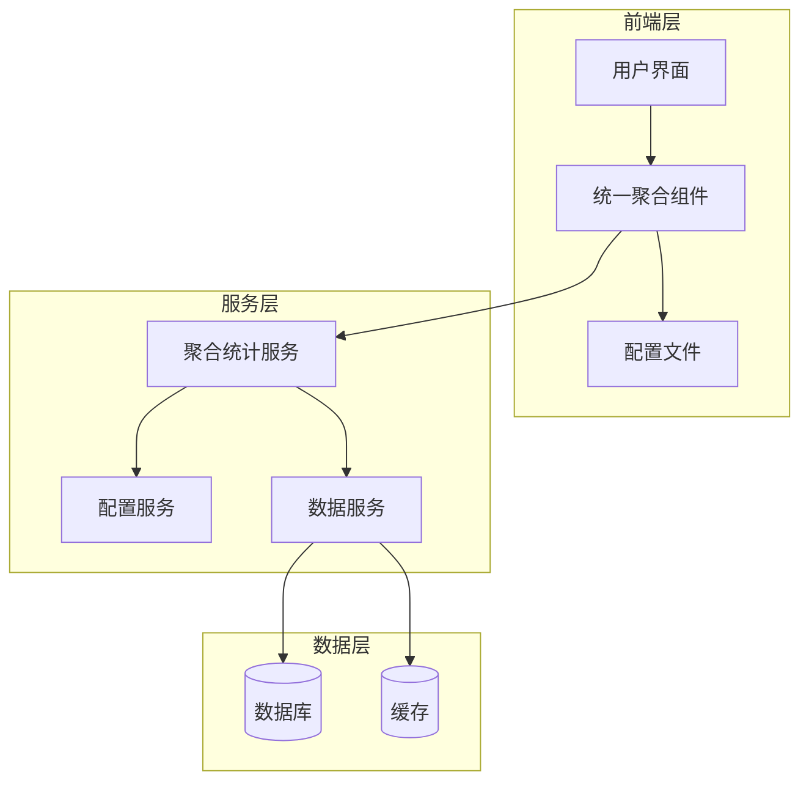

# 聚合统计重构设计文档

## 概述

本设计文档描述了聚合统计系统重构的技术方案。重构的核心目标是消除实例统计和数据库统计页面之间的代码重复，通过创建统一的组件和服务架构来提高代码复用性、可维护性和扩展性。

重构将采用渐进式方法，确保在整个过程中系统保持稳定运行，同时为未来的功能扩展奠定良好的基础。

## 架构

### 整体架构设计



### 分层架构说明

1. **前端层**: 负责用户交互和数据展示
   - 统一聚合组件：可配置的通用组件
   - 配置文件：定义不同统计类型的行为
   - 用户界面：保持现有的用户体验

2. **服务层**: 负责业务逻辑处理
   - 聚合统计服务：统一的数据处理逻辑
   - 配置服务：管理不同统计类型的配置
   - 数据服务：统一的数据访问接口

3. **数据层**: 负责数据存储和缓存
   - 数据库：存储原始统计数据
   - 缓存：提高查询性能

## 组件和接口

### 核心组件设计

#### 1. 统一聚合组件 (UnifiedAggregationComponent)

**职责**: 提供可配置的前端组件，根据配置渲染不同类型的统计页面

**主要功能**:
- 根据统计类型加载相应配置
- 动态渲染数据表格和图表
- 处理用户交互（筛选、搜索、排序）
- 管理页面状态和数据刷新

**接口设计**:
```typescript
interface UnifiedAggregationComponent {
  statsType: 'instance' | 'database';
  config: StatsConfig;
  data: AggregationData[];
  onFilter: (filters: FilterCriteria) => void;
  onSearch: (query: string) => void;
  onRefresh: () => void;
}
```

#### 2. 聚合统计服务 (AggregationStatsService)

**职责**: 提供统一的后端服务，处理不同类型的聚合数据逻辑

**主要功能**:
- 根据统计类型获取相应数据
- 执行数据聚合和计算
- 处理筛选和搜索逻辑
- 缓存管理和性能优化

**接口设计**:
```typescript
interface AggregationStatsService {
  getAggregationData(type: StatsType, filters?: FilterCriteria): Promise<AggregationData[]>;
  getStatsConfig(type: StatsType): StatsConfig;
  refreshCache(type: StatsType): Promise<void>;
  validateFilters(filters: FilterCriteria): boolean;
}
```

#### 3. 配置服务 (ConfigurationService)

**职责**: 管理不同统计类型的配置信息

**主要功能**:
- 加载和管理统计类型配置
- 提供配置验证功能
- 支持动态配置更新
- 配置版本管理

**接口设计**:
```typescript
interface ConfigurationService {
  loadConfig(type: StatsType): Promise<StatsConfig>;
  validateConfig(config: StatsConfig): boolean;
  updateConfig(type: StatsType, config: StatsConfig): Promise<void>;
  getAvailableTypes(): StatsType[];
}
```

### API接口规范

#### 统一API端点设计

```
GET /api/aggregation-stats/{type}
- 获取指定类型的聚合统计数据
- 支持查询参数：filters, search, page, limit

GET /api/aggregation-stats/{type}/config
- 获取指定类型的配置信息

POST /api/aggregation-stats/{type}/refresh
- 刷新指定类型的缓存数据

GET /api/aggregation-stats/types
- 获取所有可用的统计类型
```

## 数据模型

### 核心数据结构

#### 1. 统计配置模型 (StatsConfig)

```typescript
interface StatsConfig {
  type: StatsType;
  title: string;
  description: string;
  columns: ColumnConfig[];
  filters: FilterConfig[];
  aggregations: AggregationConfig[];
  displayOptions: DisplayOptions;
}

interface ColumnConfig {
  key: string;
  label: string;
  type: 'string' | 'number' | 'date' | 'boolean';
  sortable: boolean;
  filterable: boolean;
  formatter?: string;
}

interface FilterConfig {
  key: string;
  label: string;
  type: 'select' | 'input' | 'dateRange';
  options?: FilterOption[];
  defaultValue?: any;
}
```

#### 2. 聚合数据模型 (AggregationData)

```typescript
interface AggregationData {
  id: string;
  type: StatsType;
  timestamp: Date;
  data: Record<string, any>;
  metadata: {
    source: string;
    version: string;
    computedAt: Date;
  };
}

interface AggregationSummary {
  totalCount: number;
  aggregatedValues: Record<string, number>;
  trends: TrendData[];
  lastUpdated: Date;
}
```

#### 3. 筛选条件模型 (FilterCriteria)

```typescript
interface FilterCriteria {
  type: StatsType;
  filters: Record<string, any>;
  search?: string;
  dateRange?: {
    start: Date;
    end: Date;
  };
  pagination: {
    page: number;
    limit: number;
  };
  sorting?: {
    column: string;
    direction: 'asc' | 'desc';
  };
}
```

## 错误处理

### 错误处理策略

#### 1. 前端错误处理

- **网络错误**: 显示友好的错误提示，提供重试机制
- **数据加载失败**: 显示加载失败状态，允许用户手动刷新
- **配置错误**: 回退到默认配置，记录错误日志
- **用户输入错误**: 实时验证，提供清晰的错误提示

#### 2. 后端错误处理

- **数据库连接错误**: 实现连接重试机制，使用熔断器模式
- **数据处理错误**: 记录详细错误日志，返回标准化错误响应
- **配置加载错误**: 使用默认配置，发送告警通知
- **缓存错误**: 降级到直接数据库查询

#### 3. 错误响应格式

```typescript
interface ErrorResponse {
  code: string;
  message: string;
  details?: any;
  timestamp: Date;
  requestId: string;
}
```

### 错误恢复机制

- **自动重试**: 对于临时性错误实现指数退避重试
- **降级服务**: 在部分功能不可用时提供基础功能
- **缓存回退**: 在实时数据不可用时使用缓存数据
- **用户通知**: 及时通知用户系统状态和恢复进度

## 测试策略

### 测试层次

#### 1. 单元测试
- **组件测试**: 测试统一聚合组件的各种配置场景
- **服务测试**: 测试聚合统计服务的业务逻辑
- **工具函数测试**: 测试数据处理和格式化函数
- **配置验证测试**: 测试配置加载和验证逻辑

#### 2. 集成测试
- **API集成测试**: 测试前后端接口集成
- **数据库集成测试**: 测试数据访问层
- **缓存集成测试**: 测试缓存机制
- **配置集成测试**: 测试配置服务集成

#### 3. 端到端测试
- **用户流程测试**: 测试完整的用户操作流程
- **性能测试**: 测试系统在负载下的表现
- **兼容性测试**: 测试重构前后的功能一致性
- **回归测试**: 确保重构不影响现有功能

### 测试数据管理

- **测试数据生成**: 创建符合不同统计类型的测试数据
- **数据隔离**: 确保测试数据不影响生产环境
- **数据清理**: 自动清理测试过程中产生的临时数据
- **数据版本管理**: 维护测试数据的版本一致性

### 性能测试

- **响应时间测试**: 确保重构后性能不低于现有系统
- **并发测试**: 测试系统在高并发下的稳定性
- **内存使用测试**: 监控内存使用情况，防止内存泄漏
- **缓存效率测试**: 验证缓存机制的有效性

## 实施计划

### 渐进式重构策略

#### 阶段1: 基础架构搭建
- 创建统一的数据模型和接口定义
- 实现配置服务和基础工具函数
- 建立测试框架和CI/CD流程
- 创建开发和测试环境

#### 阶段2: 后端服务重构
- 实现聚合统计服务
- 重构现有API接口
- 实现缓存机制
- 添加错误处理和日志记录

#### 阶段3: 前端组件重构
- 开发统一聚合组件
- 实现配置驱动的UI渲染
- 重构现有页面使用新组件
- 保持向后兼容性

#### 阶段4: 集成和优化
- 集成前后端组件
- 性能优化和调试
- 完善错误处理机制
- 用户验收测试

#### 阶段5: 部署和监控
- 生产环境部署
- 监控系统运行状态
- 收集用户反馈
- 持续优化改进

### 风险控制

- **功能开关**: 使用特性开关控制新功能的启用
- **A/B测试**: 对比新旧系统的性能和用户体验
- **回滚计划**: 准备快速回滚到原有系统的方案
- **监控告警**: 实时监控系统关键指标
- **用户沟通**: 及时向用户通报重构进展和影响

通过这个设计方案，我们将能够成功重构聚合统计系统，消除代码重复，提高系统的可维护性和扩展性，同时确保用户体验的连续性和系统的稳定性。