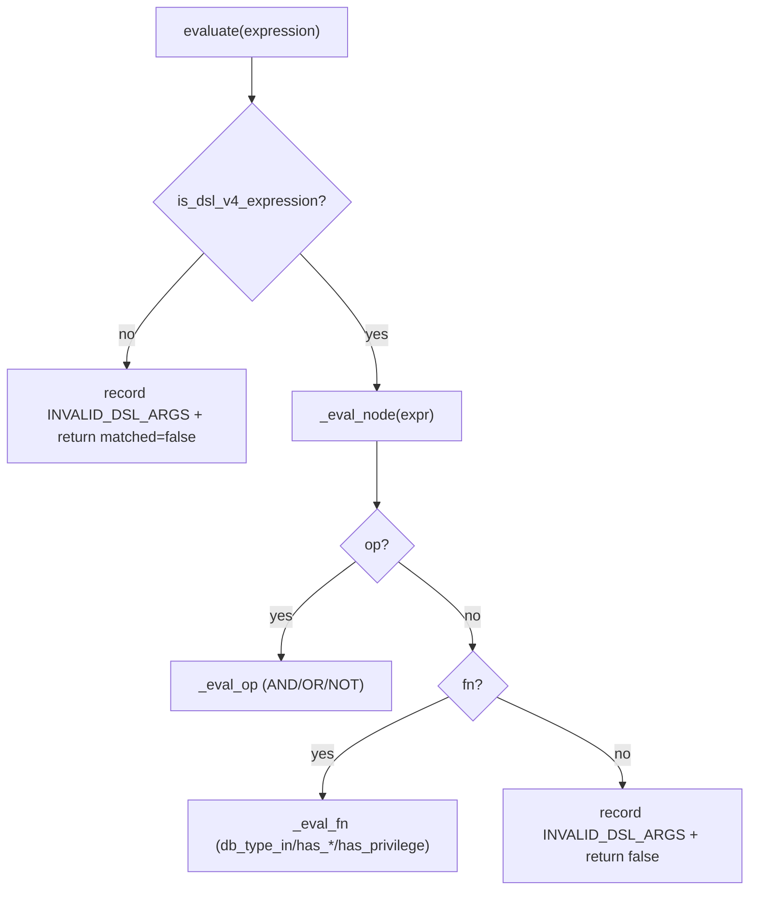
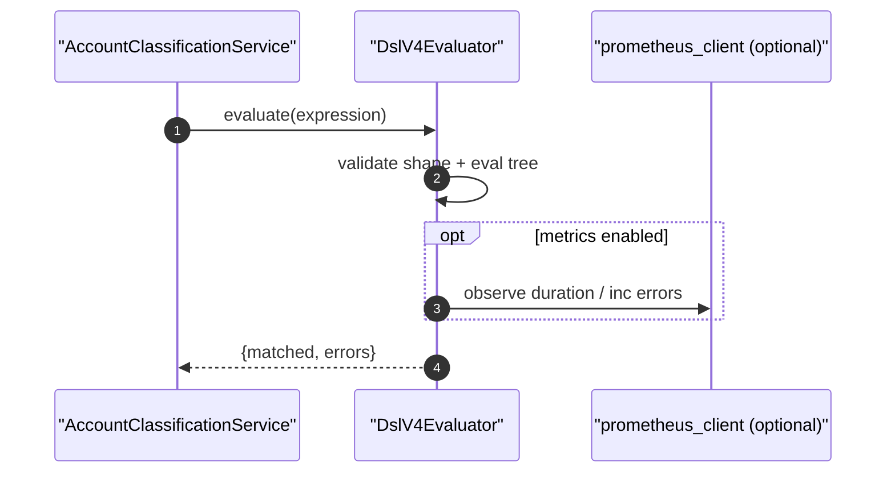

# Account Classification DSL v4(语义 + 校验 + 执行)

> [!note] 本文目标
> 明确 DSL v4 的表达式 shape、校验规则、以及 evaluator 的“失败即 False”(fail closed)语义；并把 scope/privilege 的匹配口径固化为决策表，避免口径漂移。

## 1. 概览(Overview)

DSL v4 用于对 `permission_facts` 执行规则匹配，表达式以 JSON 对象存储在 `ClassificationRule.rule_expression` 中。

最小 shape：

```json
{
  "version": 4,
  "expr": {
    "op": "AND",
    "args": [
      {"fn": "has_capability", "args": {"name": "GRANT_ADMIN"}},
      {"fn": "has_privilege", "args": {"name": "SELECT", "scope": "global"}}
    ]
  }
}
```

入口：
- shape 判定：`is_dsl_v4_expression(expression)`
- 结构校验：`collect_dsl_v4_validation_errors(expression) -> list[str]`
- 执行：`DslV4Evaluator(facts=permission_facts).evaluate(expression) -> {matched, errors}`

## 2. 依赖与边界(Dependencies)

| 类型 | 组件 | 用途 | 失败语义(摘要) |
| --- | --- | --- | --- |
| Caller | `AccountClassificationService._evaluate_rule()` | orchestrator 中执行评估 | 校验失败通常上抛 `ValidationError` |
| Data | `permission_facts` | evaluator 输入 facts | facts 缺失时由 orchestrator 抛 `AppError(CONFLICT)` |
| Metrics | `prometheus_client`(可选) | 记录耗时与错误计数 | 缺失时 no-op 降级 |
| Logs | `log_error` | 记录 evaluation error | 不影响 matched 结果 |

## 3. 事务与失败语义(Transaction + Failure Semantics)

- 本模块不触发 DB 事务。
- 评估语义：**fail closed** —— 未知函数/参数非法/shape 错误时，返回 `matched=False` 并记录 `errors[]`。

## 4. 主流程图(Flow)



## 5. 时序图(Sequence)



## 6. 决策表/规则表(Decision Table)

### 6.1 运算符(op)语义

| op | args 规则 | 语义 |
| --- | --- | --- |
| `NOT` | args 必须仅 1 个 | `not eval(args[0])` |
| `AND` | args 为 list | `all(eval(arg) for arg in args)`(短路) |
| `OR` | args 为 list | `any(eval(arg) for arg in args)`(短路) |

### 6.2 支持的函数(fn)

| fn | args | 输出 |
| --- | --- | --- |
| `db_type_in` | `{types:[str...]}` | facts.db_type 是否命中 |
| `is_superuser` | `{}` | `SUPERUSER` capability 是否存在 |
| `has_capability` | `{name:str}` | capability 是否存在 |
| `has_role` | `{name:str}` | role 是否存在 |
| `has_privilege` | `{name:str, scope:str, database?:str}` | 见 6.3 |

### 6.3 has_privilege(scope) 口径

> [!important] facts 来源
> privileges 数据来源于 [[Server/accounts-permissions-facts-builder|Facts Builder]] 的 `facts["privileges"]`，不同 db_type 的采集形态会被归一到 list/mapping。

| scope | 检查路径 | 说明 |
| --- | --- | --- |
| `global` | `privileges.global` | list[str] |
| `server` | `privileges.server` ∪ `privileges.system` | 两类合并后做 membership |
| `tablespace` | `privileges.tablespace` | mapping: database -> list[str] |
| `database` | `privileges.database` 或 `privileges.database_permissions` 或 `privileges.tablespace` | 三者任一命中即 True |

### 6.4 错误码(errors[])输出

| error_type | 触发条件(示例) |
| --- | --- |
| `INVALID_DSL_ARGS` | node 不是 dict / 缺 op/fn / args 类型错误 / scope 不支持 |
| `MISSING_DSL_ARGS` | fn 缺少必填字段(name/scope/types) |
| `UNKNOWN_DSL_FUNCTION` | fn 不在支持列表 |

## 7. 兼容/防御/回退/适配逻辑

| 位置(文件:行号) | 类型 | 描述 | 触发条件 | 清理条件/期限 |
| --- | --- | --- | --- | --- |
| `app/services/account_classification/dsl_v4.py:42` | 兼容/回退 | prometheus_client 不存在时 `_NoopMetric` 降级 | 运行环境未安装 prometheus_client | 若线上强依赖指标则固定依赖并移除 no-op |
| `app/services/account_classification/dsl_v4.py:202` | 防御 | facts 非 mapping 时回退为 `{}` | 上游传入 None/异常对象 | 上游强类型后删除兜底 |
| `app/services/account_classification/dsl_v4.py:254` | 防御 | `args = node.get("args", [])` 默认空数组 | args 缺失 | schema 强约束后收敛 |
| `app/services/account_classification/dsl_v4.py:265` | 防御/适配 | `all(...)`/`any(...)` 实现 AND/OR 短路(符合 Python 语义) | args 很长/存在昂贵子表达式 | 保留 |
| `app/services/account_classification/dsl_v4.py:281` | 防御 | `raw_args is None -> {}` | args 显式传 null | 写入侧规范化后删除 |
| `app/services/account_classification/dsl_v4.py:307` | 回退 | 未知 fn -> 记录 `UNKNOWN_DSL_FUNCTION` 并返回 False(fail closed) | expression 引入新函数 | 新增函数并补齐校验后移除该错误分支(或保留) |
| `app/services/account_classification/dsl_v4.py:371` | 防御 | `server_privs or []` 合并时兜底空集合 | privileges 字段为空/缺失 | facts schema 稳定后简化 |
| `app/services/account_classification/dsl_v4.py:304` | 防御 | metrics registry 冲突时 suppress(ValueError) | prometheus registry 冲突 | 明确指标注册位置后收敛 |

## 8. 可观测性(Logs + Metrics)

- Metrics(若 prometheus 可用)：
  - `account_classification_dsl_evaluation_duration_seconds{function}`
  - `account_classification_dsl_evaluation_errors_total{error_type}`
- Logs：
  - `dsl_v4_evaluation_error`(module=account_classification, error_type + context)

## 9. 测试与验证(Tests)

- `uv run pytest -m unit tests/unit/services/test_account_classification_dsl_v4.py`
- (编排守卫) `uv run pytest -m unit tests/unit/services/test_account_classification_orchestrator_dsl_guard.py`
