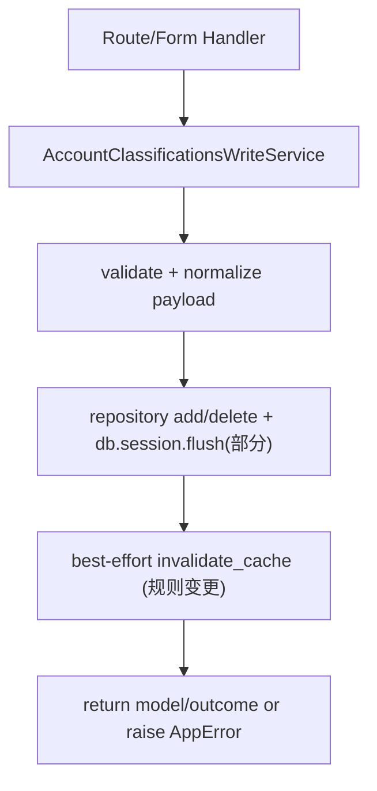
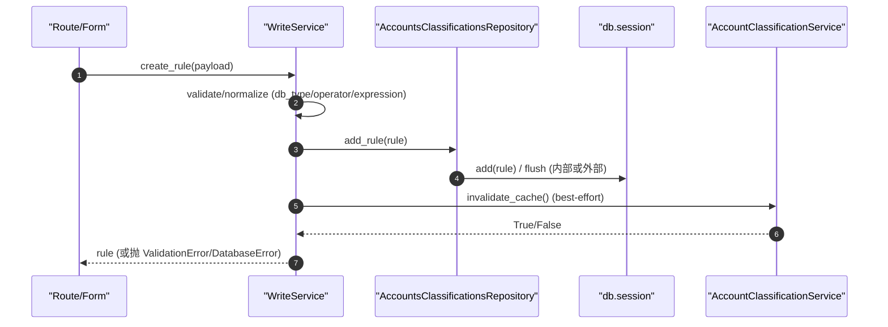

# Accounts Classifications Write Service(写入边界 + 校验/归一化)

> [!note] 本文目标
> 用“入口清单 + 校验/归一化决策表 + 写入边界”说明账户分类写服务的职责，并显式列出兜底/防御分支，便于后续收敛与删减。

## 1. 概览(Overview)

`AccountClassificationsWriteService` 负责账户分类相关写操作的编排与校验：
- 创建/更新分类(`AccountClassification`)
- 创建/更新/删除规则(`ClassificationRule`)
- 停用分配(`AccountClassificationAssignment`)

入口方法(主入口列表)：
- `create_classification(payload, operator_id=None)`
- `update_classification(classification, payload, operator_id=None)`
- `create_rule(payload, operator_id=None)`
- `update_rule(rule, payload, operator_id=None)`
- `delete_classification(classification, operator_id=None)`
- `delete_rule(rule, operator_id=None)`
- `deactivate_assignment(assignment, operator_id=None)`

持久化影响(摘要)：
- 写表：`account_classifications`、`account_classification_rules`、`account_classification_assignments`(以模型名为准)
- 额外行为：规则变更后会触发“最佳努力”的缓存失效(`AccountClassificationService.invalidate_cache()`)

## 2. 依赖与边界(Dependencies)

| 类型 | 组件 | 用途 | 失败语义(摘要) |
| --- | --- | --- | --- |
| Caller | `app/api/v1/namespaces/accounts_classifications.py` / form handlers | 路由/表单触发写操作 | route 层负责把异常转换为统一响应 |
| Repo | `AccountsClassificationsRepository` | add/delete/flush 的 DB 封装 | `SQLAlchemyError` -> `DatabaseError` |
| DB | `db.session` | `flush()` 与存在性检查 | 传播或包装为 `DatabaseError` |
| Validator | `as_str/as_int/as_bool/...` | 统一类型转换 | `ValidationError` |
| DSL | `is_dsl_v4_expression` + `collect_dsl_v4_validation_errors` | 校验规则表达式 | 不通过 -> `ValidationError(message_key=INVALID_DSL_EXPRESSION)` |
| Cache | `AccountClassificationService.invalidate_cache` | 规则变更后清缓存 | 失败仅记录日志(不阻断写入) |

## 3. 事务与失败语义(Transaction + Failure Semantics)

- **事务边界**：本 service 不 `commit`；删除操作会显式 `db.session.flush()`，其余由调用方(通常是路由层 `safe_route_call`)统一提交/回滚。
- **业务/校验失败**：抛出 `ValidationError` / `NotFoundError`。
- **数据库失败**：捕获 `SQLAlchemyError` 并抛 `DatabaseError`(带 `extra.exception` 等上下文)。
- **缓存失效失败**：写入成功优先，缓存失效失败仅记录日志，不抛异常(见 7 节)。

## 4. 主流程图(Flow)

## 5. 时序图(Sequence)

## 6. 决策表/规则表(Decision Table)

### 6.1 分类(Classification)校验与归一化

| 字段 | 规则 | 失败口径 |
| --- | --- | --- |
| `name` | 必填；更新时允许“缺省=沿用 resource.name” | `ValidationError("分类名称不能为空")` |
| `color` | 必须命中 `ThemeColors.is_valid_color()`；更新时默认 `resource.color` | `ValidationError("无效的颜色选择")` |
| `risk_level` / `icon_name` | 必须在 options 中 | `ValidationError("风险等级取值无效")` / `ValidationError("图标取值无效")` |
| `priority` | `as_int(..., default=resource.priority)` -> clamp 到 `[0, 100]` | `ValidationError("优先级必须为整数")` |
| name 唯一性 | `AccountClassification.name` 全局唯一(排除自身) | `ValidationError(..., message_key="NAME_EXISTS")` |

### 6.2 规则(Rule)校验与归一化

| 环节 | 规则 | 失败口径 |
| --- | --- | --- |
| 必填字段 | `rule_name/classification_id/db_type/operator` 必填 | `ValidationError("缺少必填字段: ...")` |
| classification_id | 必须存在 | `NotFoundError("选择的分类不存在")` |
| db_type | 先 `DatabaseType.normalize()` 再校验可选集合 | `ValidationError("数据库类型取值无效")` |
| operator | 必须在 `OPERATOR_OPTIONS` | `ValidationError("匹配逻辑取值无效")` |
| rule_expression | 归一化为稳定 JSON string(对象 + sort_keys) | 见 6.3 |
| 规则去重 | `(classification_id, db_type, rule_name)` 唯一；`rule_expression` 在分类内唯一 | `ValidationError(..., message_key="NAME_EXISTS"/"EXPRESSION_DUPLICATED")` |
| DSL v4 校验 | 若表达式为 DSL v4，则额外执行校验 | `ValidationError(message_key="INVALID_DSL_EXPRESSION")` |

### 6.3 rule_expression 归一化策略(稳定序列化)

| 输入 expression | fallback | 解析/校验 | 输出 |
| --- | --- | --- | --- |
| `None` 或空白字符串 | 更新时 fallback=`resource.rule_expression`；创建时 fallback=`{}` | `json.loads`(若为字符串)；必须为 dict | `json.dumps(..., ensure_ascii=False, sort_keys=True)` |
| 非 dict(JSON 解析后) | N/A | `raise ValidationError("规则表达式必须为对象")` | N/A |

## 7. 兼容/防御/回退/适配逻辑

| 位置(文件:行号) | 类型 | 描述 | 触发条件 | 清理条件/期限 |
| --- | --- | --- | --- | --- |
| `app/services/accounts/account_classifications_write_service.py:68` | 适配 | DI 兼容：`repository or AccountsClassificationsRepository()` | 未注入 repository | 若统一采用 DI 容器后可移除默认创建 |
| `app/services/accounts/account_classifications_write_service.py:77` | 防御 | `payload or {}`，兼容 `payload=None` | 调用方传 None | route 层统一保证 dict 后删除 |
| `app/services/accounts/account_classifications_write_service.py:323` | 兼容 | 更新时字段缺省回退到 `resource.<field>` | 部分更新 payload 缺字段 | 若改为强制 PUT 全量更新后删除 |
| `app/services/accounts/account_classifications_write_service.py:372` | 防御 | `missing = [...] if not payload.get(field)` 使用 truthy 判定缺失 | payload 字段为空值/0 | 引入显式 None 判定并补单测后替换 |
| `app/services/accounts/account_classifications_write_service.py:383` | 兼容 | `DatabaseType.normalize(x) if x else None` | db_type 为空/None | route 层统一校验后收敛 |
| `app/services/accounts/account_classifications_write_service.py:439` | 兼容 | expression 为 None/空串时回退 fallback | 表单未填/传空 | 表单层保证最小对象后删除 |
| `app/services/accounts/account_classifications_write_service.py:444` | 防御 | `json.loads` 失败时转 `ValidationError` | 非法 JSON 字符串 | 前端输入限制 + 单测覆盖后保留或删除 |
| `app/services/accounts/account_classifications_write_service.py:486` | 回退/防御 | 规则变更后清缓存失败仅记录日志，不阻断写入 | cache 连接失败/异常 | 缓存层可用性提升后改为强一致策略(或明确保留 best-effort) |
| `app/services/accounts/account_classifications_write_service.py:300` | 防御 | priority clamp 到 `[0,100]` | 上游传入过大/负值 | 若前端/表单层强约束后删掉 clamp |

## 8. 可观测性(Logs + Metrics)

- `log_info` 固定 `module="account_classification"` 或 `module="accounts_classifications"`，字段包含：
  - `classification_id` / `rule_id` / `assignment_id`
  - `operator_id`
- 缓存失效失败：`清除分类缓存失败`(不会中断写入)

## 9. 测试与验证(Tests)

- `uv run pytest -m unit tests/unit/services/test_account_classification_write_service.py`
- `uv run pytest -m unit tests/unit/services/test_classification_rule_write_service.py`
- (接口契约) `uv run pytest -m unit tests/unit/routes/test_api_v1_accounts_classifications_contract.py`
