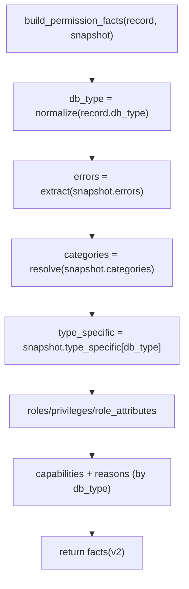

# Accounts Permissions Facts Builder(事实模型 + 规则表)

> [!note] 本文目标
> 把 `permission_snapshot(v4)` 转换为可查询/可判定规则的 `permission_facts(v2)`：明确 schema、兼容输入形态、以及 capability/role/privilege 的生成规则.

## 1. 概览

- 入口: `build_permission_facts(record, snapshot=None) -> dict`
- 输入:
  - `record`: 只依赖 `record.db_type`(通过 `getattr(record, "db_type", "")` 获取)
  - `snapshot`: `permission_snapshot`(推荐 v4)
- 输出(`permission_facts` v2): 供统计查询与规则匹配使用

### 输出 schema(摘要)

| 字段 | 说明 |
| --- | --- |
| `version` | 固定为 `2` |
| `db_type` | 归一化后的 db_type(小写字符串) |
| `capabilities` | 关键能力集合(如 `SUPERUSER`/`LOCKED`) |
| `capability_reasons` | capability -> reasons(可解释性) |
| `roles` | 角色集合(归一化后去重排序) |
| `privileges` | 结构化权限(按 global/server/system/database 等聚合) |
| `errors` | 事实构建阶段的错误码列表 |
| `meta` | `{source:"snapshot", snapshot_version:4}` |

## 2. 依赖与边界(Dependencies)

| 类型 | 组件 | 用途 | 失败语义(摘要) |
| --- | --- | --- | --- |
| Caller | `AccountPermissionManager` | 写入 `AccountPermission.permission_facts` | 上游决定是否吞掉构建失败 |
| Const | `DatabaseType` | db_type 分支 | 未命中 -> 返回空 roles/capabilities |
| IO | none | 纯计算(无 DB 写) | 尽量返回稳定结构, 不抛异常 |

## 3. 事务与失败语义(Transaction + Failure Semantics)

- 本模块不直接触发 DB 事务.
- 设计目标是“尽量不抛异常”: 通过大量类型守卫与兜底形态解析, 将不一致输入降级为 `errors[]` 或空结构.

## 4. 主流程图(Flow)

## 5. 决策表/规则表(Decision Tables)

### 5.1 snapshot 版本门禁

| 条件 | 行为 | errors |
| --- | --- | --- |
| `snapshot` 非 dict | categories 视为缺失 | `SNAPSHOT_MISSING` |
| `snapshot.version != 4` | categories 视为缺失 | `SNAPSHOT_MISSING` |
| `snapshot.categories` 非 dict | categories 视为缺失 | `SNAPSHOT_MISSING` |

### 5.2 privileges 输入兼容形态(重点)

> [!important] 兼容目标
> 同一字段允许多种历史/采集形态(列表/字典/映射), Facts Builder 负责把它们归一到 list[str].

| 输入 value 形态 | 例子 | 解析结果 |
| --- | --- | --- |
| list[str] | `["SELECT", "INSERT"]` | 原样过滤非字符串/空串 |
| dict{granted:list} | `{"granted":["SELECT"]}` | 使用 `granted` |
| dict{priv->bool} | `{"SELECT":true,"DROP":false}` | 取 enabled=true 的 key 列表 |

### 5.3 capabilities 生成(摘要)

| db_type | capability | 条件(示例) |
| --- | --- | --- |
| MySQL | `SUPERUSER` | `type_specific.super_priv is True` |
| MySQL | `LOCKED` | `type_specific.account_locked is True` |
| PostgreSQL | `SUPERUSER` | `role_attributes.rolsuper is True` 或 `role_attributes.can_super is True` |
| PostgreSQL | `LOCKED` | `role_attributes.can_login is False` 或 `valid_until` 过期 |
| SQL Server | `SUPERUSER` | `server_roles` 包含 `sysadmin` |
| SQL Server | `GRANT_ADMIN` | `server_roles` 包含 `securityadmin` 或 `server_permissions` 包含 `CONTROL SERVER` |
| SQL Server | `LOCKED` | `type_specific.connect_to_engine == "DENY"` 或 `type_specific.is_locked_out/is_password_expired/must_change_password is True` |
| Oracle | `SUPERUSER` | `oracle_roles` 包含 `DBA` |
| Oracle | `GRANT_ADMIN` | `oracle_roles` 包含 `DBA` 或 `system_privileges` 包含 `GRANT ANY PRIVILEGE` |
| Oracle | `LOCKED` | `type_specific.account_status` 非 `OPEN` |

## 6. 兼容/防御/回退/适配逻辑

| 位置(文件:行号) | 类型 | 描述 | 触发条件 | 清理条件/期限 |
| --- | --- | --- | --- | --- |
| `app/services/accounts_permissions/facts_builder.py:353` | 防御/兼容 | `str(getattr(record,"db_type","") or "").lower()` 允许 record 缺字段 | record 是 mock/异常对象 | record 类型收敛(强类型)后删除兜底 |
| `app/services/accounts_permissions/facts_builder.py:125` | 兼容 | `snapshot.get("errors") or []` 兼容 errors 缺失/为 None | snapshot.errors 为空或缺失 | snapshot schema 固定后删除 |
| `app/services/accounts_permissions/facts_builder.py:101` | 防御 | `(value or "").strip()` 兼容空字符串/None 的时间字段 | `valid_until` 为 None/空串 | 上游总是写入 ISO 字符串后删除 |
| `app/services/accounts_permissions/facts_builder.py:34` | 防御 | `_ensure_str_list()` 对非 list 输入返回空列表 | snapshot 字段形态异常 | 上游归一化后删除 |
| `app/services/accounts_permissions/facts_builder.py:147` | 兼容 | `list[dict]|list[str]` 两种 predefined_roles 形态兼容(`or` 兜底) | PostgreSQL roles 采集形态不同 | 采集层统一 schema 后删除兜底 |

## 7. 可观测性(Logs + Metrics)

- 本模块不直接打日志；由上游 service 在写入 facts 失败时记录 `message_key`/`error_type`/`snapshot.version`.
- 建议上游把 `facts.errors` 与 `capability_reasons` 作为 debug payload(避免写入高基数字段).

## 8. 测试与验证(Tests)

- `uv run pytest -m unit tests/unit/services/test_account_permission_manager.py`
