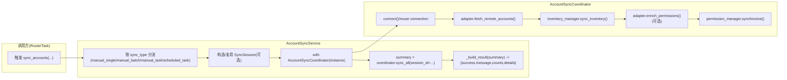
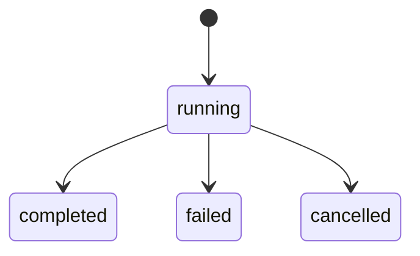
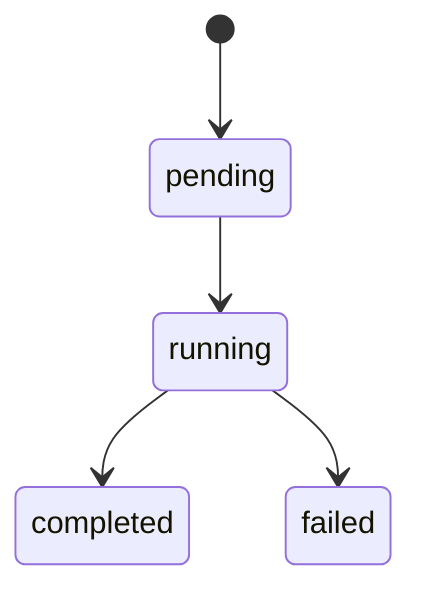

# Accounts Sync 总览(编排 + 状态机)

> [!note] 本文目标
> 用 1 张流程图说明账户同步的“两阶段”(Inventory + Collection)主链路, 并明确会话/实例记录的状态机与失败语义, 作为 Accounts Sync 域的入口文档.

## 1. 概览

Accounts Sync 负责把远端数据库的账户清单与权限快照同步到本地表, 支持“单实例同步(无会话)”与“批量/任务同步(有会话)”两类入口.

- 统一入口: `AccountSyncService.sync_accounts(instance, sync_type, session_id=None, created_by=None)`
- 两阶段编排: `AccountSyncCoordinator.sync_all(session_id=...)`
  - Inventory: `AccountInventoryManager.sync_inventory(...)` -> 维护 `InstanceAccount`
  - Collection: `AccountPermissionManager.synchronize(...)` -> 维护 `AccountPermission` + `AccountChangeLog`
- 会话与记录(批量/任务同步):
  - `SyncSession` -> `sync_sessions`
  - `SyncInstanceRecord` -> `sync_instance_records`

## 2. 依赖与边界(Dependencies)

| 类型 | 组件 | 用途 | 失败语义(摘要) |
| --- | --- | --- | --- |
| Caller | `AccountsSyncActionsService` / `app/tasks/accounts_sync_tasks.py` | 路由触发/后台批量触发 | 路由侧决定 200/4xx；任务侧更新会话/记录状态 |
| Orchestrator | `AccountSyncService` | 统一入口 + 结果封装 | 捕获异常并返回 `success=false`(不抛出) |
| Orchestrator | `AccountSyncCoordinator` | 连接管理 + 两阶段编排 | 连接失败会 `raise RuntimeError` |
| Adapter | `get_account_adapter()` + `BaseAccountAdapter` | 拉取并归一化远端账户结构 | 不支持 db_type -> `raise ValueError` |
| Manager | `AccountInventoryManager` | 维护 `InstanceAccount` 活跃/禁用 | DB 写失败 -> 传播异常 |
| Manager | `AccountPermissionManager` | 维护权限快照/差异日志 | 权限阶段失败 -> `raise PermissionSyncError` |
| DB | SQLAlchemy + `db.session` | 持久化 | route/task 层决定 commit/rollback；部分服务内部使用 `begin_nested()` |

## 3. 事务与失败语义(Transaction + Failure Semantics)

- `AccountSyncService.sync_accounts()`:
  - 失败: 捕获 `ACCOUNT_SYNC_EXCEPTIONS` 并返回 `{"success": False, ...}`.
  - 成功: 返回 `{"success": True, "details": summary, ...}`.
- `AccountSyncCoordinator`:
  - `__enter__()` 连接未建立时抛 `RuntimeError`(不吞异常).
  - `connect()` 一旦记录 `_connection_failed=True`, 后续直接返回 False(避免反复重试).
- 批量/任务同步(`app/tasks/accounts_sync_tasks.py`):
  - 以 `SyncSession/SyncInstanceRecord` 记录每实例的成功/失败与错误摘要(任务级别不返回 dict).

## 4. 主流程图(Flow)

## 5. 状态机(Session / Record)

### 5.1 SyncSession

### 5.2 SyncInstanceRecord

## 6. 决策表: sync_type 分流

| sync_type | session_id | 行为 | 备注 |
| --- | --- | --- | --- |
| `manual_single` | N/A | 单实例同步(不创建会话) | 直接返回 dict 结果 |
| `manual_batch`/`manual_task`/`scheduled_task` | 有 | 复用既有会话 | `session_id` 由路由/启动接口提供 |
| `manual_batch`/`manual_task`/`scheduled_task` | 无 | 创建新会话并写入记录 | 需要 `created_by` |
| 其他 | 任意 | 回退为 `manual_single` | 见 7 节 |

## 7. 兼容/防御/回退/适配逻辑

| 位置(文件:行号) | 类型 | 描述 | 触发条件 | 清理条件/期限 |
| --- | --- | --- | --- | --- |
| `app/services/accounts_sync/accounts_sync_service.py:139` | 防御/回退 | 未知 `sync_type` 时回退到单实例同步 | 上游传入未识别的 `sync_type` | 路由/任务层统一校验并加单测后, 改为 `raise ValidationError` |
| `app/services/accounts_sync/accounts_sync_service.py:306` | 防御 | `result.get("message") or "同步失败"` 补齐错误摘要 | 下游返回 dict 缺少 message | 下游结果结构稳定后删除兜底 |
| `app/services/accounts_sync/coordinator.py:98` | 防御 | `self._connection_error or "数据库连接未建立"` 补齐错误信息 | 连接失败但未写入 error | `connect()` 保证写入 error 后删除 |
| `app/services/accounts_sync/coordinator.py:266` | 防御 | `fetch_remote_accounts(...) or []` 避免 None 传播 | adapter 返回 None(违反约定) | adapter 严格返回 list 并加单测后删除 |

## 8. 可观测性(Logs + Metrics)

- 统一字段: `module="accounts_sync"`, `operation="sync_accounts"`, `instance_id`, `db_type`, `session_id`(如有).
- Service 侧事件:
  - `开始账户同步`(phase=start)
  - `同步过程发生异常`(phase=error, error_type/error)
- Coordinator 侧事件:
  - `accounts_sync_connection_*`(reuse/success/failed/exception)

## 9. 测试与验证(Tests)

- 单元测试(关键链路):
  - `uv run pytest -m unit tests/unit/routes/test_api_v1_accounts_sync_contract.py`
  - `uv run pytest -m unit tests/unit/services/test_account_permission_manager.py`
  - `uv run pytest -m unit tests/unit/services/test_sqlserver_adapter_permissions.py`
