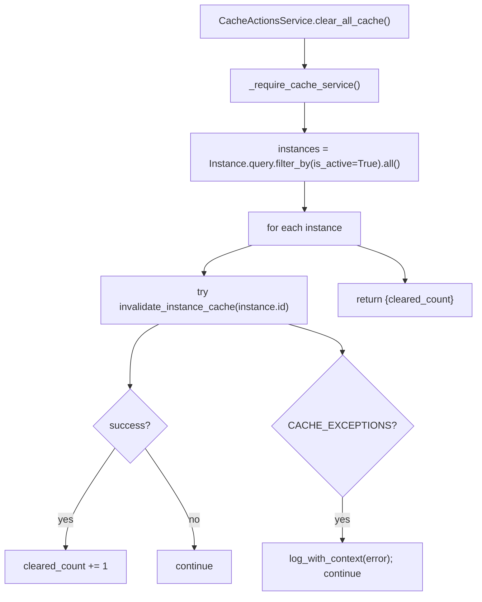
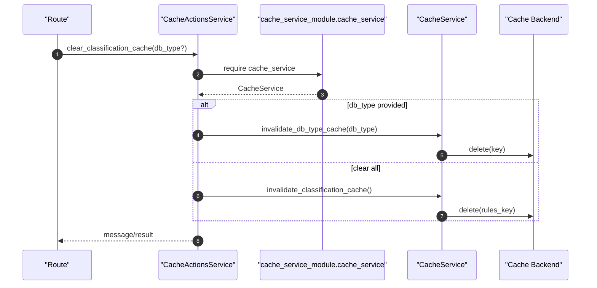

# Cache Services(缓存服务/清理动作)

> [!note] 本文目标
> 覆盖缓存域的两层实现：
> - `CacheService`：对 Flask-Caching 的薄封装（key 生成、TTL、序列化、容错）
> - `CacheActionsService`：面向 route 的动作编排（校验/查询实例/批量清理/分类缓存统计）
>
> 重点：缓存链路存在大量“吞异常继续/直接返回 True”的降级逻辑，必须显式文档化，避免调用方误以为 cache 一定被清理。

## 1. 概览(Overview)

覆盖文件：

- `app/services/cache_service.py`
- `app/services/cache/cache_actions_service.py`

典型入口：

- `init_cache_service(cache)`（初始化全局 `cache_service`）`app/services/cache_service.py:504`
- `CacheActionsService.clear_all_cache()`（清理所有活跃实例缓存）`app/services/cache/cache_actions_service.py:132`
- `CacheService.get_rule_evaluation_cache/set_rule_evaluation_cache`（规则评估缓存）
- `CacheService.get_classification_rules_by_db_type_cache`（分类规则按 db_type 缓存，含旧格式兼容）

## 2. 依赖与边界(Dependencies)

| 类型 | 组件 | 用途 | 失败语义(摘要) |
| --- | --- | --- | --- |
| Cache | `flask_caching.Cache` | 实际缓存后端（Redis/Memory 等） | 未初始化 -> 多数方法返回 None/False/True（见 7） |
| Global | `cache_service_module.cache_service` | CacheService 全局实例 | 未初始化 -> `CacheActionsService` 抛 `SystemError` |
| DB | `Instance.query` | 批量清缓存时枚举活跃实例 | 实例不存在 -> `NotFoundError` |
| JSON | `json.loads` | 缓存值兼容 str / object | 解析失败 -> warning + 返回 None |

## 3. 事务与失败语义(Transaction + Failure Semantics)

- 缓存链路不涉及 DB 事务（除 `CacheActionsService` 查询 `Instance`）。
- **显式降级**：
  - `CacheService.invalidate_user_cache/invalidate_instance_cache`：因为 Flask-Caching 不支持模式匹配，目前实现为“记录日志并直接返回 True”。`app/services/cache_service.py:91`、`app/services/cache_service.py:107`
  - `CacheActionsService.clear_all_cache`：逐实例清理，单实例失败吞并并继续。`app/services/cache/cache_actions_service.py:139`

## 4. 主流程图(Flow)

## 5. 时序图(Sequence)

## 6. 决策表/规则表(Decision Table)

### 6.1 分类规则缓存格式兼容（新/旧）

| cached_data 解析后 | 判定 | 返回 |
| --- | --- | --- |
| `dict` 且包含 `rules` | 新格式 | `data["rules"]` |
| `list` | 旧格式（兼容） | `data` |
| 其他 | 格式错误 | warning + 返回 None |

实现位置：`app/services/cache_service.py:360`。

### 6.2 cache_service 是否就绪

| 条件 | CacheActionsService 行为 |
| --- | --- |
| `cache_service is None` | `SystemError("缓存服务未初始化")` |
| 已初始化 | 继续执行动作 |

实现位置：`app/services/cache/cache_actions_service.py:75`。

## 7. 兼容/防御/回退/适配逻辑

| 位置(文件:行号) | 类型 | 描述 | 触发条件 | 清理条件/期限 |
| --- | --- | --- | --- | --- |
| `app/services/cache_service.py:41` | 防御 | `cache: Cache | None = None` 支持延后注入 | 初始化顺序不确定 | 若统一在 app init 阶段注入，可收敛为必填 |
| `app/services/cache_service.py:85` | 防御 | `_generate_cache_key`：`db_name` 为空时不拼接 | db_name 可选 | 若希望区分空字符串/None，需规范化输入 |
| `app/services/cache_service.py:91` | 回退 | `invalidate_user_cache`：由于不支持模式匹配，直接返回 True | 需要按用户清理 | 若切换到支持 scan 的后端/自建索引，可实现真实删除 |
| `app/services/cache_service.py:107` | 回退 | `invalidate_instance_cache` 同上 | 需要按实例清理 | 同上 |
| `app/services/cache_service.py:133` | 防御 | 未配置 cache -> `status=no_cache` | `self.cache is None` | 若 cache 为必选能力，可改为硬失败并提示配置 |
| `app/services/cache_service.py:164` | 兼容 | `json.loads(cached_data) if isinstance(str) else cached_data` | 历史缓存值存为 str | 统一存储格式后可移除 str 分支 |
| `app/services/cache_service.py:214` | 防御 | `ttl = ttl or self.rule_evaluation_ttl` | 未传 ttl | 若希望区分 ttl=0，需显式校验 |
| `app/services/cache_service.py:364` | 兼容 | “旧格式 list” 分类规则缓存兼容 | 历史数据仍为 list | 清空历史缓存后可移除旧格式分支 |
| `app/services/cache/cache_actions_service.py:162` | 防御 | `db_type_raw = (db_type or '').strip()` 兜底 | db_type 为空 | 若 route 强约束必填/枚举，可简化 |
| `app/services/cache/cache_actions_service.py:139` | 回退 | clear_all_cache：单实例清理失败吞并继续 | cache 后端波动 | 若需要强一致，改为失败即中断并返回错误列表 |

## 8. 可观测性(Logs + Metrics)

- CacheService：`database_filter_config_loaded` 不在此域；本域关键是 `logger.warning("...缓存失败")`（吞异常点）
- CacheActionsService：`log_with_context(... action=clear_all_cache/get_classification_cache_stats ...)` `app/services/cache/cache_actions_service.py:142`

## 9. 测试与验证(Tests)

最小验证命令：

- `uv run pytest -m unit tests/unit/routes/test_api_v1_cache_contract.py`
- `uv run pytest -m unit tests/unit/routes/test_api_v1_health_extended_contract.py`

关键用例：

- 未初始化 cache_service：路由返回 SystemError
- 分类规则缓存：旧格式 list 仍可读取
- clear_all_cache：单实例异常不会阻断整体返回

