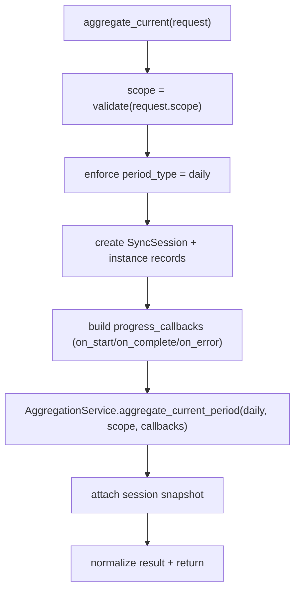
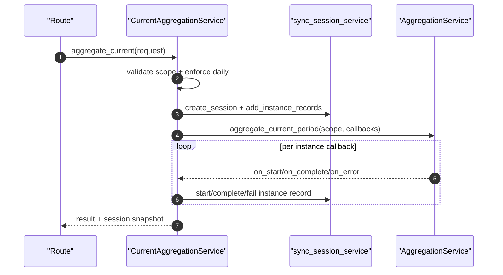

# Capacity Current Aggregation Service(手动触发 + 会话/记录写入)

> [!note] 本文目标
> 说明“手动触发当前周期聚合”的服务边界：强制周期策略、scope 校验、SyncSession/SyncInstanceRecord 写入口径、以及异常/缺失结果的兜底处理。

## 1. 概览(Overview)

`CurrentAggregationService.aggregate_current(request)` 用于从路由层手动触发“当前周期聚合”，并把执行过程写入同步会话表用于 UI 展示。

- 强制周期：仅执行 `daily`(即使请求传 `requested_period_type`)。
- scope：`instance/database/all` 三选一。
- 执行器：复用 [[Server/aggregation-pipeline|Aggregation Pipeline]] 的 `AggregationService.aggregate_current_period(...)`。

持久化影响(摘要)：
- 写表：`sync_sessions`、`sync_instance_records`(状态/统计/sync_details)
- 读取：`instances(is_active=True)`；可选读取会话快照

## 2. 依赖与边界(Dependencies)

| 类型 | 组件 | 用途 | 失败语义(摘要) |
| --- | --- | --- | --- |
| Caller | capacity 聚合路由 | 触发手动聚合 | route 层负责 response |
| Aggregator | `AggregationService.aggregate_current_period` | 执行 database/instance runner | 抛异常时本 service 兜底写失败记录后再上抛 |
| Session | `sync_session_service` | create session + add/start/complete/fail records | DB 异常传播 |
| Auth | `current_user` | 写入 created_by | 未登录 -> None |
| Time | `time_utils.to_china/now` | 生成 period_start/end | to_china 失败回退 now |

## 3. 事务与失败语义(Transaction + Failure Semantics)

- 会话创建：先 `create_session()`，再 `begin_nested()` 写入 `total_instances` 并 `flush()`。`app/services/capacity/current_aggregation_service.py:136`
- 聚合执行异常：
  - 捕获 `Exception` 后，对未 finalized 的 instance record 统一标记失败，并把 session 标记为 failed；随后重新抛出异常。`app/services/capacity/current_aggregation_service.py:115`
- 结果缺失兜底：
  - 进度回调未覆盖到的 record，会被补写为失败(`聚合结果缺失`)。`app/services/capacity/current_aggregation_service.py:274`

## 4. 主流程图(Flow)

## 5. 时序图(Sequence)

## 6. 决策表/规则表(Decision Table)

### 6.1 scope 校验

| scope | 允许 | 说明 |
| --- | --- | --- |
| `instance`/`database`/`all` | ✅ | 合法 |
| 其他 | ❌ | `ValidationError("scope 参数仅支持 ...")` |

### 6.2 requested_period_type 处理

| requested_period_type | effective_period_type | 行为 |
| --- | --- | --- |
| `daily` | `daily` | 正常执行 |
| 非 `daily` | `daily` | 记录日志并强制替换 |

## 7. 兼容/防御/回退/适配逻辑

| 位置(文件:行号) | 类型 | 描述 | 触发条件 | 清理条件/期限 |
| --- | --- | --- | --- | --- |
| `app/services/capacity/current_aggregation_service.py:88` | 防御 | `(request.scope or 'all').lower()` | scope 为空/None | route 层强校验后删 |
| `app/services/capacity/current_aggregation_service.py:90` | 防御/回退 | `(request.requested_period_type or 'daily')` + 强制替换为 daily | 用户请求非 daily | 产品允许多周期手动触发时移除强制策略 |
| `app/services/capacity/current_aggregation_service.py:101` | 适配/回退 | `to_china(...) or now()` 兼容时区转换失败 | to_china 返回 None | time_utils 稳定后简化 |
| `app/services/capacity/current_aggregation_service.py:40` | 防御 | `result.get('status') or 'completed'` 兜底异步结果缺 status | 下游不返回 status | 下游 schema 固化后删 |
| `app/services/capacity/current_aggregation_service.py:42` | 防御 | `result.get('message') or ...` 兜底错误摘要 | message 缺失 | 下游稳定后删 |
| `app/services/capacity/current_aggregation_service.py:215` | 防御 | `payload.get('status') or FAILED` | callback payload 缺 status | payload schema 固化后删 |
| `app/services/capacity/current_aggregation_service.py:216` | 防御 | `int(payload.get('processed_records') or 0)` | processed_records 缺失/空 | 保留 |
| `app/services/capacity/current_aggregation_service.py:226` | 防御 | `payload.get('message') or '聚合失败'` | message 缺失 | 保留 |
| `app/services/capacity/current_aggregation_service.py:274` | 回退 | 未被回调 finalize 的 record 兜底标记为失败 | 回调丢失/异常提前退出 | callback 可靠性增强后可删 |

## 8. 可观测性(Logs + Metrics)

- `手动聚合请求的周期已被强制替换为日周期`：记录 requested/enforced。
- 其余聚合进度主要通过 SyncSession/SyncInstanceRecord 的 `sync_details` 体现(由 UI 展示)。

## 9. 测试与验证(Tests)

- (接口契约) `uv run pytest -m unit tests/unit/routes/test_api_v1_capacity_aggregations_contract.py`
