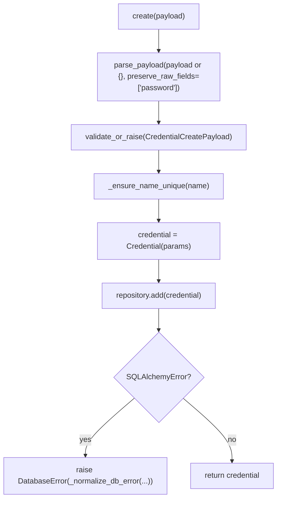
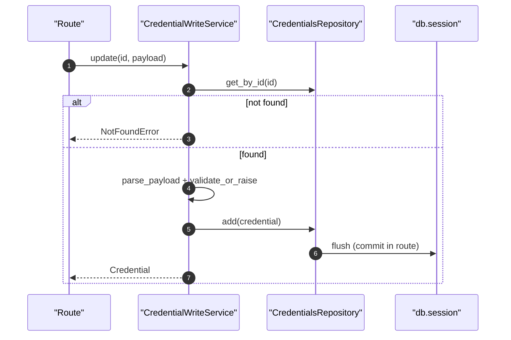

# Credential Write Service(凭据写操作/错误归一化)

> [!note] 本文目标
> 说明凭据的 create/update/delete 编排，以及 `DatabaseError` 文案归一化策略（通过匹配底层 DB 的错误字符串做兼容）。

## 1. 概览(Overview)

入口：

- `CredentialWriteService.create(payload)`（`app/services/credentials/credential_write_service.py:46`）
- `CredentialWriteService.update(credential_id, payload)`（`app/services/credentials/credential_write_service.py:75`）
- `CredentialWriteService.delete(credential_id)`（`app/services/credentials/credential_write_service.py:106`）

特点：

- `parse_payload(... preserve_raw_fields=["password"])`：保留原始密码字段（避免清洗导致密码丢失）。
- 不 commit；delete 会显式 `flush()`。`app/services/credentials/credential_write_service.py:117`

## 2. 依赖与边界(Dependencies)

| 类型 | 组件 | 用途 | 失败语义(摘要) |
| --- | --- | --- | --- |
| Repo | `CredentialsRepository` | add/get/delete | 不存在 -> NotFoundError |
| Payload | `parse_payload` + `validate_or_raise` | 归一化 + 校验 | 校验失败 -> ValidationError |
| Errors | `_normalize_db_error` | DB 异常信息归一化 | 匹配失败 -> 通用提示 |

## 3. 事务与失败语义(Transaction + Failure Semantics)

- create/update：SQLAlchemyError -> 抛 `DatabaseError`（message 经 `_normalize_db_error`）。`app/services/credentials/credential_write_service.py:69`
- delete：repository.delete + `db.session.flush()`；异常 -> `DatabaseError`。`app/services/credentials/credential_write_service.py:115`

## 4. 主流程图(Flow)

## 5. 时序图(Sequence)

## 6. 决策表/规则表(Decision Table)

### 6.1 DB 错误文案归一化（兼容不同数据库）

| error message 包含 | 归一化输出 | 目的 |
| --- | --- | --- |
| `unique constraint failed` / `duplicate key value` | `凭据名称已存在,请使用其他名称` | 兼容 SQLite/PostgreSQL 的唯一键文案 |
| `not null constraint failed` | `必填字段不能为空` | 兼容 NOT NULL 约束文案 |
| 其他 | `<action>失败,请稍后重试` | 通用兜底 |

实现位置：`app/services/credentials/credential_write_service.py:139`。

## 7. 兼容/防御/回退/适配逻辑

| 位置(文件:行号) | 类型 | 描述 | 触发条件 | 清理条件/期限 |
| --- | --- | --- | --- | --- |
| `app/services/credentials/credential_write_service.py:48` | 防御 | `payload or {}` 兜底 | route 传 None | 若 route 强约束 payload 非空，可简化 |
| `app/services/credentials/credential_write_service.py:50` | 兼容 | `preserve_raw_fields=['password']` 保留密码原值 | 密码包含特殊字符/空格 | 若统一采用单独密码字段 API，可调整策略 |
| `app/services/credentials/credential_write_service.py:90` | 防御 | update：仅当字段在 `model_fields_set` 中出现才写入 | PATCH/部分更新 | 若前端总传全量字段，可简化 |
| `app/services/credentials/credential_write_service.py:142` | 兼容 | 通过 substring 匹配 DB 错误字符串归一化文案 | 不同 DB/驱动文案差异 | 若引入结构化 DB error code，可替换该逻辑 |

## 8. 可观测性(Logs + Metrics)

- create/update/delete 成功：`log_info`（module=`credentials`）`app/services/credentials/credential_write_service.py:149`
- 失败：由上层捕获 `DatabaseError` 记录（建议 route 层记录 `exception` 字段）

## 9. 测试与验证(Tests)

最小验证命令：

- `uv run pytest -m unit tests/unit/routes/test_api_v1_credentials_contract.py`

关键用例：

- 重名：ValidationError/DatabaseError 文案符合归一化规则
- update：password 为空不覆盖；password 有值才 set_password
