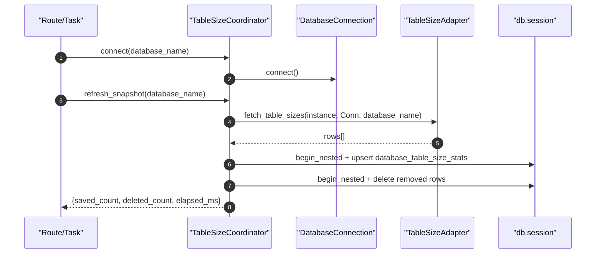

# Database Sync Table Sizes(表容量快照采集)

> [!note] 本文目标
> 说明 `TableSizeCoordinator + table_size_adapters/*` 这条“按库采集表容量并刷新本地快照”的独立链路：连接策略、字段 schema、upsert + cleanup 语义，以及 Oracle 侧多视图降级与权限兜底。

## 1. 概览(Overview)

表容量链路的职责是：**针对某个实例的某个 database(或 tablespace)**，采集该库下各表的容量并写入本地 `database_table_size_stats`，且仅保留最新快照（通过 cleanup 删除已消失的表）。

入口：

- `TableSizeCoordinator.refresh_snapshot(database_name)`（`app/services/database_sync/table_size_coordinator.py:137`）

输出：

- `TableSizeRefreshOutcome(saved_count, deleted_count, elapsed_ms)`（`app/services/database_sync/table_size_coordinator.py:45`）

写入表：

- `database_table_size_stats`（模型：`app/models/database_table_size_stat.py`，本链路只关注字段一致性）

## 2. 依赖与边界(Dependencies)

| 类型 | 组件 | 用途 | 失败语义(摘要) |
| --- | --- | --- | --- |
| Orchestrator | `TableSizeCoordinator` | 连接、采集、upsert、cleanup | 连接未建立 -> `RuntimeError` |
| Adapter | `BaseTableSizeAdapter` | 各 DB 的表容量 SQL | 适配器可抛 `ValueError`（例如 DB 不存在） |
| Remote | `ConnectionFactory` / `PostgreSQLConnection` / `SQLServerConnection` | 远端连接 | connect() 失败 -> coordinator 返回 False |
| DB(本地) | `pg_insert/sqlite_insert` + `on_conflict_do_update` | upsert 最新快照 | SQLAlchemyError -> 抛（硬失败） |

## 3. 事务与失败语义(Transaction + Failure Semantics)

- `refresh_snapshot()` 不做 commit，仅做：
  - upsert：`db.session.begin_nested()` + `flush()`（`app/services/database_sync/table_size_coordinator.py:212`）
  - cleanup：`db.session.begin_nested()` + `delete()`（`app/services/database_sync/table_size_coordinator.py:266`）
- 连接未建立直接抛 `RuntimeError`（该 coordinator 不负责重连）。`app/services/database_sync/table_size_coordinator.py:171`。
- cleanup 的语义是“以本次 records 集合作为真值集合”：本次未出现的 (schema,table) 会被删除。`app/services/database_sync/table_size_coordinator.py:254`。

## 4. 主流程图(Flow)

```mermaid
flowchart TB
    A["TableSizeCoordinator.connect(database_name)"] --> B{db_type in (pg,sqlserver)?}
    B -- yes --> C["create scoped connection(database_name)"]
    B -- no --> D["ConnectionFactory.create_connection(instance)"]
    C --> E["connection.connect()"]
    D --> E
    E --> F["refresh_snapshot(database_name)"]
    F --> G["adapter.fetch_table_sizes(instance, connection, database_name)"]
    G --> H["records = normalize rows + coerce size_mb"]
    H --> I["upsert(records) on (instance_id,database_name,schema_name,table_name)"]
    I --> J["cleanup rows not in records"]
    J --> K["return TableSizeRefreshOutcome(saved, deleted, elapsed_ms)"]
```

## 5. 时序图(Sequence)



## 6. 决策表/规则表(Decision Table)

### 6.1 连接策略：哪些 db_type 需要“按库连接”

| db_type | connect(database_name) 是否必须把 database_name 放进 DSN | 说明 |
| --- | --- | --- |
| PostgreSQL | 是 | 表容量 SQL 依赖当前连接库，adapter 内 `del database_name` |
| SQL Server | 是 | 同上 |
| MySQL | 否 | 复用实例连接，SQL 用 `WHERE TABLE_SCHEMA = %s` |
| Oracle | 否 | 复用实例连接，database_name 视为 tablespace |

实现位置：`app/services/database_sync/table_size_coordinator.py:155`、`app/services/database_sync/table_size_adapters/postgresql_adapter.py:30`、`app/services/database_sync/table_size_adapters/sqlserver_adapter.py:30`。

### 6.2 Oracle：表段视图降级策略(适配/回退)

| 优先级 | 视图 | 失败原因 | 后续动作 |
| --- | --- | --- | --- |
| 1 | `dba_segments` | ORA-00942/ORA-01031 | 记录 info，尝试下一项 |
| 2 | `sys.dba_segments` | ORA-00942/ORA-01031 | 记录 info，尝试 `user_segments` |
| 3 | `user_segments` | 权限不足/视图缺失 | 抛 `ValueError` 提示授予权限 |

实现位置：`app/services/database_sync/table_size_adapters/oracle_adapter.py:150`、`app/services/database_sync/table_size_adapters/oracle_adapter.py:186`。

## 7. 兼容/防御/回退/适配逻辑

| 位置(文件:行号) | 类型 | 描述 | 触发条件 | 清理条件/期限 |
| --- | --- | --- | --- | --- |
| `app/services/database_sync/table_size_coordinator.py:80` | 兼容 | `DatabaseType.normalize(db_type or '')` 兜底 | db_type 为空/大小写不一 | 统一数据层 db_type 后可收敛 |
| `app/services/database_sync/table_size_coordinator.py:101` | 适配 | PG/SQLServer 使用“按库连接”的 _InstanceConnectionTarget 伪 Instance | 连接类需要 database_name 字段 | 若连接工厂支持 scope 参数，可移除伪对象 |
| `app/services/database_sync/table_size_coordinator.py:229` | 兼容 | 根据本地 DB dialect 选择 `sqlite_insert` vs `pg_insert` | 单测/开发环境可能用 sqlite | 若统一为 PostgreSQL，可移除 sqlite 分支 |
| `app/services/database_sync/table_size_coordinator.py:187` | 防御 | `schema_name/table_name = item.get(...) or ''` 并跳过空字段 | adapter 返回不完整行 | 统一 adapter schema + 单测覆盖后可改为硬失败 |
| `app/services/database_sync/table_size_coordinator.py:198` | 防御 | `size_mb` 使用 `_safe_to_int(...) or 0` | size 为空/非数值 | 若要区分未知/0，改为 None 并调整展示层 |
| `app/services/database_sync/table_size_coordinator.py:271` | 防御 | `int(deleted_count or 0)` 兜底 | delete 返回 None | 若 ORM 总返回 int，可简化 |
| `app/services/database_sync/table_size_adapters/mysql_adapter.py:34` | 防御 | schema 不存在直接 `ValueError` | database_name 错误/权限不足 | 若上层需区分“不存在/无权限”，细化错误码 |
| `app/services/database_sync/table_size_adapters/postgresql_adapter.py:30` | 适配 | PG adapter 忽略 database_name（依赖连接已选库） | coordinator 已 scoped connect | 若未来改为 query 内过滤，可移除 `del database_name` |
| `app/services/database_sync/table_size_adapters/sqlserver_adapter.py:30` | 适配 | SQLServer adapter 同上 | 同上 | 同上 |
| `app/services/database_sync/table_size_adapters/oracle_adapter.py:29` | 回退 | ORA-00942/ORA-01031 视为“缺视图或权限”并降级 | 账号权限不足/视图缺失 | 若统一授予权限，删除降级与提示逻辑 |
| `app/services/database_sync/table_size_adapters/oracle_adapter.py:89` | 兼容 | current schema 查询失败时 fallback 到 credential.username | `SYS_CONTEXT` 无法访问/异常 | 统一连接层提供 current_schema 后可收敛 |

## 8. 可观测性(Logs + Metrics)

- upsert：`table_size_upsert_failed`（异常时）`app/services/database_sync/table_size_coordinator.py:217`
- cleanup：`table_size_cleanup_failed` `app/services/database_sync/table_size_coordinator.py:271`
- Oracle：`oracle_segments_query_fallback` / `oracle_tablespace_check_fallback`（降级路径）`app/services/database_sync/table_size_adapters/oracle_adapter.py:55`、`app/services/database_sync/table_size_adapters/oracle_adapter.py:156`

## 9. 测试与验证(Tests)

最小验证命令：

- `uv run pytest -m unit tests/unit/services/test_oracle_table_size_adapter.py`
- `uv run pytest -m unit tests/unit/routes/test_api_v1_instances_contract.py`

关键用例：

- Oracle：缺少 dba_segments 权限时可降级到 user_segments；仍不可用时给出明确 `ValueError` 文案
- upsert + cleanup：第二次刷新减少表集合时，历史表行被删除（notin keys）
- sqlite 方言：本地/单测环境仍可 upsert（dialect switch）
