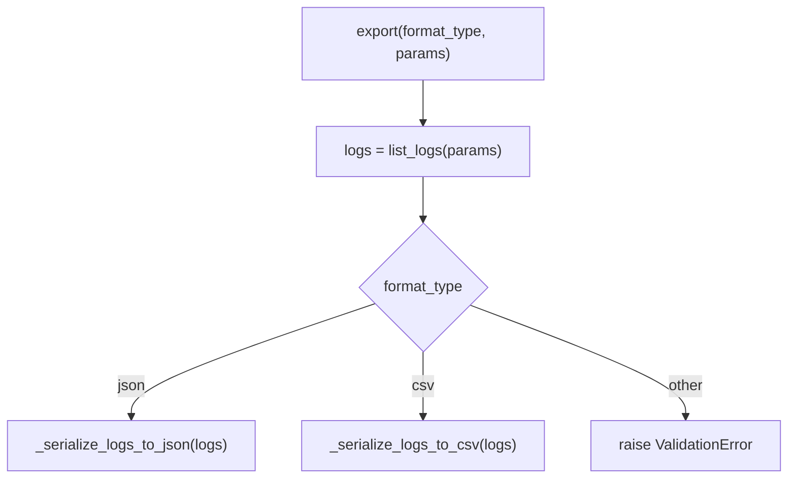
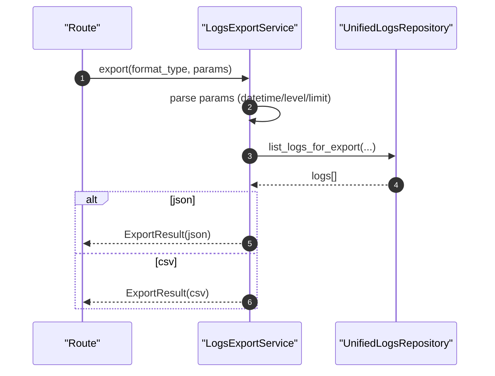

# Logs Export Service(统一日志导出)

> [!note] 本文目标
> 说明日志导出服务如何解析查询参数、委托 repository 读取数据，并安全地渲染为 json/csv（含 spreadsheet 公式注入防护）。

## 1. 概览(Overview)

入口：

- `LogsExportService.export(format_type, params)`（`app/services/files/logs_export_service.py:62`）
- `LogsExportService.list_logs(params)`：参数解析后查询可导出日志列表。`app/services/files/logs_export_service.py:41`

输出：

- `ExportResult(filename, content, mimetype)`（`app/services/files/logs_export_service.py:25`）

## 2. 依赖与边界(Dependencies)

| 类型 | 组件 | 用途 | 失败语义(摘要) |
| --- | --- | --- | --- |
| Repo | `UnifiedLogsRepository` | 读取日志 | repo 异常向上抛（由 route 处理） |
| Model | `UnifiedLog/LogLevel` | 字段结构与 level 枚举 | level 解析失败 -> ValidationError |
| Safety | `sanitize_csv_row` | 防 CSV/Excel 公式注入 | 始终执行 |
| Time | `time_utils` | exported_at/格式化时间 | 无 |

## 3. 事务与失败语义(Transaction + Failure Semantics)

- 不写 DB，不 commit。
- 参数非法直接抛 `ValidationError`：
  - `start_time/end_time` 不是 ISO 格式。`app/services/files/logs_export_service.py:83`
  - `level` 非法。`app/services/files/logs_export_service.py:91`
  - `limit` 非正整数。`app/services/files/logs_export_service.py:99`
  - `format_type` 非 `json/csv`。`app/services/files/logs_export_service.py:80`

## 4. 主流程图(Flow)

## 5. 时序图(Sequence)

## 6. 决策表/规则表(Decision Table)

### 6.1 format_type

| format_type | 输出 | mimetype |
| --- | --- | --- |
| `json` | `logs_export.json` | `application/json; charset=utf-8` |
| `csv` | `logs_export.csv` | `text/csv; charset=utf-8` |

实现位置：`app/services/files/logs_export_service.py:75`。

### 6.2 params 默认值

| 参数 | 默认值 | 说明 |
| --- | --- | --- |
| `limit` | `"1000"` | 控制导出上限，避免一次导出过大 |

实现位置：`app/services/files/logs_export_service.py:47`。

## 7. 兼容/防御/回退/适配逻辑

| 位置(文件:行号) | 类型 | 描述 | 触发条件 | 清理条件/期限 |
| --- | --- | --- | --- | --- |
| `app/services/files/logs_export_service.py:39` | 防御 | `repository or UnifiedLogsRepository()` 注入兜底 | 未注入 repo | 若统一依赖注入，可收敛 |
| `app/services/files/logs_export_service.py:47` | 防御 | `limit_raw = params.get('limit','1000')` 默认值 | 未传 limit | 若前端必传 limit，可移除默认 |
| `app/services/files/logs_export_service.py:115` | 防御 | `log.timestamp.isoformat() if log.timestamp else None` | 历史数据 timestamp 为空 | 清理历史数据后可收敛 |
| `app/services/files/logs_export_service.py:146` | 防御 | context 仅在 dict 时展开；空值/ignored_keys 跳过 | context 非 dict/含噪声字段 | 若统一 context schema，可固化结构并减少过滤 |
| `app/services/files/logs_export_service.py:155` | 防御 | CSV 行经 `sanitize_csv_row` 防公式注入 | 导出到 Excel/Sheets | 若不再导出 CSV，可移除（但建议保留） |
| `app/services/files/logs_export_service.py:160` | 防御 | `log.module or ''` / `log.message or ''` 兜底 | 字段为空 | 若强约束字段必填，可收敛 |

## 8. 可观测性(Logs + Metrics)

- 本服务自身无结构化事件名约定（主要依赖 route 层记录导出行为）
- CSV 注入防护由 `sanitize_csv_row` 内部负责（如需可在 route 层增加 audit log）

## 9. 测试与验证(Tests)

最小验证命令：

- `uv run pytest -m unit tests/unit/routes/test_api_v1_files_contract.py`

关键用例：

- format_type 非法 -> ValidationError
- CSV 导出：context 中 ignored_keys 被过滤，且每行经过 sanitize

