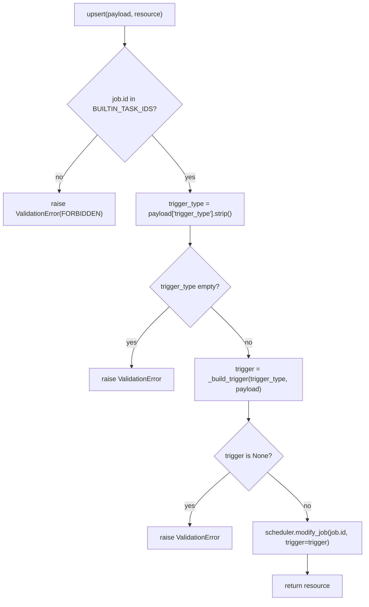
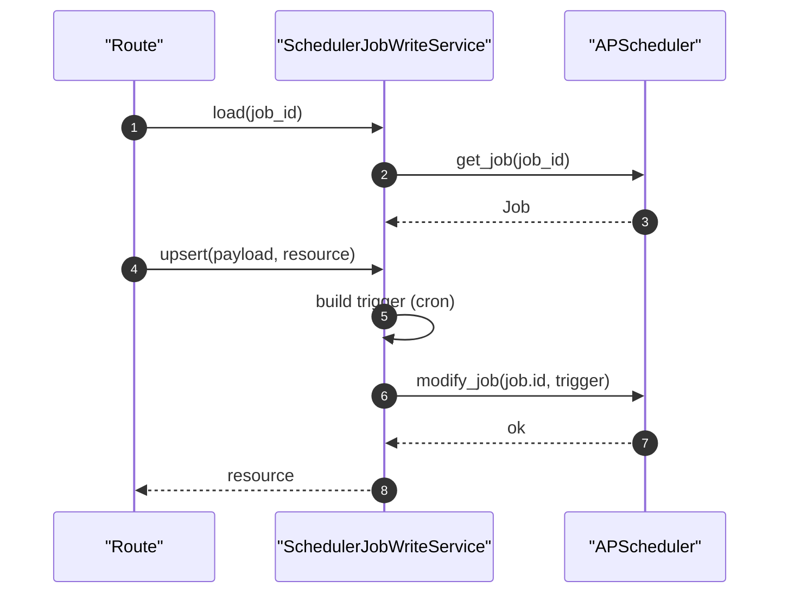

# Scheduler Job Write Service(内置任务触发器更新)

> [!note] 本文目标
> 说明如何在不依赖 form_service 的前提下更新 APScheduler 内置任务的 trigger，并明确：
> - 只允许修改内置任务（BUILTIN_TASK_IDS）
> - trigger 参数的解析规则（cron）
> - cron_expression 解析规则（5/6/7 段），并收敛为单一输入源（不再做多 key pick / `or` 兜底）

## 1. 概览(Overview)

入口：

- `SchedulerJobWriteService.load(resource_id)`：加载 job 资源。`app/services/scheduler/scheduler_job_write_service.py:50`
- `SchedulerJobWriteService.upsert(payload, resource)`：更新 trigger。`app/services/scheduler/scheduler_job_write_service.py:64`

范围：

- 不 commit（由 route 层提交/回滚）
- 仅允许修改 `BUILTIN_TASK_IDS` 内的任务触发器。`app/services/scheduler/scheduler_job_write_service.py:70`

## 2. 依赖与边界(Dependencies)

| 类型          | 组件                | 用途               | 失败语义(摘要)                             |
| ----------- | ----------------- | ---------------- | ------------------------------------ |
| Scheduler   | `get_scheduler()` | 获取运行中的 scheduler | 未启动 -> `SystemError`                 |
| APScheduler | `CronTrigger`     | 构建 trigger       | 构建失败 -> 返回 None（上层转 ValidationError） |
| TZ          | `Asia/Shanghai`   | cron 时区固定        | tzdata 缺失 -> 直接失败（不再 fallback）       |
| Validation  | `isinstance`      | 严格校验 payload     | 不合法 -> `ValidationError`             |

## 3. 事务与失败语义(Transaction + Failure Semantics)

- load：
  - scheduler 未启动/未 running -> `SystemError`。`app/services/scheduler/scheduler_job_write_service.py:54`
  - job 不存在 -> `NotFoundError`。`app/services/scheduler/scheduler_job_write_service.py:59`
- upsert：
  - 非内置任务 -> `ValidationError(FORBIDDEN)`。`app/services/scheduler/scheduler_job_write_service.py:70`
  - trigger_type 缺失/配置非法 -> `ValidationError(VALIDATION_ERROR)`。`app/services/scheduler/scheduler_job_write_service.py:74`
  - cron_expression 缺失/长度非法 -> `ValidationError(VALIDATION_ERROR)`。`app/services/scheduler/scheduler_job_write_service.py:119`
  - `modify_job` 抛异常 -> 转为 `ValidationError`。`app/services/scheduler/scheduler_job_write_service.py:89`

## 4. 主流程图(Flow)

## 5. 时序图(Sequence)

## 6. 决策表/规则表(Decision Table)

### 6.1 trigger_type -> builder

| trigger_type | builder | 失败返回 |
| --- | --- | --- |
| `cron` | `_build_cron_trigger` | None |
| 其他 | 无 | None |

实现位置：`app/services/scheduler/scheduler_job_write_service.py:100`。

### 6.2 cron_expression 拆分与映射

| parts 长度 | 解释 | 写入字段 |
| --- | --- | --- |
| 7 | second minute hour day month day_of_week year | 写入全部 |
| 6 | second minute hour day month day_of_week | 写入前 6 项 |
| 5 | minute hour day month day_of_week | second 固定为 `0` |
| 其他 | - | 直接 `ValidationError` |

实现位置：`app/services/scheduler/scheduler_job_write_service.py:119`。

## 7. 兼容/防御/回退/适配逻辑

已清理（2026-01-09）：

- 收敛为严格契约：`payload` 必须非空；`trigger_type` 必须为 `"cron"`；`cron_expression` 必填且仅支持 5/6/7 段。
- 时区固定为 `Asia/Shanghai`，不再读取用户输入 timezone，也不再对 tzdata 做 fallback。
- 移除多 key alias `_pick(...)` 与 `or` 兜底合并逻辑（避免继续扩散兼容分支）。

## 8. 可观测性(Logs + Metrics)

- scheduler 未启动：`log_error("调度器未启动...")` `app/services/scheduler/scheduler_job_write_service.py:55`
- trigger 构建失败：`CronTrigger 构建失败` `app/services/scheduler/scheduler_job_write_service.py:116`
- 修改成功：`内置任务触发器更新成功` `app/services/scheduler/scheduler_job_write_service.py:95`

## 9. 测试与验证(Tests)

最小验证命令：

- `uv run pytest -m unit tests/unit/routes/test_api_v1_scheduler_contract.py`

关键用例：

- 非内置任务 -> Forbidden/ValidationError
- cron_expression 长度 5/6/7 映射行为符合预期
- cron_expression 缺失/长度非法 -> ValidationError
