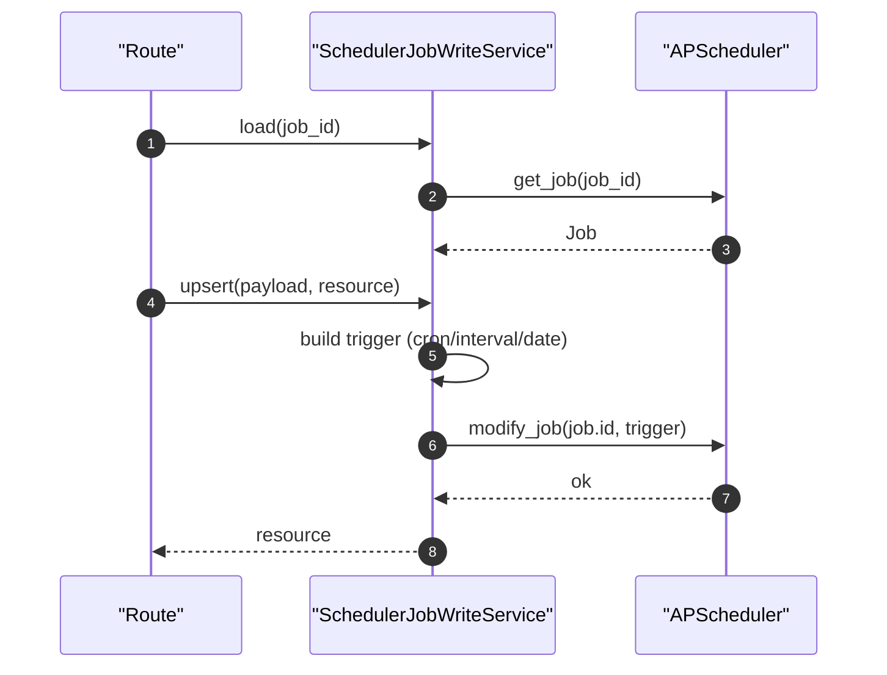

# Scheduler Job Write Service(内置任务触发器更新)

> [!note] 本文目标
> 说明如何在不依赖 form_service 的前提下更新 APScheduler 内置任务的 trigger，并明确：
> - 只允许修改内置任务（BUILTIN_TASK_IDS）
> - trigger 参数的解析规则（cron/interval/date）
> - cron_expression 与字段覆盖的兼容逻辑（大量 `or` 兜底与多 key pick）

## 1. 概览(Overview)

入口：

- `SchedulerJobWriteService.load(resource_id)`：加载 job 资源。`app/services/scheduler/scheduler_job_write_service.py:59`
- `SchedulerJobWriteService.upsert(payload, resource)`：更新 trigger。`app/services/scheduler/scheduler_job_write_service.py:73`

范围：

- 仅允许修改 `BUILTIN_TASK_IDS` 内的任务触发器。`app/services/scheduler/scheduler_job_write_service.py:79`
- 不 commit（由 route 层提交/回滚）

## 2. 依赖与边界(Dependencies)

| 类型 | 组件 | 用途 | 失败语义(摘要) |
| --- | --- | --- | --- |
| Scheduler | `get_scheduler()` | 获取运行中的 scheduler | 未启动 -> `SystemError` |
| APScheduler | `CronTrigger/IntervalTrigger/DateTrigger` | 构建 trigger | 构建失败 -> 返回 None（上层转 ValidationError） |
| TZ | `ZoneInfo` | cron 时区 | 无 tzdata 时 fallback 到 `Asia/Shanghai` |
| Converters | `as_str/as_int/as_optional_str` | 兼容不同 payload 形态 | 无法转换时走兜底/None |

## 3. 事务与失败语义(Transaction + Failure Semantics)

- load：
  - scheduler 未启动/未 running -> `SystemError`。`app/services/scheduler/scheduler_job_write_service.py:62`
  - job 不存在 -> `NotFoundError`。`app/services/scheduler/scheduler_job_write_service.py:68`
- upsert：
  - 非内置任务 -> `ValidationError(FORBIDDEN)`。`app/services/scheduler/scheduler_job_write_service.py:79`
  - trigger_type 缺失/配置非法 -> `ValidationError(VALIDATION_ERROR)`。`app/services/scheduler/scheduler_job_write_service.py:83`
  - `modify_job` 抛异常 -> 转为 `ValidationError`。`app/services/scheduler/scheduler_job_write_service.py:91`

## 4. 主流程图(Flow)

## 5. 时序图(Sequence)

## 6. 决策表/规则表(Decision Table)

### 6.1 trigger_type -> builder

| trigger_type | builder | 失败返回 |
| --- | --- | --- |
| `cron` | `_build_cron_trigger` | None |
| `interval` | `_build_interval_trigger` | None |
| `date` | `_build_date_trigger` | None |
| 其他 | 无 | None |

实现位置：`app/services/scheduler/scheduler_job_write_service.py:107`。

### 6.2 cron_expression 拆分与覆盖

| parts 长度 | 解释 | 覆盖字段 |
| --- | --- | --- |
| 7 | second minute hour day month day_of_week year | 覆盖全部 |
| 6 | second minute hour day month day_of_week | 覆盖前 6 项 |
| 5 | minute hour day month day_of_week | 覆盖除 second 外字段 |
| 其他 | 不覆盖 | 保持 base_fields |

实现位置：`app/services/scheduler/scheduler_job_write_service.py:162`。

## 7. 兼容/防御/回退/适配逻辑

| 位置(文件:行号) | 类型 | 描述 | 触发条件 | 清理条件/期限 |
| --- | --- | --- | --- | --- |
| `app/services/scheduler/scheduler_job_write_service.py:82` | 防御 | `sanitized = dict(payload or {})` 兜底 | payload 为 None | 若 route 强约束 payload 非空，可简化 |
| `app/services/scheduler/scheduler_job_write_service.py:83` | 防御 | `as_str(..., default='')` + `.strip()` 兜底 | trigger_type 缺失/类型不对 | 若前端严格传枚举，可收敛 |
| `app/services/scheduler/scheduler_job_write_service.py:123` | 回退 | timezone 缺失/非法时 fallback 到 `Asia/Shanghai` | 未安装 tzdata/传入非法 tz | 若统一固定时区，可移除用户输入与 fallback |
| `app/services/scheduler/scheduler_job_write_service.py:154` | 防御 | cron_expression 为空返回 `[]` | 未提供表达式 | 若强制要求表达式，可改为硬失败 |
| `app/services/scheduler/scheduler_job_write_service.py:196` | 兼容 | `_pick` 支持多个别名 key（`cron_weekday/cron_day_of_week/day_of_week/weekday`） | 历史字段名不同 | 清理旧字段名后可逐步移除别名 |
| `app/services/scheduler/scheduler_job_write_service.py:206` | 防御 | `_merge_parts` 使用 `pick_value or part` 兜底 | base_fields 缺失/空值 | 若 base_fields 强约束完整，可收敛 |
| `app/services/scheduler/scheduler_job_write_service.py:218` | 防御 | interval：无有效字段返回 None | 全部 <=0/不可转换 | 若要提示具体字段错误，返回结构化原因 |
| `app/services/scheduler/scheduler_job_write_service.py:233` | 防御 | date：run_date 解析失败返回 None | run_date 不可解析 | 若要明确错误提示，改为 ValidationError 并提示格式 |

## 8. 可观测性(Logs + Metrics)

- scheduler 未启动：`log_error("调度器未启动...")` `app/services/scheduler/scheduler_job_write_service.py:64`
- trigger 构建失败：`CronTrigger/IntervalTrigger/DateTrigger 构建失败` `app/services/scheduler/scheduler_job_write_service.py:132`
- 修改成功：`内置任务触发器更新成功` `app/services/scheduler/scheduler_job_write_service.py:99`

## 9. 测试与验证(Tests)

最小验证命令：

- `uv run pytest -m unit tests/unit/routes/test_api_v1_scheduler_contract.py`

关键用例：

- 非内置任务 -> Forbidden/ValidationError
- cron_expression 长度 5/6/7 覆盖行为符合预期
- timezone 非法时回退到 Asia/Shanghai

