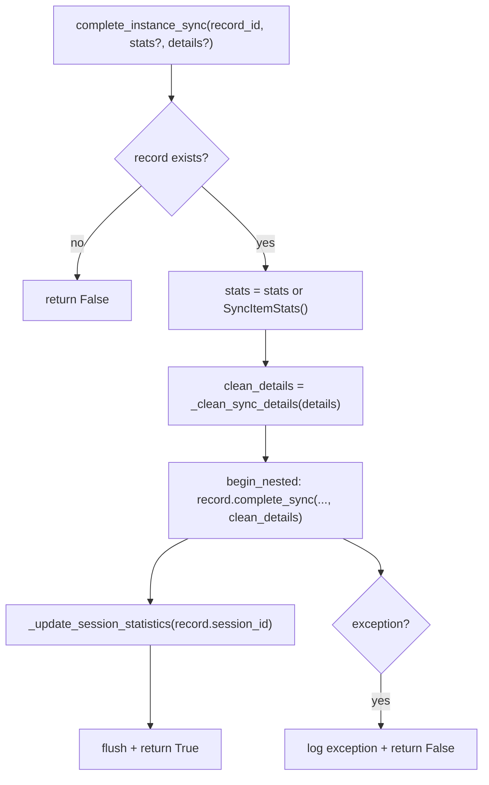
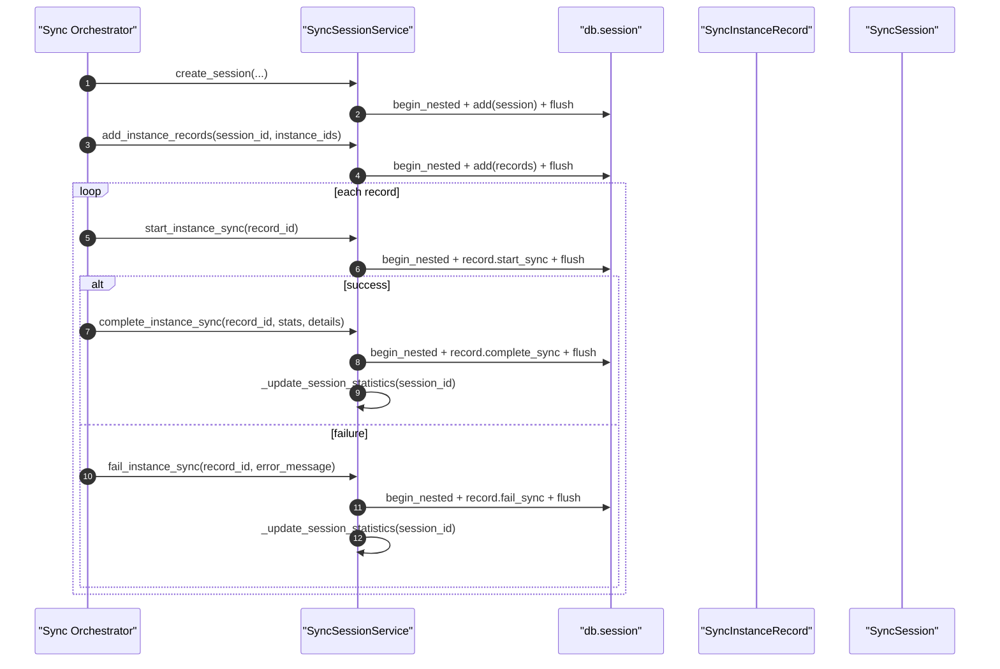

# Sync Session Service(同步会话/实例记录状态机)

> [!note] 本文目标
> 说明同步会话域如何管理：
> - `SyncSession`（会话）创建/取消/统计更新
> - `SyncInstanceRecord`（实例记录）start/complete/fail 状态流转
> - sync_details 的序列化清洗（datetime/date -> isoformat）
>
> 重点：该服务存在多处“吞异常返回 False/空列表”的防御分支，必须显式列出以便后续收敛。

## 1. 概览(Overview)

入口：

- `SyncSessionService.create_session(sync_type, sync_category="account", ...)` `app/services/sync_session_service.py:75`
- `SyncSessionService.add_instance_records(session_id, instance_ids, sync_category="account")` `app/services/sync_session_service.py:129`
- `SyncSessionService.start_instance_sync(record_id)` `app/services/sync_session_service.py:191`
- `SyncSessionService.complete_instance_sync(record_id, stats?, sync_details?)` `app/services/sync_session_service.py:230`
- `SyncSessionService.fail_instance_sync(record_id, error_message, sync_details?)` `app/services/sync_session_service.py:297`
- `SyncSessionService.cancel_session(session_id)` `app/services/sync_session_service.py:507`

## 2. 依赖与边界(Dependencies)

| 类型 | 组件 | 用途 | 失败语义(摘要) |
| --- | --- | --- | --- |
| Model | `SyncSession/SyncInstanceRecord` | 状态机与字段 | 单条状态更新失败 -> 返回 False（部分方法） |
| DB | `db.session.begin_nested()` | 写入/flush | create/add 失败会抛；部分更新失败吞并 |
| Time | `time_utils` | 时间戳 | 无 |
| JSON | `_clean_sync_details` | 清洗 sync_details 可序列化 | 空/None -> None |

## 3. 事务与失败语义(Transaction + Failure Semantics)

- create_session / add_instance_records：异常会记录并 **re-raise**（硬失败）。`app/services/sync_session_service.py:108`、`app/services/sync_session_service.py:171`
- start/complete/fail：
  - record 不存在 -> 返回 False（不抛）。`app/services/sync_session_service.py:204`、`app/services/sync_session_service.py:250`
  - DB 异常 -> 记录 exception 并返回 False（不抛）。`app/services/sync_session_service.py:211`、`app/services/sync_session_service.py:274`
- complete/fail 会调用 `_update_session_statistics()` 刷新 succeeded/failed 计数（同一 nested 事务中）。`app/services/sync_session_service.py:272`
- cancel_session：
  - session 不存在 -> False；存在但非 RUNNING -> 不更新也返回 True（“幂等取消”）。`app/services/sync_session_service.py:519`

## 4. 主流程图(Flow)

## 5. 时序图(Sequence)

## 6. 决策表/规则表(Decision Table)

### 6.1 sync_details 清洗规则

| value 类型 | 处理 | 目的 |
| --- | --- | --- |
| `datetime/date` | `isoformat()` | JSON 可序列化 |
| `dict` | 递归清洗 | 深层结构兼容 |
| `list` | 递归清洗 | 同上 |
| 其他 | 原样返回 | 保持信息 |

实现位置：`app/services/sync_session_service.py:48`。

## 7. 兼容/防御/回退/适配逻辑

| 位置(文件:行号)                                  | 类型  | 描述                                                                        | 触发条件                 | 清理条件/期限                                        |
| ------------------------------------------ | --- | ------------------------------------------------------------------------- | -------------------- | ---------------------------------------------- |
| `app/services/sync_session_service.py:61`  | 防御  | `_clean_sync_details`：`if not sync_details: return None`（空 dict 也会变 None） | details 为 `{}`       | 若需要区分“空详情 vs 无详情”，改为 `if sync_details is None` |
| `app/services/sync_session_service.py:103` | 防御  | 可选 session_id：只有传入才覆盖模型生成值                                                | caller 指定 session_id | 若统一由模型生成，可移除外部覆盖能力                             |
| `app/services/sync_session_service.py:159` | 防御  | add_instance_records：instance_id 不存在则跳过该 id（不抛）                           | instance_ids 包含无效 id | 若要强约束输入有效性，改为硬失败并返回 missing 列表                 |
| `app/services/sync_session_service.py:254` | 防御  | complete：`stats = stats or SyncItemStats()` 默认 0                          | 未提供 stats            | 若强制上游提供 stats，可移除默认                            |
| `app/services/sync_session_service.py:271` | 防御  | complete/fail：异常返回 False（不抛）                                              | DB 写失败               | 若需要强一致，改为抛错并由 orchestrator 处理回滚                |
| `app/services/sync_session_service.py:372` | 防御  | `scalar() or 0`：count 为空视为 0                                              | 查询无结果/None           | 若 repository 保证返回 int，可简化                      |
| `app/services/sync_session_service.py:410` | 回退  | get_session_records 异常返回 `[]`                                             | DB 查询异常              | 若要区分异常，改为抛错并由 route 显示错误                       |
| `app/services/sync_session_service.py:431` | 回退  | get_session_by_id 异常返回 None                                               | 同上                   | 同上                                             |
| `app/services/sync_session_service.py:523` | 防御  | cancel_session：session 非 RUNNING 不更新也返回 True（幂等）                          | 重复取消/已完成会话           | 若要严格语义，返回 False 或返回状态码区分                       |

## 8. 可观测性(Logs + Metrics)

- 创建会话/添加记录：`sync_logger.info("创建同步会话"/"添加实例记录")` `app/services/sync_session_service.py:118`、`app/services/sync_session_service.py:181`
- 状态更新失败：`sync_logger.exception("完成实例同步失败"/"标记实例同步失败时出错")` `app/services/sync_session_service.py:275`、`app/services/sync_session_service.py:329`
- 取消会话：`sync_logger.info("取消同步会话")` `app/services/sync_session_service.py:531`

## 9. 测试与验证(Tests)

最小验证命令：

- `uv run pytest -m unit tests/unit/routes/test_api_v1_history_sessions_contract.py`

关键用例：

- record 不存在 -> start/complete/fail 返回 False
- sync_details 含 datetime/date -> 清洗为 isoformat
- cancel_session：重复取消/非 RUNNING 仍返回 True（当前语义）

