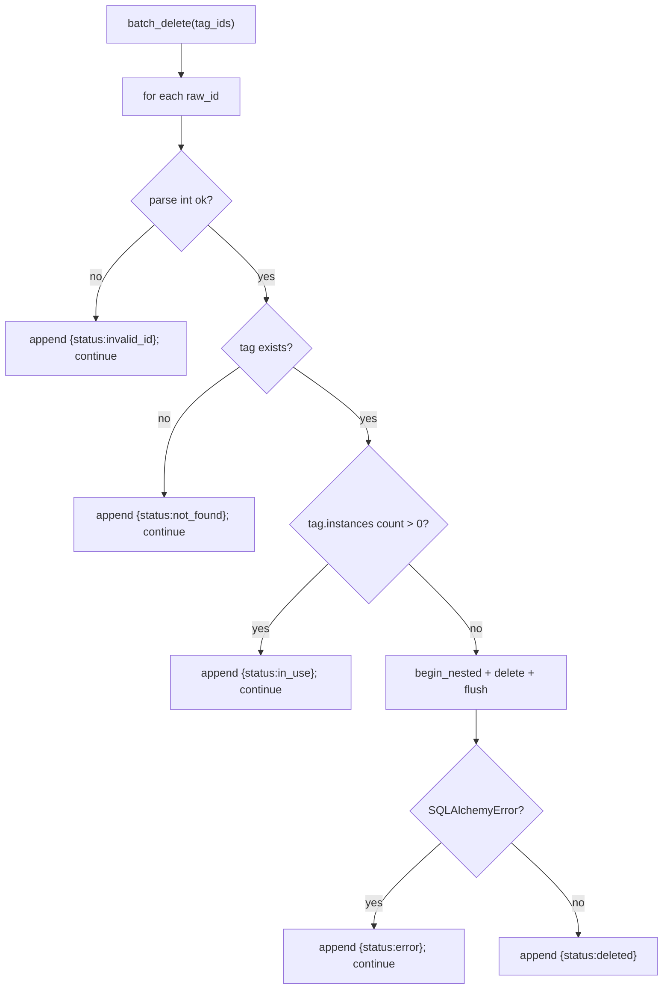
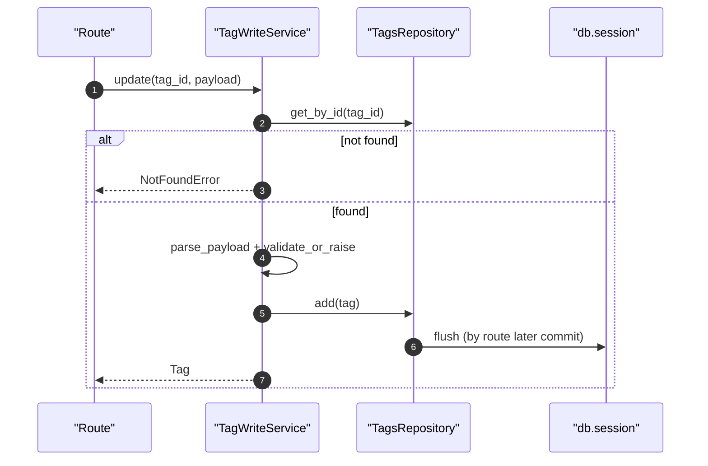

# Tags Write Service(标签写操作/批量删除)

> [!note] 本文目标
> 说明标签写操作的入口、失败语义与“批量逐条继续”的策略；同时显式列出 `payload or {}`、`rowcount or 0` 等兜底点，便于后续收敛数据/删除遗留逻辑。

## 1. 概览(Overview)

核心入口：

- `TagWriteService.create(payload)`（`app/services/tags/tag_write_service.py:58`）
- `TagWriteService.update(tag_id, payload)`（`app/services/tags/tag_write_service.py:84`）
- `TagWriteService.delete(tag_id)`：若标签被实例引用则返回 `in_use`（不抛）。`app/services/tags/tag_write_service.py:114`
- `TagWriteService.batch_delete(tag_ids)`：逐条处理，返回 `results[] + has_failure`。`app/services/tags/tag_write_service.py:138`

持久化影响：

- 写 `tags`；删除时可能影响 tag-instance 关联（由 ORM 关系定义决定）

## 2. 依赖与边界(Dependencies)

| 类型 | 组件 | 用途 | 失败语义(摘要) |
| --- | --- | --- | --- |
| Repo | `TagsRepository` | get/add/delete | 不存在 -> NotFoundError |
| Payload | `parse_payload` + `validate_or_raise` | 归一化 + 校验 | 校验失败 -> ValidationError |
| DB | `db.session.begin_nested()` | batch_delete 逐条事务包裹 | 单条失败不阻断其他 |

## 3. 事务与失败语义(Transaction + Failure Semantics)

- create/update：写入失败会 `rollback()` 并抛 `ValidationError("保存失败")`。`app/services/tags/tag_write_service.py:75`、`app/services/tags/tag_write_service.py:105`
- delete：若 tag.instances 非空，返回 `status=in_use`（业务可恢复）。`app/services/tags/tag_write_service.py:120`
- batch_delete：
  - 输入 id 不可解析 -> `status=invalid_id`，继续下一条。`app/services/tags/tag_write_service.py:149`
  - tag 不存在 -> `status=not_found`，继续。`app/services/tags/tag_write_service.py:156`
  - tag 被引用 -> `status=in_use`，继续。`app/services/tags/tag_write_service.py:162`
  - DB 异常 -> `status=error`，继续。`app/services/tags/tag_write_service.py:180`

## 4. 主流程图(Flow)

## 5. 时序图(Sequence)

## 6. 决策表/规则表(Decision Table)

### 6.1 delete：删除 vs in_use

| 条件 | 行为 | 返回 |
| --- | --- | --- |
| `len(tag.instances) > 0` | 不删除 | `TagDeleteOutcome(status="in_use")` |
| 否则 | 删除 | `TagDeleteOutcome(status="deleted")` |

实现位置：`app/services/tags/tag_write_service.py:120`。

## 7. 兼容/防御/回退/适配逻辑

| 位置(文件:行号) | 类型 | 描述 | 触发条件 | 清理条件/期限 |
| --- | --- | --- | --- | --- |
| `app/services/tags/tag_write_service.py:56` | 防御 | `repository or TagsRepository()` 注入兜底 | 未注入 repo | 若统一依赖注入，可收敛 |
| `app/services/tags/tag_write_service.py:60` | 防御 | `payload or {}` 兜底 | route 传 None | 若 route 强约束 payload 非空，可简化 |
| `app/services/tags/tag_write_service.py:78` | 回退 | SQLAlchemyError 时显式 `rollback()` 并转为 ValidationError | DB 约束/连接异常 | 若需要区分错误类型，细化错误码并加测试 |
| `app/services/tags/tag_write_service.py:120` | 防御 | delete：被引用返回 in_use（不抛） | 标签被实例占用 | 若未来支持强制删除/解绑，补新分支并文档化 |
| `app/services/tags/tag_write_service.py:143` | 兼容 | batch_delete 支持 bool/int/float/str 的 tag_id | 历史/前端传参不严格 | 若 route 强约束类型，可移除宽松解析 |
| `app/services/tags/tag_write_service.py:175` | 回退 | batch_delete 逐条 `begin_nested`，单条失败不影响整体 | 批量中出现脏数据/偶发 DB 错误 | 若要求原子性，改为批量事务并失败回滚 |

## 8. 可观测性(Logs + Metrics)

- 创建/更新/删除：`log_info` 事件 `标签创建成功/标签更新成功/标签删除成功` `app/services/tags/tag_write_service.py:196`
- 批量失败：`log_with_context(... action=batch_delete_tags ...)` `app/services/tags/tag_write_service.py:182`

## 9. 测试与验证(Tests)

最小验证命令：

- `uv run pytest -m unit tests/unit/routes/test_api_v1_tags_contract.py`（如存在）

关键用例：

- delete：被引用返回 in_use
- batch_delete：invalid_id/not_found/in_use/error 多状态混合仍可返回结果列表

