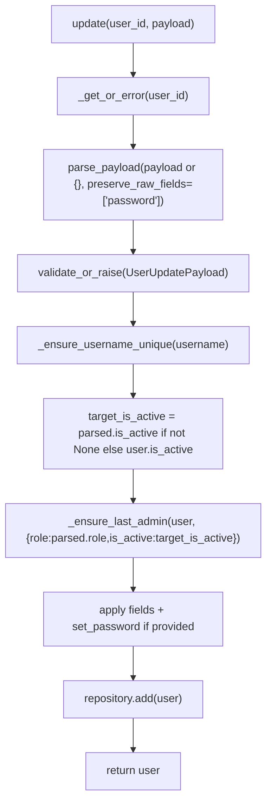
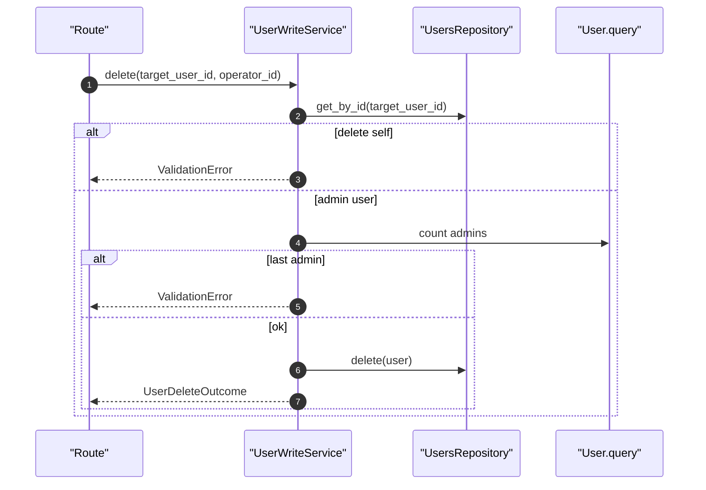

# User Write Service(用户写操作/最后管理员保护)

> [!note] 本文目标
> 说明用户 create/update/delete 的编排与约束，重点是“系统至少需要一位活跃管理员”的防御逻辑（last admin guard），以及 username 唯一性冲突的 message_key 约定。

## 1. 概览(Overview)

入口：

- `UserWriteService.create(payload)`（`app/services/users/user_write_service.py:49`）
- `UserWriteService.update(user_id, payload)`（`app/services/users/user_write_service.py:75`）
- `UserWriteService.delete(user_id, operator_id=None)`（`app/services/users/user_write_service.py:103`）

约束：

- 用户名唯一（冲突时抛 `ConflictError(message_key="USERNAME_EXISTS")`）。
- 不能删除自己的账户。`app/services/users/user_write_service.py:107`
- 不能删除最后一个管理员账户（delete 时通过 count 判断）。`app/services/users/user_write_service.py:110`
- update 时禁止把最后一个活跃管理员变为非管理员或停用。`app/services/users/user_write_service.py:129`

## 2. 依赖与边界(Dependencies)

| 类型 | 组件 | 用途 | 失败语义(摘要) |
| --- | --- | --- | --- |
| Repo | `UsersRepository` | add/get/delete | 不存在 -> NotFoundError |
| Payload | `parse_payload` + `validate_or_raise` | 归一化 + 校验 | 校验失败 -> ValidationError |
| Role | `UserRole` | ADMIN 判定 | last admin guard |

## 3. 事务与失败语义(Transaction + Failure Semantics)

- 不 commit（由 route 层提交）。
- create/update：SQLAlchemyError -> `ValidationError("保存失败")`。`app/services/users/user_write_service.py:67`
- delete：
  - 不能删除自己 -> `ValidationError`。`app/services/users/user_write_service.py:107`
  - 不能删除最后管理员 -> `ValidationError`。`app/services/users/user_write_service.py:112`

## 4. 主流程图(Flow)

## 5. 时序图(Sequence)

## 6. 决策表/规则表(Decision Table)

### 6.1 last admin guard（update 时）

| 当前用户 | 目标状态 | 是否允许 |
| --- | --- | --- |
| 非管理员 | 任意 | 允许（不走 guard） |
| 管理员 | 仍为活跃管理员 | 允许 |
| 管理员 | 变为非管理员或停用 | 仅当存在其他活跃管理员时允许，否则拒绝 |

实现位置：`app/services/users/user_write_service.py:129`、`app/services/users/user_write_service.py:126`。

## 7. 兼容/防御/回退/适配逻辑

| 位置(文件:行号)                                      | 类型  | 描述                                                                            | 触发条件                    | 清理条件/期限                       |
| ---------------------------------------------- | --- | ----------------------------------------------------------------------------- | ----------------------- | ----------------------------- |
| `app/services/users/user_write_service.py:47`  | 防御  | `repository or UsersRepository()` 注入兜底                                        | 未注入 repo                | 若统一依赖注入，可收敛                   |
| `app/services/users/user_write_service.py:52`  | 防御  | `payload or {}` 兜底                                                            | route 传 None            | 若 route 强约束 payload 非空，可简化    |
| `app/services/users/user_write_service.py:86`  | 防御  | `target_is_active = parsed.is_active if ... else user.is_active`              | PATCH 未传 is_active      | 若前端总传全量字段，可简化                 |
| `app/services/users/user_write_service.py:127` | 兼容  | `_is_target_state_admin` 中 `as_bool(..., default=True)` 把缺省 is_active 视为 True | normalized 未带 is_active | 若强约束 is_active 必传，可移除 default |
| `app/services/users/user_write_service.py:110` | 防御  | delete 时使用 count 防止删除最后管理员                                                    | 系统仅 1 位管理员              | 若引入更复杂 RBAC，可替换为策略引擎          |

## 8. 可观测性(Logs + Metrics)

- create/update/delete：`log_info`（module=`users`）`app/services/users/user_write_service.py:142`
- 冲突：`ConflictError(message_key=USERNAME_EXISTS)` 便于 UI 定位错误原因

## 9. 测试与验证(Tests)

最小验证命令：

- `uv run pytest -m unit tests/unit/services/test_user_write_service.py`

关键用例：

- username 重名 -> `message_key == USERNAME_EXISTS`
- last admin：停用/降权最后一个管理员会被拒绝

