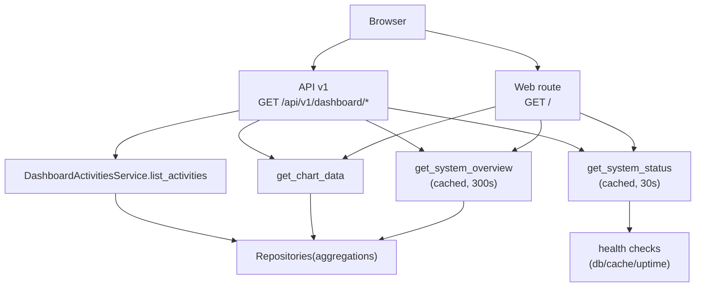

# Dashboard domain

## 边界与职责

- 提供系统概览页: 实例/账号/容量/数据库等统计汇总 + 图表 + 运行状态.
- 仪表板是"读模型"(read model)聚合层:
  - 数据来自各 repository 的统计查询.
  - 不应在 dashboard 域引入写路径与业务规则.
- 性能策略:
  - 概览与系统状态有缓存, 避免每次刷新都打满统计 SQL 与健康检查.

## 用户入口

Web UI:

- `/`(dashboard 首页, Jinja2 渲染)

API v1(SSOT: [[API/dashboard-api-contract]]):

- `GET /api/v1/dashboard/overview`
- `GET /api/v1/dashboard/charts?type=all|log|task|sync|...`
- `GET /api/v1/dashboard/activities`
- `GET /api/v1/dashboard/status`

## 代码落点(Where to change what)

Web route:

- `app/routes/dashboard.py`(HTML 或 JSON, 取决于 `request.is_json`)

API v1:

- `app/api/v1/namespaces/dashboard.py`

Services:

- overview/status: `app/services/dashboard/dashboard_overview_service.py`
- charts: `app/services/dashboard/dashboard_charts_service.py`
- activities: 当前在 `app/api/v1/namespaces/dashboard.py` 内联返回空数组(占位)

Repositories(统计查询):

- `app/repositories/users_repository.py`
- `app/repositories/account_statistics_repository.py`
- `app/repositories/instance_statistics_repository.py`
- `app/repositories/database_statistics_repository.py`
- `app/repositories/capacity_instances_repository.py`

Cache:

- decorator: `app/utils/cache_utils.py` -> `dashboard_cache`
- backend: Flask-Caching(`CACHE_TYPE=simple/redis`)

## 组件图

> [!tip]
> Canvas: [[canvas/dashboard/dashboard-domain-components.canvas]]

## 常见坑

- `request.is_json` 只在 client 明确发 JSON 请求时为 true, 不要把它当成 "Accept header 是否包含 json" 的等价物.
- 概览服务内会先 `db.session.rollback()`:
  - 目的是避免前序异常导致 session 处于 failed 状态影响后续统计查询.
  - 如果你在同一请求里混入写路径, 可能会被 rollback 影响(因此 dashboard 域应保持只读).
- 缓存不一致:
  - `overview` 与 `status` timeout 不同, UI 上可能出现短时间统计与状态不同步.

## 排障锚点

- 先看 module=dashboard 的日志:
  - 例如 `dashboard_base_counts`, `dashboard_classification_counts`, `dashboard_active_counts`
- 如果返回错误封套:
  - 先用 `message_code` 去 [[reference/errors/message-code-catalog]] 对齐语义
  - 再用 `context.request_id` 去日志中心过滤(见 [[operations/observability-ops]])
