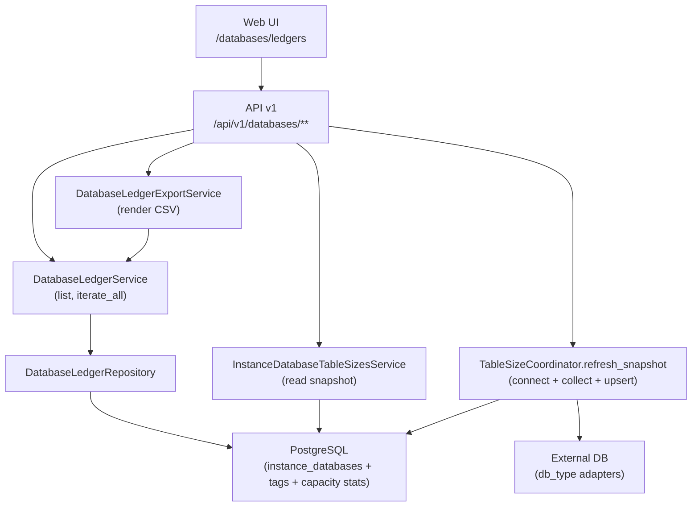
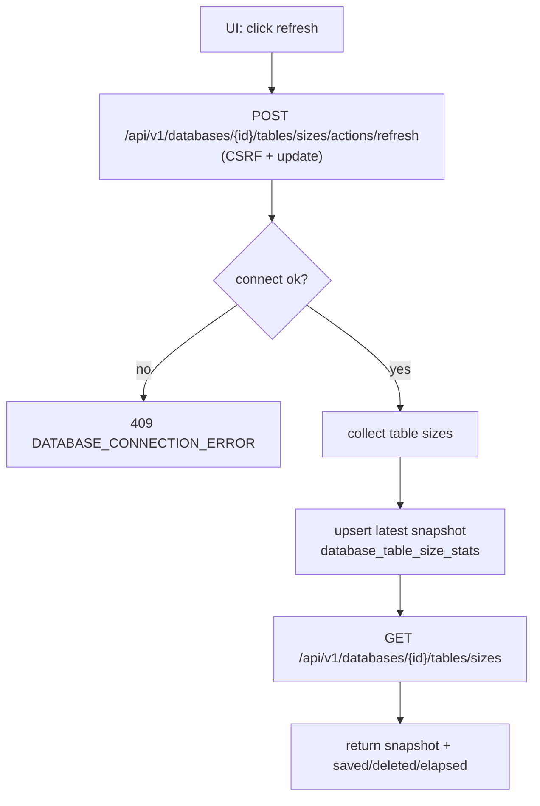

# Databases ledger domain

## 边界与职责

- 提供"数据库台账"视图: 以 `InstanceDatabase` 为主表, 汇总实例信息, 标签, 以及最新容量.
- 提供导出: 以 CSV 附件形式导出台账.
- 提供表容量快照: 查询最新表级容量快照, 并支持手动刷新(连接外部数据库采集后写回主库).
- 不负责容量采集/聚合调度: 采集与聚合属于 `capacity`/`database_sync` 域, 本域只是消费其结果用于展示与查询.

## 用户入口

Web UI:

- `/databases/ledgers`

API v1(SSOT: [[API/databases-api-contract]]):

- `GET /api/v1/databases/ledgers`
- `GET /api/v1/databases/ledgers/exports`(CSV)
- `GET /api/v1/databases/options`
- `GET /api/v1/databases/sizes`
- `GET /api/v1/databases/{database_id}/tables/sizes`
- `POST /api/v1/databases/{database_id}/tables/sizes/actions/refresh`

## 代码落点(Where to change what)

Web UI:

- route: `app/routes/databases/ledgers.py`
- template: `app/templates/databases/ledgers.html`
- JS: `app/static/js/modules/views/databases/ledgers.js`

API v1:

- namespace: `app/api/v1/namespaces/databases.py`

Services:

- ledger query: `app/services/ledgers/database_ledger_service.py`
- export: `app/services/files/database_ledger_export_service.py`
- table sizes snapshot: `app/services/instances/instance_database_table_sizes_service.py`
- table sizes refresh coordinator: `app/services/database_sync/table_size_coordinator.py`

Repositories/Models(主库):

- model: `app/models/instance_database.py`
- ledger repo: `app/repositories/ledgers/database_ledger_repository.py`
- capacity stats:
  - `app/models/database_size_stat.py`
  - `app/models/database_table_size_stat.py`

## 组件图

> [!tip]
> Canvas: [[canvas/databases-ledger/databases-ledger-domain-components.canvas]]

## 流程图(表容量刷新)

> [!tip]
> Canvas: [[canvas/databases-ledger/databases-ledger-flow.canvas]]

## 常见坑

- 分页统一为 `page/limit`, 不支持 `offset`(databases namespace 会直接报 `VALIDATION_ERROR`).
- `ledgers/exports` 成功返回 CSV, 失败仍是 JSON envelope(对齐 contract).
- `tables/sizes/actions/refresh` 是写动作:
  - MUST: `X-CSRFToken`
  - MUST: `api_permission_required("update")`

## 排障锚点

- 错误码入口: [[reference/errors/message-code-catalog]]
- 常见 message_code:
  - `DATABASE_CONNECTION_ERROR`
  - `SYNC_DATA_ERROR`
  - `VALIDATION_ERROR`
- 日志定位: module 常见为 `databases`/`databases_ledgers`/`database_aggregations`(以实际日志 `context.module` 为准), SOP 见 [[operations/observability-ops]].

