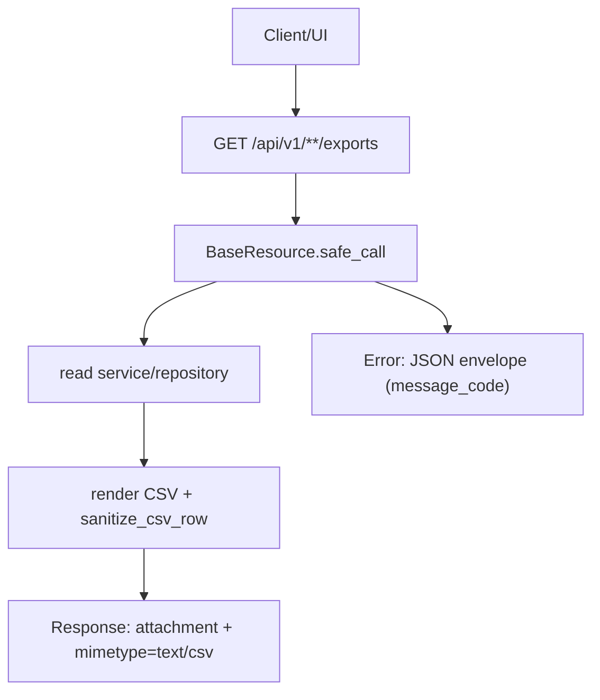

# Files exports domain(CSV)

## 边界与职责

- 本域提供"导出为 CSV"与"下载导入模板"能力, 供各业务域复用.
- 本域本身不承载业务查询规则, 只负责:
  - 调用对应的 read service/repository 拿数据
  - 渲染 CSV 内容(包含表头与字段格式)
  - 处理文件名与 mimetype
  - 输出为 `Content-Disposition: attachment` 的 Response

## 覆盖的 endpoints(现状)

以各 domain contract 为准:

- Accounts ledger export:
  - `GET /api/v1/accounts/ledgers/exports`(SSOT: [[API/accounts-api-contract]])
- Instances export + import template:
  - `GET /api/v1/instances/exports`
  - `GET /api/v1/instances/imports/template`(SSOT: [[API/instances-api-contract]])
- Databases ledger export:
  - `GET /api/v1/databases/ledgers/exports`(SSOT: [[API/databases-api-contract]])

## 成功返回文件, 失败仍返回 JSON envelope

这类 endpoints 的 contract 口径是:

- 成功: 返回 CSV(不是 JSON envelope), 并带 `Content-Disposition: attachment`.
- 失败: 仍走统一错误封套(JSON envelope), 便于 UI 与排障统一处理.

实现关键点:

- handler 内部用 `BaseResource.safe_call(...)` 包裹.
- 成功分支返回 `flask.Response(csv_content, mimetype=...)`.
- 失败分支由 `safe_call` 统一捕获并返回 JSON envelope.

## 代码落点(Where to change what)

Services(组织导出内容, 不返回 Response, 不 commit):

- accounts export: `app/services/files/account_export_service.py`
- instances export: `app/services/files/instances_export_service.py`
- databases ledger export: `app/services/files/database_ledger_export_service.py`
- instances import template: `app/services/files/instances_import_template_service.py`

API v1(Response 组装与 headers):

- `app/api/v1/namespaces/accounts.py` -> `/ledgers/exports`
- `app/api/v1/namespaces/instances.py` -> `/exports`, `/imports/template`
- `app/api/v1/namespaces/databases.py` -> `/ledgers/exports`

单测契约(最小保障):

- `tests/unit/routes/test_api_v1_files_contract.py`

## CSV 安全(必须)

CSV 文件可能被 Excel/Sheets 打开. 为避免公式注入:

- MUST: 每行写入前调用 `sanitize_csv_row(...)`.
- 落点: `app/utils/spreadsheet_formula_safety.py`

标准入口:

- [[standards/backend/sensitive-data-handling]]

## 流程图

> [!tip]
> Canvas: [[canvas/files/files-exports-flow.canvas]]

## 常见坑

- 忘记 `sanitize_csv_row`: 会引入 CSV 公式注入风险.
- 在 export service 内做 `db.session.commit()`: 违反写路径边界, 也会让导出变成 side effect.
- contract 没写清楚"成功是 CSV": UI 可能按 JSON 解析导致报错.

