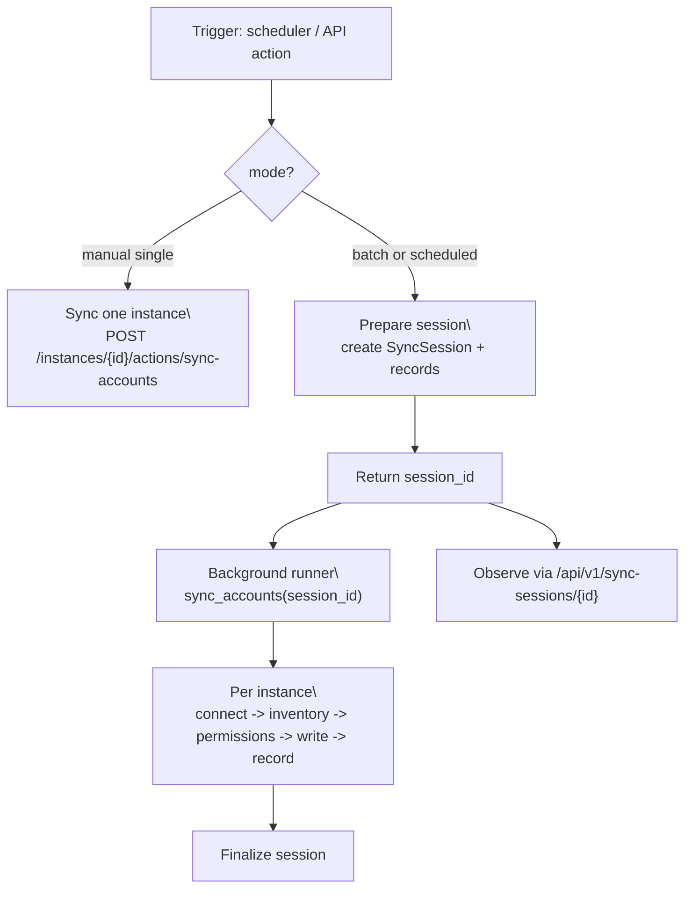
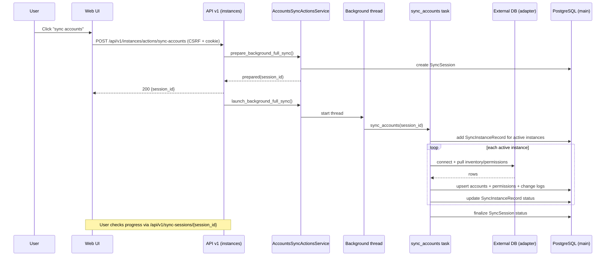

# 账户同步(accounts sync)

## 适用范围

- 你在加新的 db_type 适配器, 或修权限解析/归一化.
- 你在排查: 为什么某实例账号没更新, 为什么权限快照缺失, 为什么 session 里部分实例 failed.
- 你要新增一个触发入口(比如 UI 按钮)但复用同一条同步主线.

## 触发入口

- 定时任务(scheduler):
  - `app/tasks/accounts_sync_tasks.py:sync_accounts`
- 手动触发(API action):
  - 全量后台: `POST /api/v1/instances/actions/sync-accounts` (返回 `session_id`)
  - 单实例同步: `POST /api/v1/instances/{instance_id}/actions/sync-accounts` (同步返回结果)
- Web UI:
  - instances detail 页的 action 按钮(调用 API action, 然后走会话观测面).

## 流程图



> [!tip]
> Canvas: [[canvas/accounts/accounts-flow.canvas]]

### 会话模式(全量后台)关键时序



> [!tip]
> Canvas: [[canvas/accounts/accounts-session-sequence.canvas]]

## 代码入口

- Contract(SSOT): [[API/instances-api-contract]]
- API:
  - `app/api/v1/namespaces/instances_accounts_sync.py`
- Task:
  - `app/tasks/accounts_sync_tasks.py`
- Actions service:
  - `app/services/accounts_sync/accounts_sync_actions_service.py`
- Coordinator + adapters:
  - `app/services/accounts_sync/coordinator.py`
  - `app/services/accounts_sync/adapters/**`
- Inventory/permissions:
  - `app/services/accounts_sync/inventory_manager.py`
  - `app/services/accounts_sync/permission_manager.py`
- Models(tables):
  - `app/models/instance_account.py` (`instance_accounts`)
  - `app/models/account_permission.py` (`account_permission`)
  - `app/models/account_change_log.py` (`account_change_log`)
- Web UI:
  - template: `app/templates/instances/detail.html`
  - JS: `app/static/js/modules/views/instances/detail.js`
  - JS service: `app/static/js/modules/services/instance_management_service.js`

## 深读(服务层文档)

- [[reference/service/accounts-sync-overview]]
- [[reference/service/accounts-sync-actions-service]]
- [[reference/service/accounts-sync-adapters]]
- [[reference/service/accounts-sync-permission-manager]]
- [[reference/service/accounts-permissions-facts-builder]]

## 相关 domain notes

- [[architecture/domain/accounts-permissions-domain]]
- [[architecture/domain/credentials-connections-domain]]
- [[architecture/domain/instances-domain]]

## 可复制复现(curl)

最小可跑链路请直接复用:
- `[[reference/examples/api-v1-cookbook#最小可跑: CSRF + cookie 登录]]`

手动触发示例:

```bash
# 全量后台(返回 session_id)
curl -sS -X POST \\
  -H "X-CSRFToken: $CSRF" \\
  -b "$COOKIE_JAR" \\
  "$BASE_URL/api/v1/instances/actions/sync-accounts"

# 单实例同步(同步返回)
curl -sS -X POST \\
  -H "X-CSRFToken: $CSRF" \\
  -b "$COOKIE_JAR" \\
  "$BASE_URL/api/v1/instances/$INSTANCE_ID/actions/sync-accounts"
```

## 常见 message_code

以 `[[reference/errors/message-code-catalog]]` 为准, 本流程常见:

- `DATABASE_CONNECTION_ERROR`: 连接外部实例失败.
- `SYNC_DATA_ERROR`: adapter 输出缺字段/回填缺失/归一化失败.
- `SNAPSHOT_MISSING`: v4 权限快照缺失(下游读取时).
- `DATABASE_QUERY_ERROR`: 落库失败或事务失败.

## 自查命令(rg)

```bash
# API action 入口
rg -n \"sync-accounts\" app/api/v1/namespaces/instances_accounts_sync.py app/api/v1/namespaces/instances.py

# task 入口与会话写入
rg -n \"def sync_accounts\\b|SyncSession|SyncInstanceRecord\" app/tasks/accounts_sync_tasks.py

# adapter 归一化输出
rg -n \"RemoteAccount|PermissionSnapshot|fetch_remote_accounts|enrich_permissions\" app/services/accounts_sync
```

## 自查 SQL(常用)

```sql
-- 1) 最近一次会话(按 instance_id)
select
  r.sync_session_id,
  r.instance_id,
  r.status,
  r.error_message,
  r.started_at,
  r.ended_at
from sync_instance_records r
where r.instance_id = :instance_id
order by r.started_at desc
limit 20;

-- 2) 某实例账号清单(是否被标记 inactive)
select
  id,
  instance_id,
  username,
  db_type,
  is_active,
  updated_at
from instance_accounts
where instance_id = :instance_id
order by updated_at desc
limit 200;

-- 3) 某实例最近权限变更日志
select
  id,
  instance_id,
  username,
  change_type,
  created_at
from account_change_log
where instance_id = :instance_id
order by created_at desc
limit 200;
```
