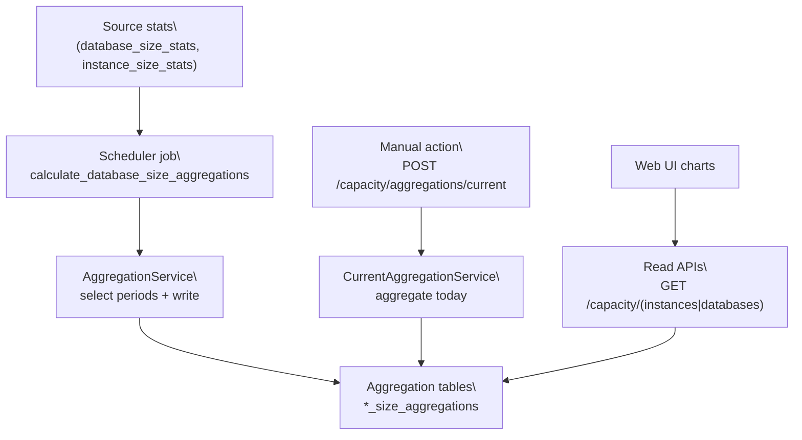
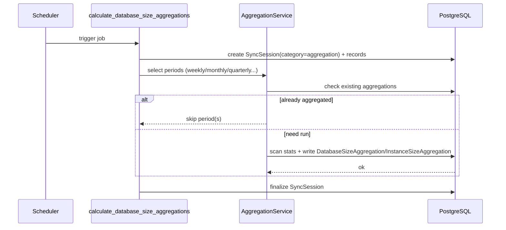

# 聚合统计(aggregation stats)

## 适用范围

- 你在排查: capacity charts 为空/不更新/跨度不对.
- 你在调整聚合粒度(period_type)或时间窗口(time_range).
- 你在做运维: jobstore 重置, 多实例部署, 以及 ENABLE_SCHEDULER 相关问题.

## 触发入口

- 定时任务(scheduler, 会话模式):
  - `app/tasks/capacity_aggregation_tasks.py:calculate_database_size_aggregations`
- 手动触发(action, 写操作):
  - `POST /api/v1/capacity/aggregations/current` (admin + CSRF)
- 查询(read):
  - `GET /api/v1/capacity/instances` + `/summary`
  - `GET /api/v1/capacity/databases` + `/summary`
- Web UI:
  - `/capacity/instances`, `/capacity/databases`(charts + filters)

## 流程图



> [!tip]
> Canvas: [[canvas/capacity/aggregation-stats-flow.canvas]]

### 定时聚合任务关键时序



> [!tip]
> Canvas: [[canvas/capacity/capacity-aggregation-sequence.canvas]]

## 代码入口

- Contract(SSOT): [[API/capacity-api-contract]]
- API:
  - `app/api/v1/namespaces/capacity.py`
- Tasks:
  - `app/tasks/capacity_aggregation_tasks.py`
- Services:
  - `app/services/aggregation/aggregation_service.py`
  - `app/services/capacity/current_aggregation_service.py` (manual current)
- Models(tables):
  - `app/models/database_size_aggregation.py` (`database_size_aggregations`)
  - `app/models/instance_size_aggregation.py` (`instance_size_aggregations`)
- Web UI:
  - routes:
    - `app/routes/capacity/instances.py`
    - `app/routes/capacity/databases.py`
  - templates:
    - `app/templates/capacity/instances.html`
    - `app/templates/capacity/databases.html`
  - charts:
    - `app/static/js/modules/views/components/charts/manager.js`
    - `app/static/js/modules/views/components/charts/data-source.js`
    - `app/static/js/modules/services/capacity_stats_service.js`

## 深读(服务层文档)

- [[reference/service/aggregation-pipeline]]
- [[reference/service/capacity-current-aggregation-service]]

## 相关 domain notes

- [[architecture/domain/capacity-partitions-domain]]
- [[architecture/domain/scheduler-domain]]

## 运维与排障口径(必看)

- [[operations/scheduler-jobstore-ops]]
- [[operations/observability-ops]]
- [[getting-started/debugging]]

## 常见 message_code

以 `[[reference/errors/message-code-catalog]]` 为准, 本流程常见:

- `VALIDATION_ERROR`: 手动触发参数非法(period_type/scope 等).
- `TASK_EXECUTION_FAILED`, `INTERNAL_ERROR`: 未捕获异常或任务失败.
- `DATABASE_QUERY_ERROR`: 聚合读写失败.

## 自查 SQL(常用)

```sql
-- 1) 某周期聚合是否已存在
select
  period_type,
  period_start_date,
  period_end_date,
  count(*) as rows
from instance_size_aggregations
where period_type = :period_type
  and period_start_date = :start_date
group by period_type, period_start_date, period_end_date;

-- 2) 某实例某周期聚合条数
select
  instance_id,
  period_type,
  count(*) as rows
from database_size_aggregations
where instance_id = :instance_id
  and period_type = :period_type
group by instance_id, period_type
order by rows desc;
```
