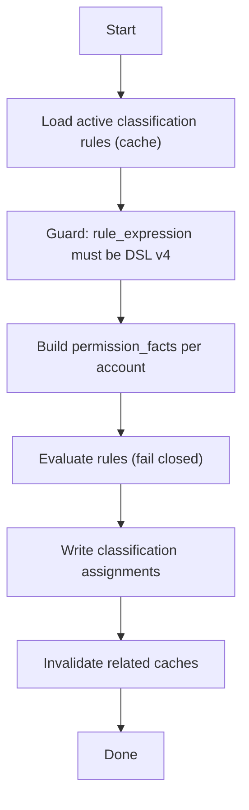

# 账户自动分类(auto-classify)

## 适用范围

- 你在新增/调整分类规则, 或排查分类结果不符合预期.
- 你在排查: 为何 auto-classify 返回 409/500, 或为何提示 snapshot/facts 缺失.
- 你要明确权限检查与 CSRF 要求(避免 UI/API 调用口径不一致).

## 触发入口

- API action:
  - `POST /api/v1/accounts/classifications/actions/auto-classify`
  - permission: `update`
  - CSRF: required
  - body: `instance_id?`(为空表示全量)
- Web UI:
  - 页面: `/accounts/classifications/`
  - action 按钮: auto-classify all / scoped auto-classify

## 流程图



> [!tip]
> Canvas: [[canvas/account-classification/account-classification-flow.canvas]]

## 代码入口

- Contract(SSOT): [[API/accounts-api-contract]]
- API:
  - `app/api/v1/namespaces/accounts_classifications.py`
- Services:
  - `app/services/account_classification/auto_classify_service.py`
  - `app/services/account_classification/orchestrator.py`
- Web UI:
  - route: `app/routes/accounts/classifications.py`
  - template: `app/templates/accounts/account-classification/index.html`
  - JS: `app/static/js/modules/views/accounts/account-classification/index.js`
  - JS service: `app/static/js/modules/services/account_classification_service.js`

## 相关 domain notes

- [[architecture/classification-domain]]
- [[architecture/accounts-permissions-domain]]

## 常见 message_code

以 `[[reference/errors/message-code-catalog]]` 为准, 本流程常见:

- `PERMISSION_FACTS_MISSING`: facts 缺失/非法, orchestrator 无法补齐.
- `SNAPSHOT_MISSING`: v4 权限快照缺失或版本不对.
- `DSL_V4_REQUIRED`, `INVALID_DSL_EXPRESSION`: 规则表达式校验失败.
- `VALIDATION_ERROR`: body 参数非法.

## 常见坑(实现与调用)

- auto-classify 属于写操作, Web 与 API v1 都要求 CSRF.
- 规则表达式必须是 DSL v4. 规则存量升级时优先先跑校验接口.
- 合同里提示: 某些失败路径可能抛出非 AppError 异常, 可能表现为 500(以当前实现为准).

## 自查命令(rg)

```bash
# action 入口
rg -n \"actions/auto-classify\" app/api/v1/namespaces/accounts_classifications.py

# facts/snapshot 构造与 guard
rg -n \"PERMISSION_FACTS_MISSING|SNAPSHOT_MISSING|DSL_V4_REQUIRED|INVALID_DSL_EXPRESSION\" app/services/account_classification app/services/accounts_permissions
```
