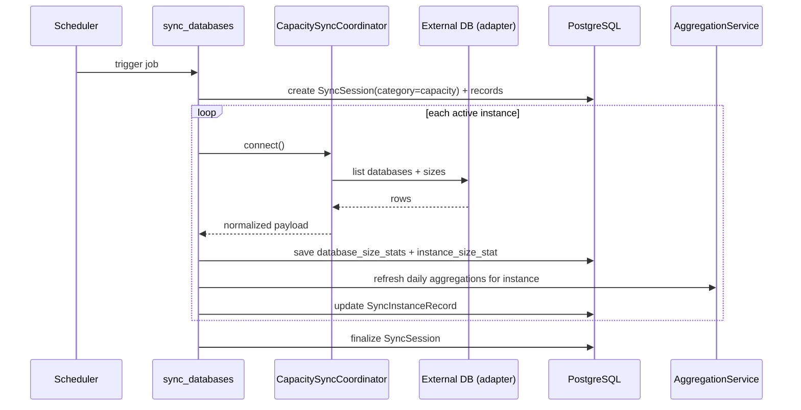

# 容量同步(capacity sync)

## 适用范围

- 你在排查: 某实例容量统计不更新, 某天采集为空, 或者容量图表不对.
- 你在加/改 table size adapter, 或者要支持新的 db_type.
- 你在确认手动 sync-capacity 的返回语义与错误口径.

## 触发入口

- 定时任务(scheduler, 会话模式):
  - `app/tasks/capacity_collection_tasks.py:sync_databases`
  - 会创建 `SyncSession(sync_category=capacity)` + `SyncInstanceRecord`.
- 手动触发(API action, 单实例同步返回):
  - `POST /api/v1/instances/{instance_id}/actions/sync-capacity`
  - service: `app/services/capacity/instance_capacity_sync_actions_service.py`
- Web UI:
  - instances detail 页的 action 按钮(手动触发).
  - capacity charts 页读取聚合数据(见 [[architecture/flows/aggregation-stats]]).

## 流程图(定时任务主线)



> [!tip]
> Canvas: [[canvas/capacity/capacity-sequence.canvas]]

## 手动触发(单实例)与定时任务(会话)的差异

- 手动单实例 `sync-capacity`:
  - 同步执行并返回 `result`(不创建 SyncSession).
  - 适合: 你只想验证某个实例的连接/采集是否正常.
- 定时任务 `sync_databases`:
  - 批量执行, 可观测面在会话中心.
  - 适合: 日常全量采集与长期统计.

## 代码入口

- Contract(SSOT): [[API/instances-api-contract]]
- API action(单实例):
  - `app/api/v1/namespaces/instances.py` (`/instances/{id}/actions/sync-capacity`)
- Task(会话模式):
  - `app/tasks/capacity_collection_tasks.py`
- Service:
  - `app/services/capacity/instance_capacity_sync_actions_service.py`
  - `app/services/aggregation/aggregation_service.py` (best-effort daily refresh)
- Adapters:
  - inventory/sizes: `app/services/database_sync/**`
  - table sizes(optional): `app/services/database_sync/table_size_adapters/**`
- Models(tables):
  - `app/models/database_size_stat.py` (`database_size_stats`)
  - `app/models/instance_size_stat.py` (`instance_size_stats`)
- Web UI:
  - template: `app/templates/instances/detail.html`
  - JS: `app/static/js/modules/views/instances/detail.js`
  - JS service: `app/static/js/modules/services/instance_management_service.js`

## 深读(服务层文档)

- [[reference/service/database-sync-overview]]
- [[reference/service/database-sync-adapters]]
- [[reference/service/database-sync-table-sizes]]
- [[reference/service/aggregation-pipeline]]
- [[reference/service/instance-capacity-sync-actions-service]]
- [[reference/service/instances-database-sizes-services]]

## 相关 domain notes

- [[architecture/domain/capacity-partitions-domain]]
- [[architecture/domain/credentials-connections-domain]]
- [[architecture/domain/instances-domain]]

## 常见 message_code

以 `[[reference/errors/message-code-catalog]]` 为准, 本流程常见:

- `DATABASE_CONNECTION_ERROR`: 外部实例连接失败(手动与定时都可能).
- `SYNC_DATA_ERROR`: 采集结果为空或缺字段(例如 collected empty).
- `DATABASE_QUERY_ERROR`: 落库失败或事务失败.

## 自查命令(rg)

```bash
# 手动 action 入口
rg -n \"actions/sync-capacity\" app/api/v1/namespaces/instances.py

# 定时任务入口
rg -n \"def sync_databases\\b\" app/tasks/capacity_collection_tasks.py

# adapters 与归一化
rg -n \"table_size_adapters|CapacitySyncCoordinator|database_size_stats|instance_size_stats\" app/services
```

## 自查 SQL(常用)

```sql
-- 1) 某实例最近 N 天 instance_size_stats
select
  instance_id,
  stat_date,
  total_bytes,
  collected_at
from instance_size_stats
where instance_id = :instance_id
  and stat_date >= current_date - :days
order by stat_date desc
limit 200;

-- 2) 某实例某天 database_size_stats top N
select
  instance_id,
  database_name,
  stat_date,
  total_bytes
from database_size_stats
where instance_id = :instance_id
  and stat_date = :stat_date
order by total_bytes desc
limit 50;
```
