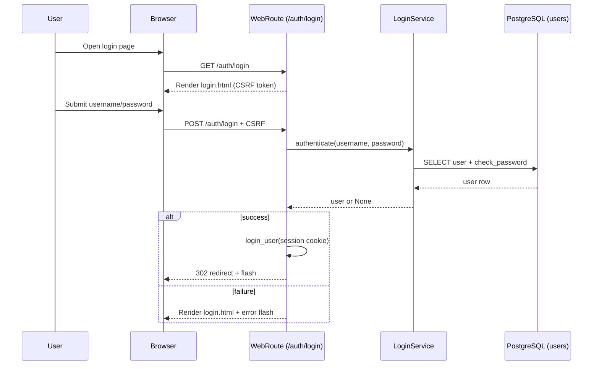
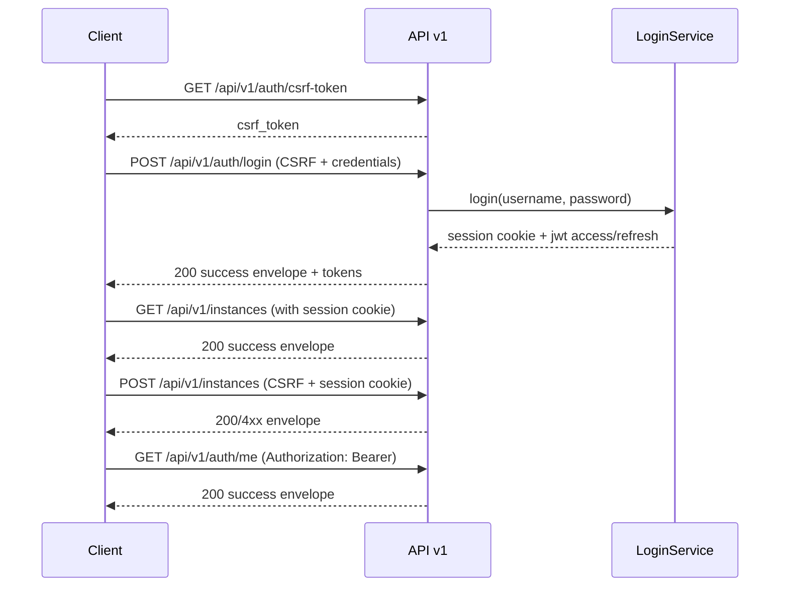

# 登录(login)与鉴权调用路径

## 适用范围

- 你要新增一个需要登录/权限的 API v1 endpoint.
- 你在排查 "为什么 401/403" 或 "为什么 CSRF 报错".
- 你在写 curl/自动化脚本调用 API v1.

## 触发入口

- Web 登录(页面):
  - `GET /auth/login`
  - `POST /auth/login`
- API 登录(REST):
  - `GET /api/v1/auth/csrf-token`
  - `POST /api/v1/auth/login`
  - 后续调用通常携带 session cookie, 写接口再加 `X-CSRFToken`.

## 流程图

### Web 登录(页面)



> [!tip]
> Canvas: [[canvas/auth/web-login-sequence.canvas]]

### API 登录与调用(REST)



> [!tip]
> Canvas: [[canvas/auth/api-login-sequence.canvas]]

## 代码入口(按定位顺序)

- Web routes:
  - `app/routes/auth.py`
- API v1:
  - `app/api/v1/namespaces/auth.py`
  - decorators: `app/api/v1/resources/decorators.py`
- Auth services:
  - `app/services/auth/login_service.py`
  - `app/services/auth/auth_me_read_service.py`
- CSRF:
  - `app/utils/decorators.py:require_csrf`

## 可复制复现(curl)

直接复用 cookbook 的最小链路即可:
- `[[reference/examples/api-v1-cookbook#最小可跑: CSRF + cookie 登录]]`
- `[[reference/examples/api-v1-cookbook#最小可跑: 调用一个 view 接口]]`

## 常见 message_code

以 `[[reference/errors/message-code-catalog]]` 为准, 登录相关高频项:

- `CSRF_MISSING`, `CSRF_INVALID`
- `INVALID_CREDENTIALS`, `ACCOUNT_DISABLED`, `RATE_LIMIT_EXCEEDED`
- `AUTHENTICATION_REQUIRED`, `PERMISSION_REQUIRED`

## 自查命令(rg)

```bash
# Web 登录入口
rg -n \"GET /auth/login|POST /auth/login\" app/routes/auth.py

# API 登录入口
rg -n \"csrf-token|/auth/login\" app/api/v1/namespaces/auth.py

# CSRF guard
rg -n \"def require_csrf\\b|CSRF_MISSING|CSRF_INVALID\" app/utils/decorators.py app

# message_code 触发点
rg -n \"message_key=\\\"(CSRF_MISSING|CSRF_INVALID|INVALID_CREDENTIALS|ACCOUNT_DISABLED|RATE_LIMIT_EXCEEDED)\\\"\" app
```

## 深读(服务层文档)

- [[reference/service/auth-services]]
