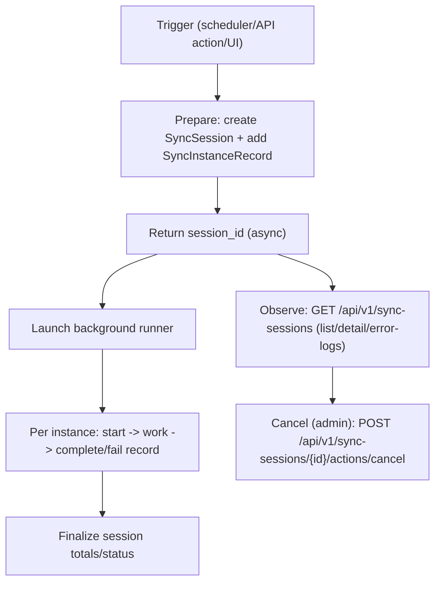

# 批量异步会话(SyncSession)主线

## 适用范围

- 你在实现一个"发起即返回, 后台慢慢跑"的动作(action endpoint).
- 你在排查批量任务: 为何卡住, 为何部分实例失败, 为何 UI 一直转圈.
- 你要给新能力接入统一的会话观测面(History Sessions).

## 核心概念

- `SyncSession`: 一次批量执行的聚合视图(总状态, 计数, started/ended, error_summary).
- `SyncInstanceRecord`: 以 `instance_id` 为粒度的执行记录(每实例状态, 错误, 统计).
- 典型产物:
  - accounts sync, capacity sync, aggregation stats 等都复用同一套会话模型.

## 触发入口(高层)

- scheduler jobs: cron/interval 触发 `app/tasks/**`, 内部创建 session 并写 records.
- API actions: request -> prepare(session_id) -> response -> launch background.
- Web UI: 发起动作后轮询 `/api/v1/sync-sessions/{session_id}` 展示进度.

## 流程图



> [!tip]
> Canvas: [[canvas/sync-sessions/sync-session-flow.canvas]]

## 代码入口

- Contract(SSOT): [[API/sessions-api-contract]]
- Models:
  - `app/models/sync_session.py`
  - `app/models/sync_instance_record.py`
- Service:
  - `app/services/sync_session_service.py`
- API:
  - `app/api/v1/namespaces/sessions.py` (`/api/v1/sync-sessions`)
- Web UI(会话中心):
  - route: `app/routes/history/sessions.py` (`/history/sessions`)
  - template: `app/templates/history/sessions/sync-sessions.html`
  - JS: `app/static/js/modules/views/history/sessions/sync-sessions.js`
  - async feedback helper: `app/static/js/modules/ui/async-action-feedback.js`

## 深读(服务层文档)

- [[reference/service/sync-session-service]]

## 可复制自查(SQL)

> [!note]
> 下面 SQL 以 PostgreSQL 为例, 表名以 models 为准.

```sql
-- 1) 查某个 session 的实例失败明细
select
  id,
  sync_session_id,
  instance_id,
  status,
  error_message,
  started_at,
  ended_at
from sync_instance_records
where sync_session_id = :session_id
  and status = 'failed'
order by ended_at desc;

-- 2) 最近 24h failed session, 按 sync_category 聚合
select
  sync_category,
  count(*) as failed_count
from sync_sessions
where status = 'failed'
  and started_at >= now() - interval '24 hours'
group by sync_category
order by failed_count desc;
```

## 常见 message_code(排障入口)

以 `[[reference/errors/message-code-catalog]]` 为准, 会话相关高频项:

- `SYNC_DATA_ERROR`, `SNAPSHOT_MISSING`, `PERMISSION_FACTS_MISSING`
- `TASK_EXECUTION_FAILED`, `DATABASE_QUERY_ERROR`, `INTERNAL_ERROR`

## 排障路径(建议顺序)

1. 先拿到 `session_id`:
   - action response 里返回的 `session_id`, 或从会话中心列表里找到.
2. 看会话详情:
   - `GET /api/v1/sync-sessions/{session_id}`
3. 看失败实例记录与错误日志:
   - `GET /api/v1/sync-sessions/{session_id}/error-logs`
4. 用日志字段定位:
   - [[operations/observability-ops]]
5. 回到代码入口:
   - 结合 `sync_category/sync_type` 去找对应 task/service.
6. 深入调试套路:
- [[getting-started/debugging]]
