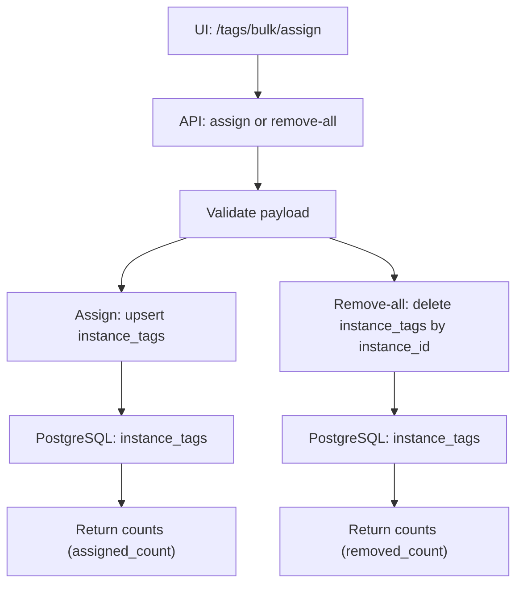

# 标签批量操作(tags bulk)

## 适用范围

- 你在做批量打标或批量清理标签.
- 你在排查: 为什么批量操作没有生效, 或为什么 counts 不对.
- 你在改 UI 行为, 需要确认后端 endpoints 与语义.

## 入口与范围

覆盖(以当前 UI 行为为主):

- 批量分配: `POST /api/v1/tags/bulk/actions/assign`
- 批量移除(清空实例所有标签): `POST /api/v1/tags/bulk/actions/remove-all`

可选补充(非 UI 主路径, 仅作为后端能力备注):

- 批量移除(指定 tag_ids): `POST /api/v1/tags/bulk/actions/remove`

Web UI:

- 页面: `/tags/bulk/assign`
- 当前 UI 的"移除"走 `remove-all`(不支持指定 tag_ids 移除).

## 流程图



> [!tip]
> Canvas: [[canvas/tags/tags-bulk-flow.canvas]]

## 代码入口

- Contract(SSOT): [[API/tags-api-contract]]
- API:
  - `app/api/v1/namespaces/tags.py` (`/api/v1/tags/bulk/**`)
- Service:
  - `app/services/tags/tags_bulk_actions_service.py`
- Models:
  - `app/models/tag.py` (`instance_tags` join table)
  - `app/models/instance.py`
- Web UI:
  - route: `app/routes/tags/bulk.py`
  - template: `app/templates/tags/bulk/assign.html`
  - JS: `app/static/js/modules/views/tags/batch-assign.js`
  - JS service: `app/static/js/modules/services/tag_management_service.js`

## 相关 domain notes

- [[architecture/tags-domain]]

## 常见 message_code

以 `[[reference/errors/message-code-catalog]]` 为准, 本流程常见:

- `REQUEST_DATA_EMPTY`: body 为空或不是 object.
- `VALIDATION_ERROR`: instance_ids/tag_ids 非法.

## 自查 SQL(常用)

```sql
-- 1) 某实例当前标签数
select
  instance_id,
  count(*) as tag_count
from instance_tags
where instance_id = :instance_id
group by instance_id;

-- 2) 某 tag 被多少实例引用
select
  tag_id,
  count(*) as instance_count
from instance_tags
where tag_id = :tag_id
group by tag_id;
```

## 备注: remove(tag_ids) 与 remove-all 的取舍

- remove-all 更符合当前 UI 语义: "一键清空选中实例的所有标签".
- remove(tag_ids) 更适合"精确移除", 但需要 UI 选择要移除的 tag_ids.
