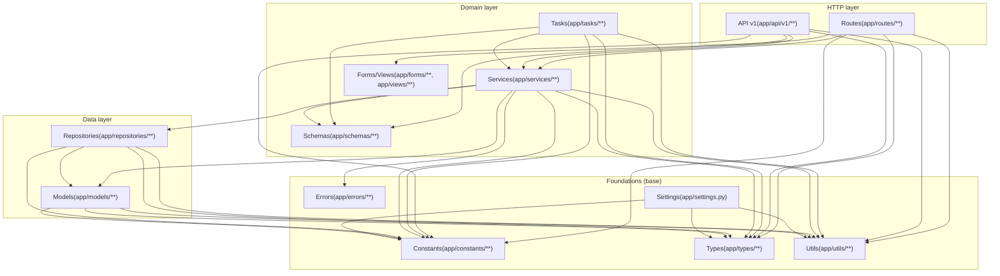

# 模块依赖边界图(layer-first)

> [!note] 目标
> 给出一个能落到 `import` 级别的依赖方向: 谁可以依赖谁, 谁不应该依赖谁.

## 1. 依赖方向总览(Depends on)



## 2. 核心规则(看这几条就够用)

- Routes/API 只能做 "HTTP 边界层": 解析入参/权限/调用 service/返回封套, 禁止在这里堆业务逻辑.
- Services 承载业务编排与事务边界, 可以调用 repositories/models, 但不应依赖 routes/api.
- Repositories 只做 read query 组合与数据访问细节, 不应依赖 services.
- Utils/Types/Constants/Errors 属于基础层, 禁止反向依赖上层(例如 utils import services).

## 3. 常见违规形态(快速自检)

> [!tip]
> 当你不确定边界是否被破坏时, 先用 `rg` 找 import 链路.

```bash
# services 不应 import routes/api
rg -n \"from app\\.routes|import app\\.routes|from app\\.api|import app\\.api\" app/services

# repositories 不应 import services/routes/api
rg -n \"from app\\.services|import app\\.services|from app\\.routes|import app\\.routes|from app\\.api|import app\\.api\" app/repositories

# utils 不应 import services/routes/api/repos
rg -n \"from app\\.services|from app\\.routes|from app\\.api|from app\\.repositories\" app/utils
```

## 4. 关联标准与入口

- 分层标准(SSOT): [[standards/backend/layer/README|后端分层标准]]
- 代码地图: [[architecture/project-structure]]
- 常见开发任务入口: [[architecture/developer-entrypoint]]

