# WhaleFall 技术规格与架构说明

> [!summary] Reader guide
> - 代码落点: [[architecture/project-structure]]
> - 常见任务: [[architecture/developer-entrypoint]]
> - 认证与权限: [[architecture/identity-access]]
> - 运维排障: [[operations/observability-ops]]
> - API contract: [[API/api-v1-api-contract]]
> - 可编辑图(Canvas): [[canvas/README]]
> - 流程 SOP: [[architecture/flows/README]]

## 1. 系统概述(As-built)

WhaleFall 是一个面向 DBA/平台团队的数据库管理 Web 应用.
系统维护"实例与凭据"清单, 通过适配器连接外部数据库, 拉取账户与权限快照, 生成分类与台账, 并提供容量统计, 任务调度, 统一日志与审计能力.

核心领域对象(主库持久化):

- 实例(Instance)
- 凭据(Credential)
- 账户与权限快照(Account/Permission snapshot)
- 分类与规则(Classification/Rules)
- 标签(Tag)
- 同步会话(SyncSession + instance records)
- 容量统计与聚合(Capacity stats/aggregations)
- 统一日志(UnifiedLog)

### 1.1 业务能力图(Capability map)

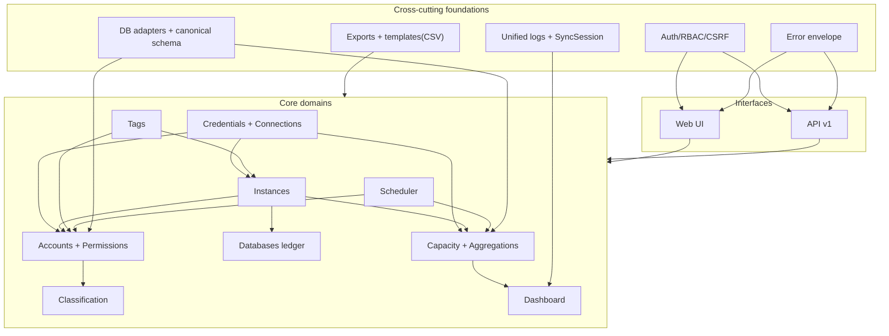

> [!tip]
> Canvas: [[canvas/global-business-capability-map.canvas]]

## 2. 运行拓扑与数据存储

### 2.1 系统上下文(C4 L1)

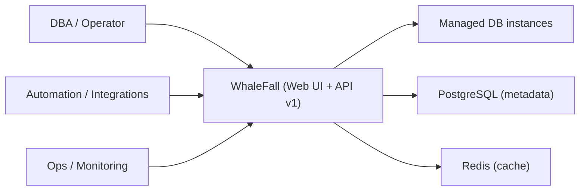

> [!tip]
> Canvas: [[canvas/global-c4-l1-system-context.canvas]]

### 2.2 运行拓扑(C4 L2)

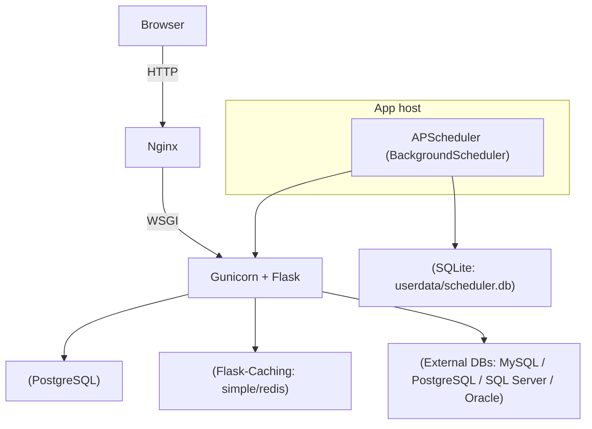

> [!tip]
> Canvas: [[canvas/global-c4-l2-runtime-topology.canvas]]

说明:

- 主库: SQLAlchemy models 存储在 PostgreSQL(由 `SQLALCHEMY_DATABASE_URI` 配置).
- 缓存: Flask-Caching, 支持 `CACHE_TYPE=simple/redis`(生产建议 redis).
- 调度器: APScheduler + SQLite jobstore(`userdata/scheduler.db`), 通过部署约束保持单实例执行（推荐 Web/Scheduler 分进程 + `ENABLE_SCHEDULER` 开关）.

## 3. 整体架构图(组件视角)

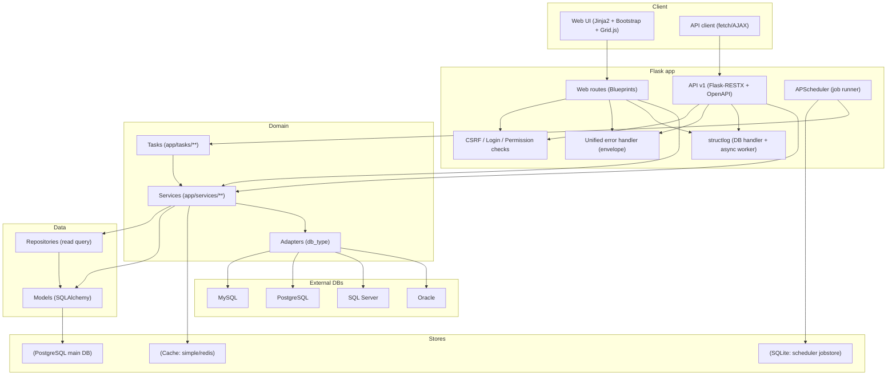

> [!tip]
> Canvas: [[canvas/global-system-architecture.canvas]]

## 4. 代码架构与分层

代码地图见 [[architecture/project-structure]]. 关键边界如下:

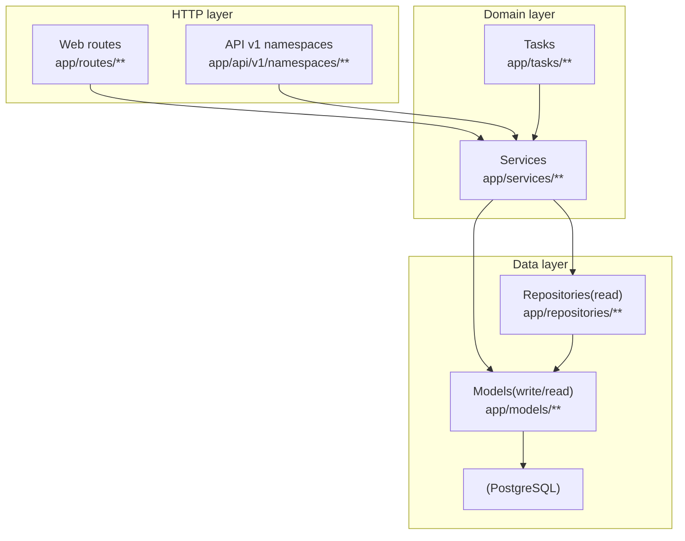

> [!tip]
> Canvas: [[canvas/global-c4-l3-component-layering.canvas]]

关键约束(避免架构漂移):

- 写路径事务边界: service 负责事务边界与失败语义, 见 [[standards/backend/hard/write-operation-boundary]].
- API 错误封套: API v1 必须走统一错误口径, 见 [[standards/backend/hard/error-message-schema-unification]].
- request payload 与 schema: 写路径入参校验优先用 `app/schemas/**`(Pydantic), 见 [[standards/backend/gate/request-payload-and-schema-validation]].
- 任务必须在 `app.app_context()` 内运行, 见 [[standards/backend/hard/task-and-scheduler]].

## 5. 关键流程(As-built)

> [!tip]
> 本节是概览. 可执行 SOP 见 [[architecture/flows/README]].

### 5.1 Web 登录(页面)

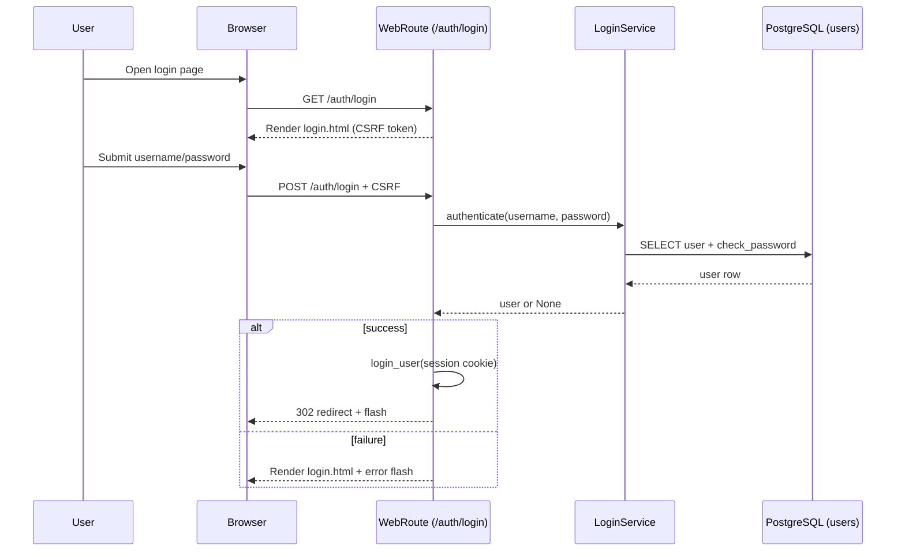

> [!tip]
> Canvas: [[canvas/auth/web-login-sequence.canvas]]

### 5.2 API 登录与调用(REST)

> [!note]
> API v1 的写操作普遍要求 CSRF header(`X-CSRFToken`). 同时, 多数资源鉴权依赖 session cookie(Flask-Login).
> JWT 目前主要用于 `/api/v1/auth/me` 等 auth 域接口.

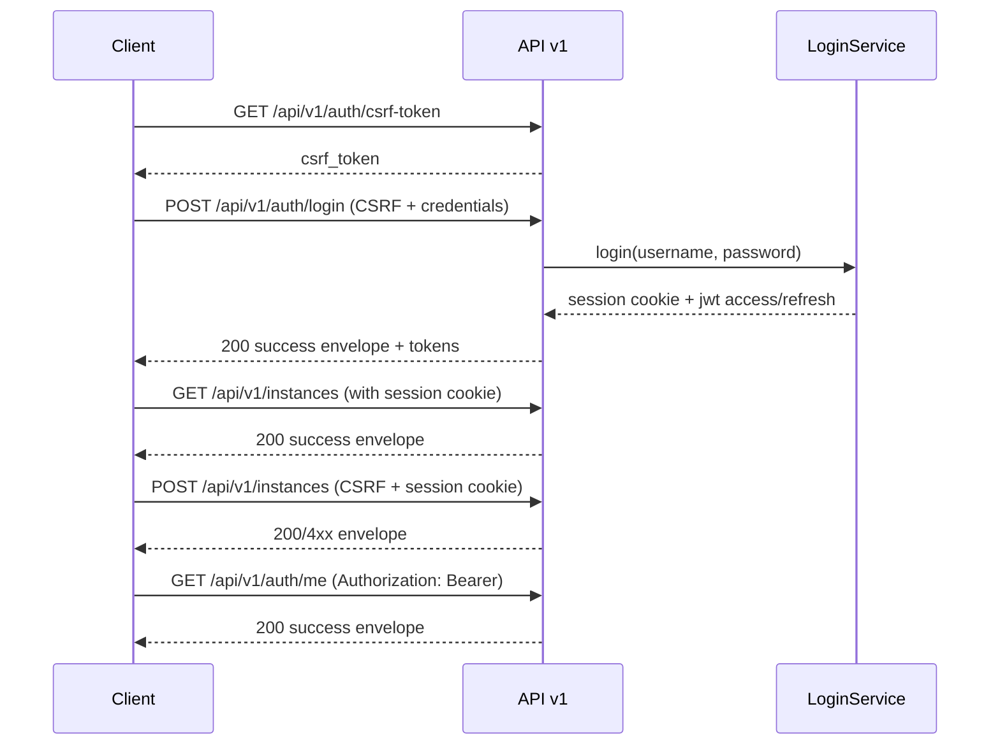

> [!tip]
> Canvas: [[canvas/auth/api-login-sequence.canvas]]

### 5.3 账户同步(后台: inventory + permissions)

API action 已迁移到 instances 资源下:

- `POST /api/v1/instances/actions/sync-accounts`(全量)
- `POST /api/v1/instances/{instance_id}/actions/sync-accounts`(单实例)

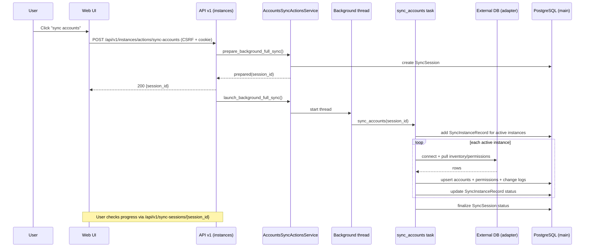

> [!tip]
> Canvas: [[canvas/accounts/accounts-session-sequence.canvas]]

### 5.4 账户分类(规则 + DSL v4)

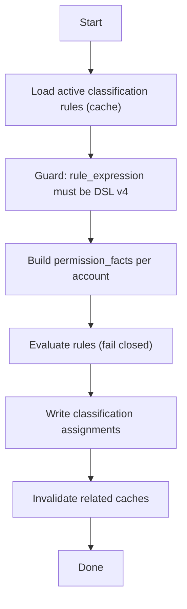

> [!tip]
> Canvas: [[canvas/account-classification/account-classification-flow.canvas]]

更细的 DSL v4 语义与守卫口径见:

- [[reference/service/account-classification-dsl-v4|Account Classification DSL v4]]
- [[reference/service/account-classification-orchestrator|Account Classification Orchestrator]]

### 5.5 容量采集(库存 + size stats)

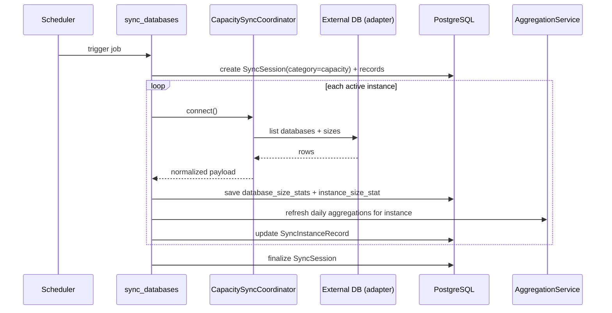

> [!tip]
> Canvas: [[canvas/capacity/capacity-sequence.canvas]]

### 5.6 周/月/季聚合(aggregation)

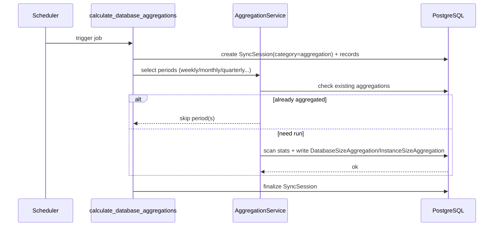

> [!tip]
> Canvas: [[canvas/capacity/capacity-aggregation-sequence.canvas]]

### 5.7 统一日志落库与查询

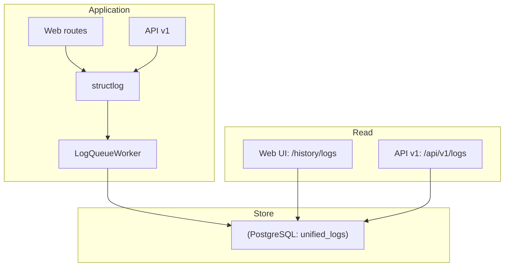

> [!tip]
> Canvas: [[canvas/observability/unified-logs-flow.canvas]]

## 6. API v1 设计(`/api/v1/**`)

对外 JSON API 的 SSOT 是 `docs/Obsidian/API/*-api-contract.md`(索引: [[API/api-v1-api-contract]]).
实现落点:

- blueprint 注册: `app/api/__init__.py`
- RestX Api 定制: `app/api/v1/api.py`(`WhaleFallApi.handle_error`)
- namespaces: `app/api/v1/namespaces/*.py`
- OpenAPI: `/api/v1/openapi.json`
- Swagger UI: `/api/v1/docs`(可通过 settings 开关)

响应封套(高层约束):

- success: `success=true`, `error=false`, `message`, `timestamp`, `data?`, `meta?`
- error: 统一字段集, 由全局错误处理器生成(参考 `app/utils/response_utils.py`)

## 7. Identity & Access(认证/授权/权限)

结论与细节以 [[architecture/identity-access]] 为准. 这里仅给开发侧落点提示:

- Web UI: Flask-Login session cookie + CSRF(Flask-WTF/CSRFProtect)
- API v1:
  - 登录: `/api/v1/auth/login`(写入 session, 同时签发 JWT access/refresh token)
  - CSRF: 写操作通常要求 `X-CSRFToken` 头
  - 权限检查: `app/utils/decorators.py:has_permission` + API decorators(`app/api/v1/resources/decorators.py`)

## 8. Scheduler & Tasks(任务调度)

调度器实现:

- `app/scheduler.py`: APScheduler 封装, SQLite jobstore, `ENABLE_SCHEDULER` 开关
- `app/config/scheduler_tasks.yaml`: 默认任务配置

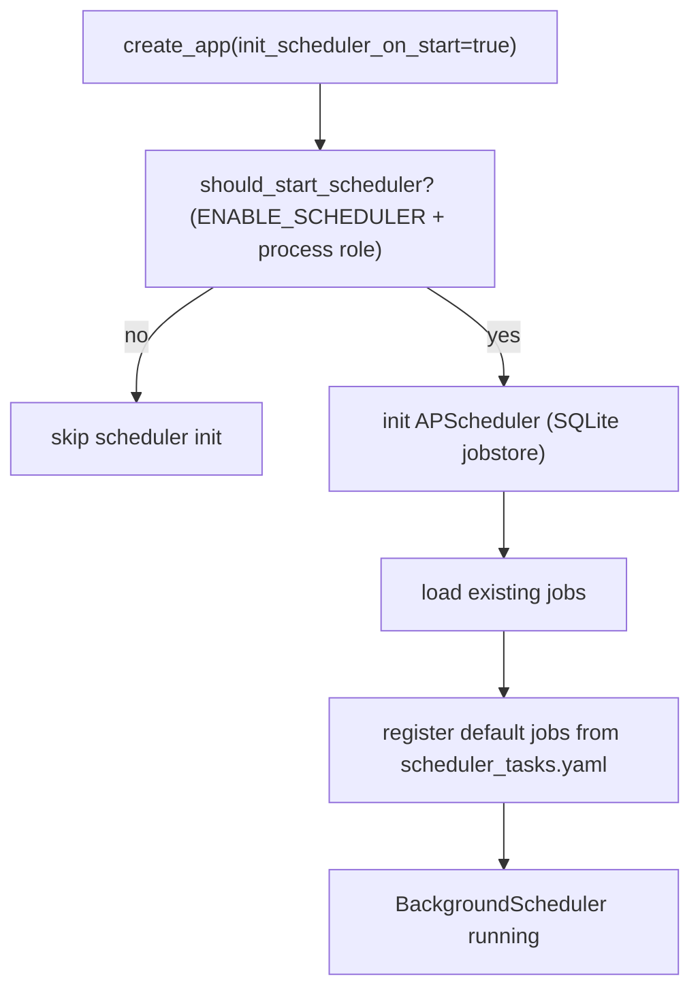

> [!tip]
> Canvas: [[canvas/scheduler/scheduler-flow.canvas]]

任务实现:

- `app/tasks/**`: 任务入口负责 app context + 可观测字段, 业务逻辑下沉到 `app/services/**`
- 典型模式: 任务内部 `create_app(init_scheduler_on_start=False)` 后 `with app.app_context(): ...`

## 9. 外部数据库适配器(db_type)

系统通过适配器隔离不同数据库的连接与元数据获取差异:

- 连接适配器: `app/services/connection_adapters/adapters/**`
- 账户同步适配器: `app/services/accounts_sync/adapters/**`
- 数据库/容量同步适配器: `app/services/database_sync/adapters/**` + `app/services/database_sync/table_size_adapters/**`

新增 db_type 的任务导航见 [[architecture/developer-entrypoint]].

## 10. 可观测性与排障接口

可观测性 SOP 与关键字段见 [[operations/observability-ops]].
代码侧关键落点:

- structlog 配置: `app/utils/structlog_config.py`
- 统一日志模型: `app/models/unified_log.py`
- 同步会话与实例记录: `app/models/sync_session.py`, `app/models/sync_instance_record.py`

## 11. 文档 SSOT 与边界

文档边界以 [[standards/doc/guide/document-boundary]] 为准. 简要记忆:

- standards: `docs/Obsidian/standards/**`(规范 SSOT)
- reference: `docs/Obsidian/reference/**`(查阅型 SSOT)
- API: `docs/Obsidian/API/**`(contract SSOT)
- operations: `docs/Obsidian/operations/**`(运维与排障)
