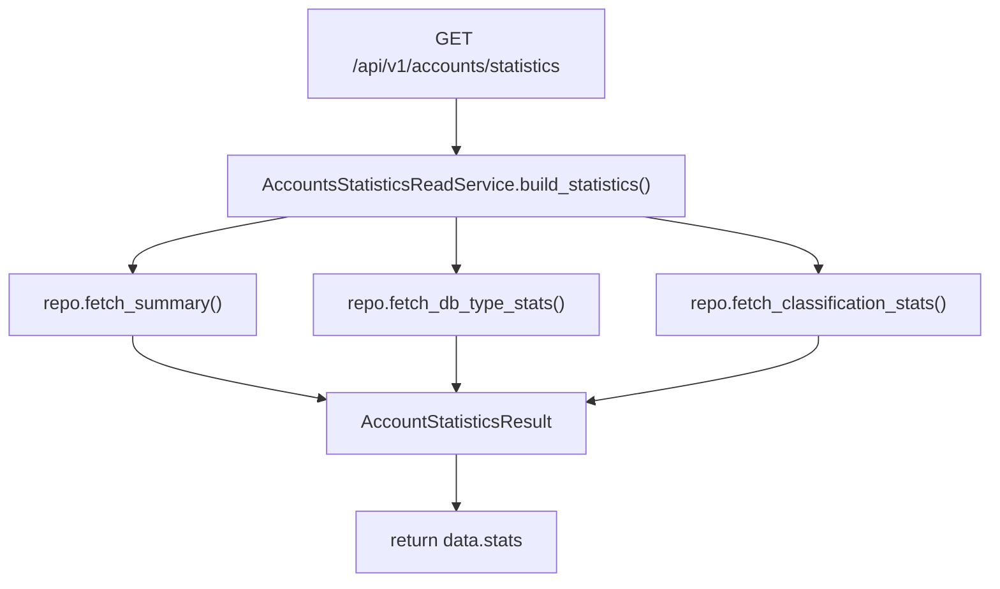

# Accounts Statistics Read Service(账户统计汇总)

> [!note] 本文目标
> 说明 `AccountsStatisticsReadService` 如何聚合 repository 的多个统计查询, 并输出稳定 DTO.

## 1. 概览(Overview)

覆盖文件:

- `app/services/accounts/accounts_statistics_read_service.py`
- repository: `app/repositories/account_statistics_repository.py`

核心入口:

- `build_statistics()`:
  - `fetch_summary()` + `fetch_db_type_stats()` + `fetch_classification_stats()` 组装为 `AccountStatisticsResult`.
- `fetch_summary(instance_id?, db_type?)`:
  - 用于 `/api/v1/accounts/statistics/summary`.

持久化影响:

- 只读: 统计聚合查询, 不做写入.

## 2. 依赖与边界(Dependencies)

| 类型 | 组件 | 用途 | 失败语义(摘要) |
| --- | --- | --- | --- |
| Repo | `AccountStatisticsRepository` | 统计 SQL/查询构造 | DB 异常由 repo 抛出 |
| DTO | `AccountStatisticsResult` | 对外结构 | 不直接返回 dict |

## 3. 事务与失败语义(Transaction + Failure Semantics)

- 读服务, 不做 commit.
- service 不做 try/except; 依赖 repository/route 层统一处理 DB 异常与 error envelope.

## 4. 主流程图(Flow)

## 5. 兼容/防御/回退/适配逻辑

| 位置(文件:行号) | 类型 | 描述 | 触发条件 | 清理条件/期限 |
| --- | --- | --- | --- | --- |
| `app/services/accounts/accounts_statistics_read_service.py:19` | 防御 | `repository or AccountStatisticsRepository()` 兜底 | 调用方未注入 repository | 若统一 DI, 改为强制注入 |
| `app/services/accounts/accounts_statistics_read_service.py:34` | 防御 | `summary.get("total_instances", 0)` 兜底 | repo 未返回 total_instances | 若 repo 输出 schema 固定, 可改为强约束 |

## 6. 测试与验证(Tests)

最小验证命令:

- `uv run pytest -m unit tests/unit/routes/test_api_v1_accounts_statistics_contract.py`
