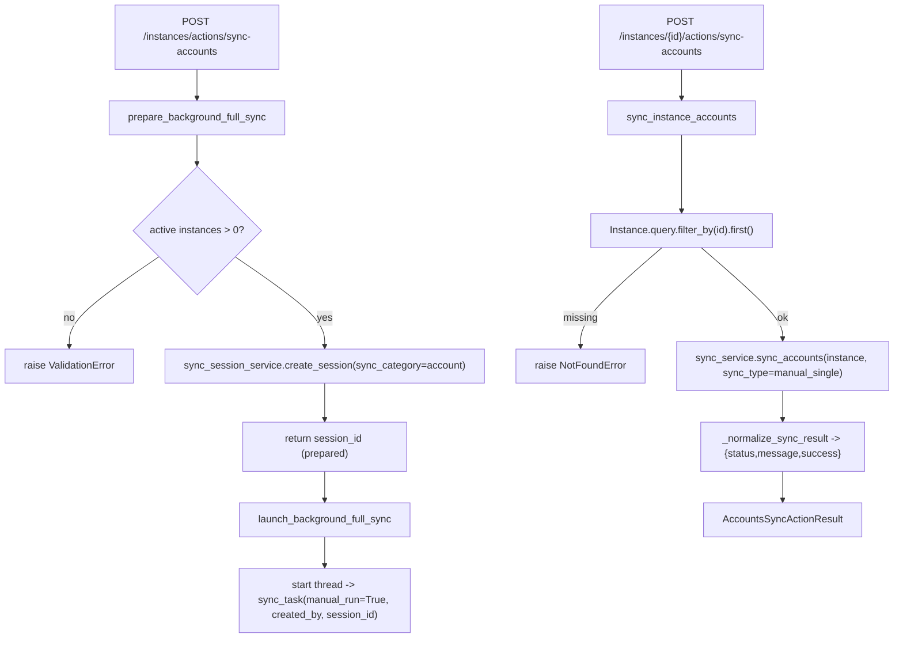

# Accounts Sync Actions Service(触发后台同步/单实例同步)

> [!note] 本文目标
> 说明 accounts sync 的 action 编排层如何做到: prepare session_id -> commit -> launch background thread, 以及单实例同步的 result 标准化规则.

## 1. 概览(Overview)

覆盖文件:

- `app/services/accounts_sync/accounts_sync_actions_service.py`

核心入口:

- `prepare_background_full_sync(created_by?) -> AccountsSyncBackgroundPreparedSession`
  - 校验存在活跃实例
  - 创建 `SyncSession(sync_type=manual_task, sync_category=account)`
- `launch_background_full_sync(created_by?, prepared) -> AccountsSyncBackgroundLaunchResult`
  - 启动后台线程, 调用 task 函数 `sync_task(manual_run=True, created_by, session_id)`
- `sync_instance_accounts(instance_id, actor_id?, sync_type=manual_single) -> AccountsSyncActionResult`
  - 同步执行单实例 accounts sync, 并规范化 result/status/message 结构

典型调用方:

- `POST /api/v1/instances/actions/sync-accounts` (后台会话模式)
- `POST /api/v1/instances/{id}/actions/sync-accounts` (单实例同步返回)

## 2. 依赖与边界(Dependencies)

| 类型 | 组件 | 用途 | 失败语义(摘要) |
| --- | --- | --- | --- |
| Model | `Instance.query` | 校验活跃实例/获取实例 | 0 个活跃实例 -> ValidationError; 不存在 -> NotFoundError |
| Session | `sync_session_service.create_session` | 创建 SyncSession | DB 异常由 service 抛出 |
| Worker | `threading.Thread(daemon=True)` | 启动后台线程 | 后台异常仅记录日志(不传播) |
| Sync | `SupportsAccountSync.sync_accounts` | 单实例同步 | 返回 dict 或 None |

## 3. 事务与失败语义(Transaction + Failure Semantics)

- prepare_background_full_sync:
  - active instance count=0 -> ValidationError("没有找到活跃的数据库实例").
  - 创建 session: 由 `sync_session_service` 执行 nested 事务与 flush.
- launch_background_full_sync:
  - 仅负责启动线程; 线程内异常捕获 `BACKGROUND_SYNC_EXCEPTIONS` 并记录 error log (pragma: no cover).
- sync_instance_accounts:
  - Instance 不存在 -> NotFoundError("实例不存在").
  - sync_service 返回 None/空 -> 标准化为 `{status:failed, success:false, message:...}`.
  - sync_result 中若缺少 `success` 字段, 默认视为 `success=True` (见 7).

## 4. 主流程图(Flow)

## 5. 决策表/规则表(Decision Table)

### 5.1 _normalize_sync_result(result)

| result | 输出 success | status | message |
| --- | --- | --- | --- |
| None/空 | False | failed | "{context}返回为空" |
| dict 且 `success` 缺失 | True | completed | 若缺 message, 补 "{context}成功" |
| dict 且 `success=false` | False | failed | 若缺 message, 补 "{context}失败" |

实现位置: `app/services/accounts_sync/accounts_sync_actions_service.py:114`.

## 6. 兼容/防御/回退/适配逻辑

| 位置(文件:行号) | 类型 | 描述 | 触发条件 | 清理条件/期限 |
| --- | --- | --- | --- | --- |
| `app/services/accounts_sync/accounts_sync_actions_service.py:90` | 防御 | 后台线程捕获异常仅记录日志(不传播) | 后台任务失败 | 若需要对外可观测, 需补 session failed 更新与 error_logs 写入 |
| `app/services/accounts_sync/accounts_sync_actions_service.py:114` | 兼容 | result 缺 `success` 默认 True | 历史 adapter/service 返回结构不一致 | 统一 result schema 后可改为强约束 |
| `app/services/accounts_sync/accounts_sync_actions_service.py:169` | 防御 | `instance.sync_count = (sync_count or 0) + 1` 兜底 None | 旧数据 sync_count 为空 | 数据迁移后可移除 `or 0` |

## 7. 可观测性(Logs + Metrics)

- 单实例同步:
  - `log_with_context(... action="sync_instance_accounts")` 记录 instance_id/name/db_type/host.
- 后台全量同步失败:
  - `log_with_context("error","后台批量账户同步失败", action="sync_all_accounts_background", session_id=...)` (仅日志, 不会影响线程外部).

## 8. 测试与验证(Tests)

最小验证命令:

- `uv run pytest -m unit tests/unit/routes/test_api_v1_accounts_sync_contract.py`
