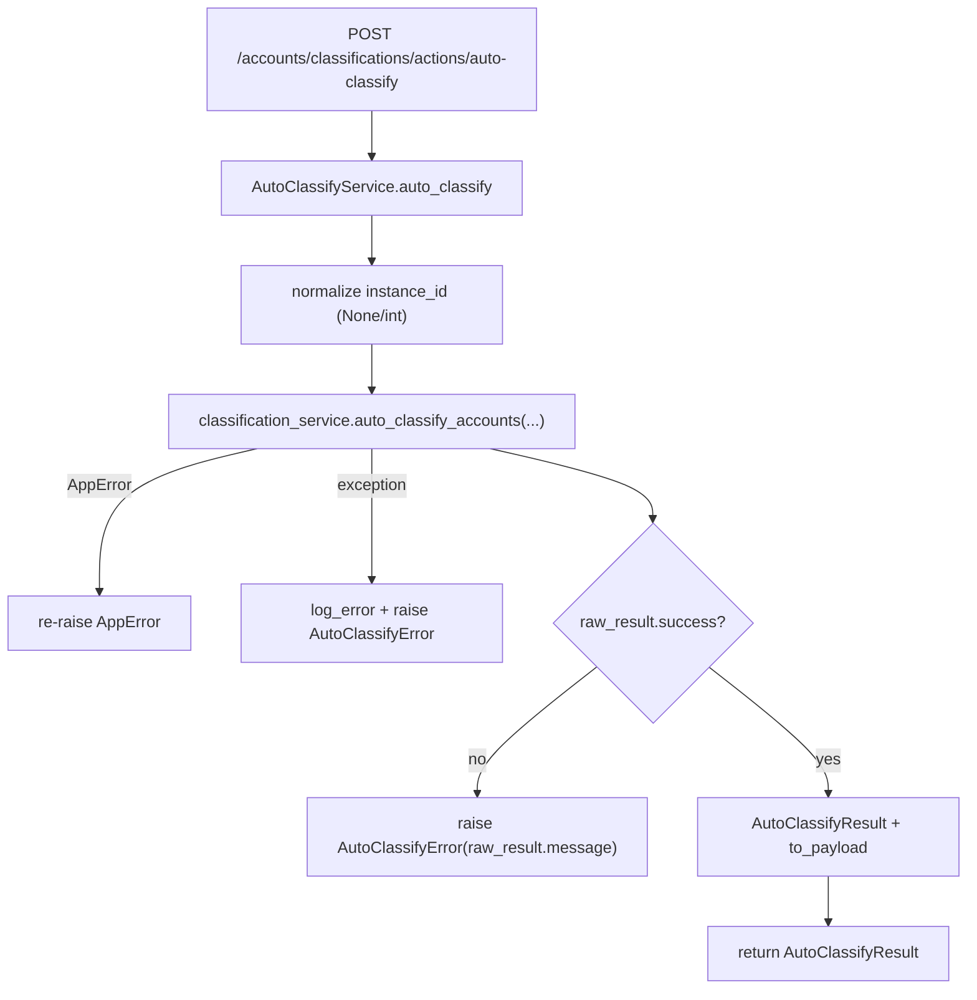

# Auto Classify Service(自动分类 action 编排)

> [!note] 本文目标
> 说明 `AutoClassifyService.auto_classify` 如何将 route 层与分类引擎编排器解耦, 以及它的参数归一化与失败语义.

## 1. 概览(Overview)

覆盖文件:

- `app/services/account_classification/auto_classify_service.py`

核心入口:

- `AutoClassifyService.auto_classify(instance_id?, created_by?) -> AutoClassifyResult`
  - instance_id 为空: 全量
  - instance_id 非空: 单实例范围

调用方:

- API action: `POST /api/v1/accounts/classifications/actions/auto-classify` (见 `[[API/accounts-api-contract]]`)

下游依赖:

- `AccountClassificationService.auto_classify_accounts(...)` (见 `[[reference/server/account-classification-orchestrator]]`)

## 2. 依赖与边界(Dependencies)

| 类型 | 组件 | 用途 | 失败语义(摘要) |
| --- | --- | --- | --- |
| Orchestrator | `AccountClassificationService` | 执行引擎编排与落库 | 返回 dict(success/message/...) 或抛 AppError |
| Logs | `log_info/log_error` | 记录 trigger/completed/failed | 不影响返回 |
| Errors | `AppError` / `AutoClassifyError` | 对外失败口径 | route 层封套 |

## 3. 事务与失败语义(Transaction + Failure Semantics)

- 本 service 不做 commit.
- 对 orchestrator 的调用:
  - 如果抛 `AppError`: 直接透传(不包裹).
  - 其他异常: 记录 log_error 并抛 `AutoClassifyError("自动分类执行失败")`.
- 如果 orchestrator 返回 `success=false`:
  - 记录 log_error.
  - 抛 `AutoClassifyError(message)` (message 优先用 raw_result.message).

## 4. 主流程图(Flow)

## 5. 决策表/规则表(Decision Table)

### 5.1 instance_id 归一化

| 输入 | 输出 | 失败 |
| --- | --- | --- |
| None/"" | None(全量) | - |
| bool | - | AutoClassifyError("instance_id 参数无效") |
| int/float/str 可转 int | int | - |
| 其他 | - | AutoClassifyError("instance_id 必须为整数") |

实现位置: `app/services/account_classification/auto_classify_service.py:156`.

## 6. 兼容/防御/回退/适配逻辑

| 位置(文件:行号) | 类型 | 描述 | 触发条件 | 清理条件/期限 |
| --- | --- | --- | --- | --- |
| `app/services/account_classification/auto_classify_service.py:106` | 防御 | `_as_int(value or 0)` + try/except 转 int, 失败返回 0 | orchestrator 返回的 counts 非 int | 若保证 schema, 改为强约束并补测试 |
| `app/services/account_classification/auto_classify_service.py:120` | 兼容 | errors 支持 str 或 list, 统一转为 list[str] | orchestrator errors 类型不稳定 | 若下游统一为 list[str], 可收敛 |
| `app/services/account_classification/auto_classify_service.py:86` | 防御 | `classification_service or AccountClassificationService()` 兜底 | 调用方未注入 | 若统一 DI, 改为强制注入 |
| `app/services/account_classification/auto_classify_service.py:66` | 防御 | `except Exception` 捕获非 AppError 并转 AutoClassifyError | 未预期异常 | 若要细分错误码, 收敛异常类型并补用例 |

## 7. 可观测性(Logs + Metrics)

- `auto_classify_triggered` (info) 与 `auto_classify_completed` (info) 输出关键字段: `instance_id`, `created_by`, `classified_accounts`, `failed_count`.
- 失败日志:
  - `auto_classify_service_failed` (exception)
  - `auto_classify_failed` (business failed, raw_result.success=false)

## 8. 测试与验证(Tests)

最小验证命令:

- `uv run pytest -m unit tests/unit/routes/test_api_v1_accounts_classifications_contract.py`
