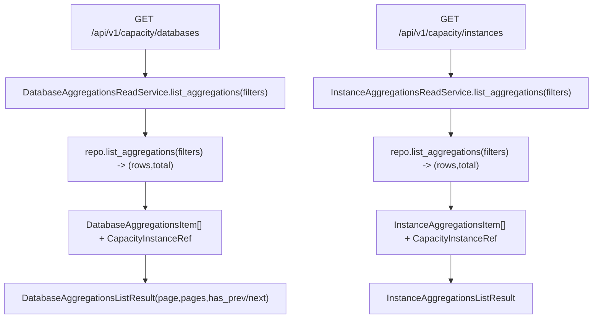

# Capacity Aggregations Read Services(聚合查询/summary)

> [!note] 本文目标
> 说明 capacity 聚合表的读路径: list + summary, 以及分页/get_all 规则.

## 1. 概览(Overview)

覆盖文件:

- `app/services/capacity/database_aggregations_read_service.py`
- `app/services/capacity/instance_aggregations_read_service.py`
- repositories:
  - `app/repositories/capacity_databases_repository.py`
  - `app/repositories/capacity_instances_repository.py`

核心入口:

- databases:
  - `DatabaseAggregationsReadService.list_aggregations(filters)`
  - `DatabaseAggregationsReadService.build_summary(filters)`
- instances:
  - `InstanceAggregationsReadService.list_aggregations(filters)`
  - `InstanceAggregationsReadService.build_summary(filters)`

## 2. 事务与失败语义(Transaction + Failure Semantics)

- 读服务, 不做 commit.
- list_aggregations:
  - 聚合 rows -> 逐条 cast/format 为 DTO.
  - 缺失数值字段会以 `0/0.0/None` 填充(见 7).

## 3. 主流程图(Flow)

## 4. 决策表/规则表(Decision Table)

### 4.1 databases list: get_all

| filters.get_all | 行为 |
| --- | --- |
| true | `total=len(items)`, `page=1`, `pages=1`, `limit=len(items)`, `has_prev/next=false` |
| false | pages 计算: `(total + limit - 1) // limit` (total 为 0 则 pages=0) |

实现位置: `app/services/capacity/database_aggregations_read_service.py:92`.

### 4.2 instances list: pages 最小值

| total | pages |
| --- | --- |
| 任意 | `max((total+limit-1)//limit, 1)` |

实现位置: `app/services/capacity/instance_aggregations_read_service.py:98`.

## 5. 兼容/防御/回退/适配逻辑

| 位置(文件:行号) | 类型 | 描述 | 触发条件 | 清理条件/期限 |
| --- | --- | --- | --- | --- |
| `app/services/capacity/database_aggregations_read_service.py:26` | 防御 | `repository or CapacityDatabasesRepository()` 兜底 | 调用方未注入 | 若统一 DI, 改为强制注入 |
| `app/services/capacity/database_aggregations_read_service.py:67` | 兼容 | Decimal/None -> float/0.0 | DB 结果缺失/为 Decimal | 若 DTO 改为 Decimal, 可收敛 |
| `app/services/capacity/instance_aggregations_read_service.py:26` | 防御 | `repository or CapacityInstancesRepository()` 兜底 | 调用方未注入 | 同上 |

## 6. 测试与验证(Tests)

最小验证命令:

- `uv run pytest -m unit tests/unit/routes/test_api_v1_capacity_databases_contract.py`
- `uv run pytest -m unit tests/unit/routes/test_api_v1_capacity_instances_contract.py`
