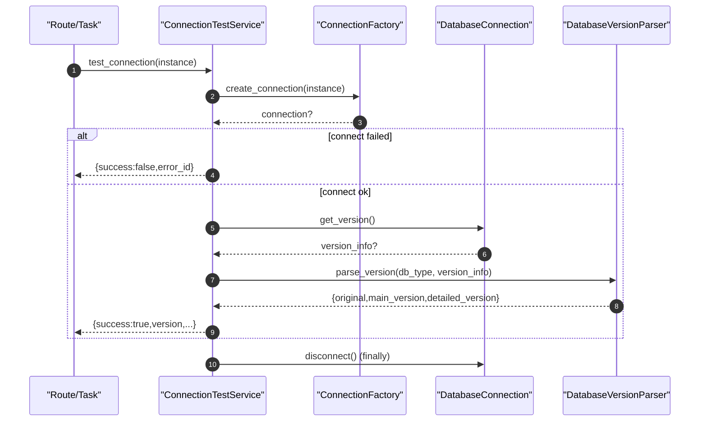

# Connection Test Service(数据库连接测试/版本探测)

> [!note] 本文目标
> 说明连接测试链路如何：
> - 使用 `ConnectionFactory` 生成适配器连接并测试 connect
> - 探测版本并写回 `Instance` 的版本字段
> - 在失败时返回“对外安全”的结果结构，并按 debug/admin 决定是否暴露 details
>
> 同时覆盖 Top38 中涉及的 Oracle/SQL Server 连接适配器里与测试相关的兼容/回退逻辑（默认库名、客户端初始化、params 兜底等）。

## 1. 概览(Overview)

核心入口：

- `ConnectionTestService.test_connection(instance)`：返回 dict 结构结果（不抛异常给 UI）。`app/services/connection_adapters/connection_test_service.py:72`

成功时更新实例字段：

- `instance.last_connected`
- `instance.database_version/main_version/detailed_version`（来自 `DatabaseVersionParser`）

失败时仍更新：

- `instance.last_connected`（用于审计“尝试时间”）`app/services/connection_adapters/connection_test_service.py:222`

## 2. 依赖与边界(Dependencies)

| 类型 | 组件 | 用途 | 失败语义(摘要) |
| --- | --- | --- | --- |
| Factory | `ConnectionFactory.create_connection` | instance -> 连接适配器 | None/连接失败 -> 返回 failure dict |
| Adapter | `DatabaseConnection.connect/get_version/disconnect` | 连接/版本 | 适配器异常 -> 返回 failure dict |
| Version | `DatabaseVersionParser` | 解析/展示版本 | 解析异常被外层捕获 |
| Security | `_should_expose_details` | 控制 details 是否输出 | 默认不输出 |
| Logs | `get_sync_logger()` | 同步链路日志 | 失败记录 error_id 便于追踪 |

## 3. 事务与失败语义(Transaction + Failure Semantics)

- 本服务不 commit，写回 instance 字段由上层事务提交。
- connect 失败（create_connection 返回 None 或 `connect()` False）：
  - 返回 `{success:false, message, error_code, error_id}`，不抛。`app/services/connection_adapters/connection_test_service.py:104`
- 运行时异常（CONNECTION_TEST_EXCEPTIONS）：
  - 记录 error_id，返回 failure dict；若允许暴露详情则增加 `details.error_type`。`app/services/connection_adapters/connection_test_service.py:147`
- finally 必定尝试 disconnect；disconnect 失败只记录 warning，不影响返回。`app/services/connection_adapters/connection_test_service.py:210`

## 4. 主流程图(Flow)

```mermaid
flowchart TB
    A["test_connection(instance)"] --> B["connection = ConnectionFactory.create_connection(instance)"]
    B --> C{connection && connection.connect()?}
    C -- no --> D["update_last_connected(); log warning; return failure dict"]
    C -- yes --> E["version_info = connection.get_version() or '未知版本'"]
    E --> F["parsed = DatabaseVersionParser.parse_version(db_type, version_info)"]
    F --> G["instance.version fields = parsed"]
    G --> H["return success dict (formatted_version)"]
    A --> I{exception?}
    I -- yes --> J["update_last_connected(); log exception; return safe failure dict"]
    A --> K["finally: try disconnect()"]
```

## 5. 时序图(Sequence)



## 6. 决策表/规则表(Decision Table)

### 6.1 是否允许对外返回 details

| 条件 | 结果 |
| --- | --- |
| 无 app_context | False |
| `current_app.debug == True` | True |
| 无 request_context / 未登录 | False |
| 登录且 `current_user.is_admin()` 为 True | True |
| 其他 | False |

实现位置：`app/services/connection_adapters/connection_test_service.py:54`。

### 6.2 版本字符串兜底

| 输入 | 规则 | 输出 |
| --- | --- | --- |
| `connection.get_version()` 返回 None/空 | `or "未知版本"` | 用于解析与展示 |

实现位置：`app/services/connection_adapters/connection_test_service.py:125`。

## 7. 兼容/防御/回退/适配逻辑

| 位置(文件:行号) | 类型 | 描述 | 触发条件 | 清理条件/期限 |
| --- | --- | --- | --- | --- |
| `app/services/connection_adapters/connection_test_service.py:104` | 防御 | `create_connection` 失败或 connect 失败 -> 返回 failure dict（不抛） | 连接不可用/参数错误 | 若需要上层区分失败原因，补 error_code 细分与单测 |
| `app/services/connection_adapters/connection_test_service.py:125` | 防御 | `get_version() or '未知版本'` 兜底 | 适配器无法获取版本 | 若版本必须可用，改为硬失败并提示权限/查询语句 |
| `app/services/connection_adapters/connection_test_service.py:147` | 防御 | 捕获广泛异常并返回安全结果结构 | 驱动/连接/解析异常 | 若要减少吞异常范围，收敛异常类型并补用例 |
| `app/services/connection_adapters/connection_test_service.py:207` | 防御 | details 仅在 debug/admin 可见 | 生产环境普通用户 | 若要给前端更多诊断，新增可控开关并审计 |
| `app/services/connection_adapters/connection_test_service.py:213` | 防御 | disconnect 失败只 warning 不影响返回 | 连接句柄异常 | 若频发应修复适配器 disconnect 幂等性 |
| `app/services/connection_adapters/adapters/oracle_adapter.py:49` | 兼容 | `service_name = instance.database_name or 'ORCL'` 默认库名 | 未填写 database_name | 若 UI 强制必填，可移除默认值 |
| `app/services/connection_adapters/adapters/oracle_adapter.py:56` | 回退 | 非 thin 模式时尝试多路径 init_oracle_client；失败仅 warning（允许继续） | 客户端未安装/路径不一致 | 若部署环境固定，可收敛到单一路径并移除 fallback |
| `app/services/connection_adapters/adapters/sqlserver_adapter.py:66` | 兼容 | `database_name = instance.database_name or default_schema or 'master'` | 未填写库名 | 若 UI 强制必填，可移除默认值 |
| `app/services/connection_adapters/adapters/sqlserver_adapter.py:202` | 防御 | `tuple(params or [])` 兜底空参数 | params 为 None | 若统一参数风格，可简化 |

## 8. 可观测性(Logs + Metrics)

- 失败：`数据库连接测试失败`（含 `error_id/error_code/error_type`）`app/services/connection_adapters/connection_test_service.py:189`
- 可疑错误：命中 suspicious_patterns 时输出 `security_alert=true` warning `app/services/connection_adapters/connection_test_service.py:175`

## 9. 测试与验证(Tests)

最小验证命令：

- `uv run pytest -m unit tests/unit/routes/test_api_v1_connections_contract.py`

关键用例：

- connect 失败 -> 返回 `success=false` 且包含 `error_id`
- debug/admin -> details 可见；普通用户 -> details 不可见
