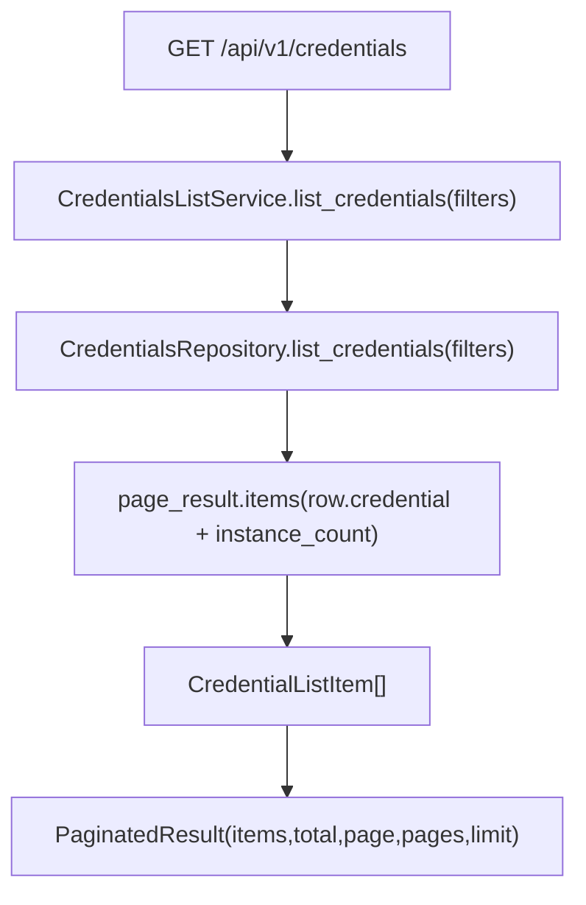

# Credentials List Service(凭据列表)

> [!note] 本文目标
> 说明 CredentialsListService 如何把 repository 的分页结果转换为稳定 DTO, 并补齐 created_at_display 等展示字段.

## 1. 概览(Overview)

覆盖文件:

- `app/services/credentials/credentials_list_service.py`
- repository: `app/repositories/credentials_repository.py`

核心入口:

- `CredentialsListService.list_credentials(filters) -> PaginatedResult[CredentialListItem]`

持久化影响:

- 只读 `credentials` 及关联统计字段(instance_count 等).

## 2. 依赖与边界(Dependencies)

| 类型 | 组件 | 用途 | 失败语义(摘要) |
| --- | --- | --- | --- |
| Repo | `CredentialsRepository` | 分页查询 + join 统计 | DB 异常由 repo 抛出 |
| Time | `time_utils.format_china_time` | `created_at_display` | created_at None -> "" |
| Mask | `credential.get_password_masked()` | 对外脱敏 | - |

## 3. 事务与失败语义(Transaction + Failure Semantics)

- 读服务, 不做 commit.
- service 不捕获异常, 依赖 route/repo 统一处理.

## 4. 主流程图(Flow)

## 5. 兼容/防御/回退/适配逻辑

| 位置(文件:行号) | 类型 | 描述 | 触发条件 | 清理条件/期限 |
| --- | --- | --- | --- | --- |
| `app/services/credentials/credentials_list_service.py:22` | 防御 | `repository or CredentialsRepository()` 兜底 | 调用方未注入 | 若统一 DI, 改为强制注入 |
| `app/services/credentials/credentials_list_service.py:49` | 兼容 | created_at None -> created_at_display="" | 历史数据缺失 created_at | 若 schema 强约束, 可收敛 |

## 6. 测试与验证(Tests)

最小验证命令:

- `uv run pytest -m unit tests/unit/routes/test_api_v1_credentials_contract.py`
