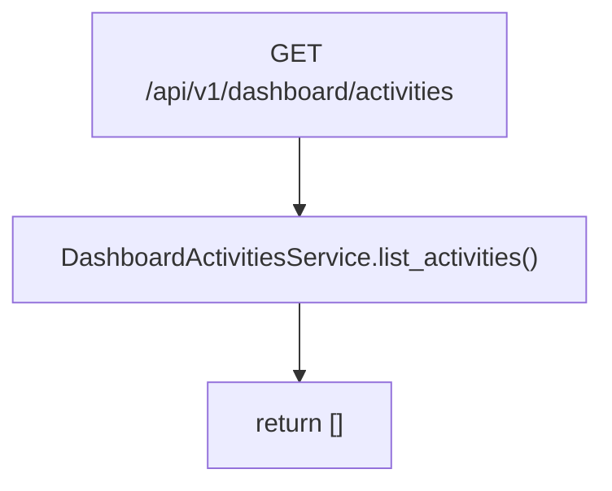

# Dashboard Activities Service(仪表板活动列表)

> [!note] 本文目标
> 说明 dashboard activities 的当前实现边界: 这是一个占位 service, 当前返回空数组, 用于保持 API contract 稳定.

## 1. 概览(Overview)

覆盖文件:

- `app/services/dashboard/dashboard_activities_service.py`

核心入口:

- `DashboardActivitiesService.list_activities() -> list[dict[str, object]]` (当前恒为 `[]`)

## 2. 事务与失败语义(Transaction + Failure Semantics)

- 读服务, 不做 commit.
- 当前无失败分支.

## 3. 主流程图(Flow)

## 4. 兼容/防御/回退/适配逻辑

| 位置(文件:行号) | 类型 | 描述 | 触发条件 | 清理条件/期限 |
| --- | --- | --- | --- | --- |
| `app/services/dashboard/dashboard_activities_service.py:14` | 兼容 | 返回空数组占位 | 功能未实现 | 若接入真实活动源, 用新数据源替换并补测试 |

## 5. 测试与验证(Tests)

最小验证命令:

- `uv run pytest -m unit tests/unit/routes/test_api_v1_dashboard_contract.py`
