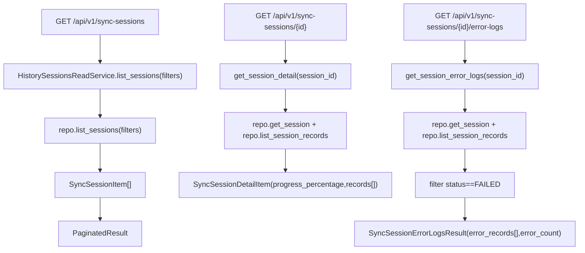

# History Sessions Read Service(会话中心读取)

> [!note] 本文目标
> 说明 HistorySessionsReadService 如何把 SyncSession/SyncInstanceRecord 的查询结果转换为会话中心可用的稳定 DTO.

## 1. 概览(Overview)

覆盖文件:

- `app/services/history_sessions/history_sessions_read_service.py`
- repository: `app/repositories/history_sessions_repository.py`

核心入口:

- `list_sessions(filters) -> PaginatedResult[SyncSessionItem]`
- `get_session_detail(session_id) -> SyncSessionDetailResult`
- `get_session_error_logs(session_id) -> SyncSessionErrorLogsResult`

## 2. 依赖与边界(Dependencies)

| 类型 | 组件 | 用途 | 失败语义(摘要) |
| --- | --- | --- | --- |
| Repo | `HistorySessionsRepository` | session list/detail/records | DB 异常或 not found 由 repo 抛出 |
| Status | `SyncStatus.FAILED` | 过滤失败 record | - |
| DTO | `SyncSessionItem/SyncInstanceRecordItem/...` | 对外结构 | `getattr(..., default)` 兜底 |

## 3. 事务与失败语义(Transaction + Failure Semantics)

- 读服务, 不做 commit.
- error logs:
  - 使用 `record.status == SyncStatus.FAILED` 过滤.

## 4. 主流程图(Flow)

## 5. 决策表/规则表(Decision Table)

### 5.1 error-logs filter

| 条件 | 是否进入 error_records |
| --- | --- |
| `record.status == SyncStatus.FAILED` | yes |
| 其他 | no |

实现位置: `app/services/history_sessions/history_sessions_read_service.py:62`.

## 6. 兼容/防御/回退/适配逻辑

| 位置(文件:行号) | 类型 | 描述 | 触发条件 | 清理条件/期限 |
| --- | --- | --- | --- | --- |
| `app/services/history_sessions/history_sessions_read_service.py:27` | 防御 | `repository or HistorySessionsRepository()` 兜底 | 调用方未注入 | 若统一 DI, 改为强制注入 |
| `app/services/history_sessions/history_sessions_read_service.py:72` | 防御 | `_to_session_item/_to_record_item` 使用 getattr 兜底 | ORM projection 变动 | 若 repo 输出 schema 固定, 可收敛 |

## 7. 测试与验证(Tests)

最小验证命令:

- `uv run pytest -m unit tests/unit/routes/test_api_v1_history_sessions_contract.py`
