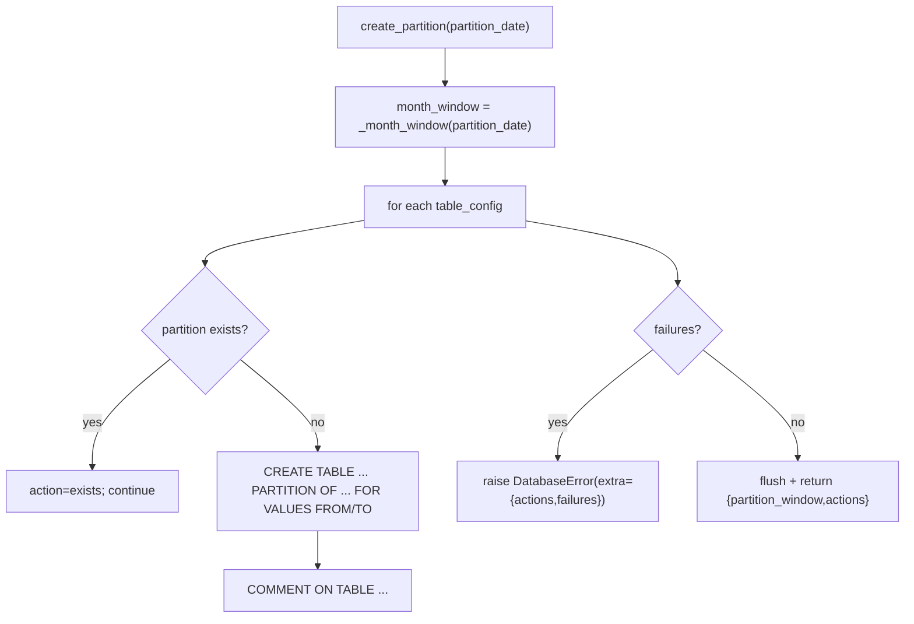
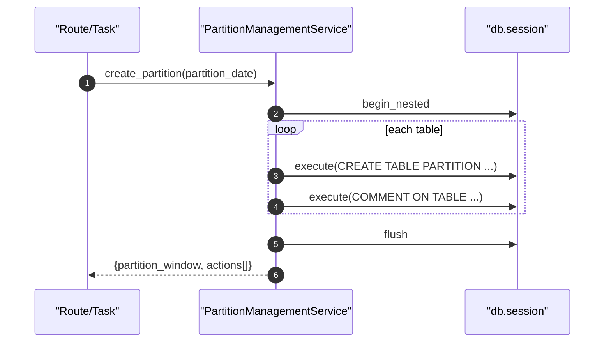

# Partition Services(容量表分区管理)

> [!note] 本文目标
> 说明 `PartitionManagementService` 如何为容量相关表创建/清理 PostgreSQL 月度分区：入口、SQL 策略、事务边界与失败语义；同时显式列出“继续执行/兜底返回”的防御分支，避免这些遗留逻辑长期无人清理。

## 1. 概览(Overview)

本服务用于管理 4 张容量相关表的月度分区：

- `database_size_stats`（按 `collected_date`）
- `database_size_aggregations`（按 `period_start`）
- `instance_size_stats`（按 `collected_date`）
- `instance_size_aggregations`（按 `period_start`）

核心入口：

- `PartitionManagementService.create_partition(partition_date)`：创建目标月份分区（若存在则跳过）。`app/services/partition_management_service.py:100`
- `PartitionManagementService.cleanup_old_partitions(retention_months=12)`：清理早于保留期的分区（逐分区尝试，最后汇总失败）。`app/services/partition_management_service.py:250`

不做的事：

- 不做 commit（依赖路由/任务层统一 commit/rollback）
- 不保证跨 DB 兼容（SQL 使用 PostgreSQL 分区语法）

## 2. 依赖与边界(Dependencies)

| 类型 | 组件 | 用途 | 失败语义(摘要) |
| --- | --- | --- | --- |
| DB | `db.session.execute(text(sql))` | 执行 CREATE/DROP/COMMENT SQL | SQLAlchemyError 记录并汇总为 `DatabaseError` |
| Time | `time_utils` | 计算月窗口/格式化分区名 | 无 |
| Logs | `log_info/log_warning/log_error` | 结构化日志输出 | 单条分区失败不一定中断（见 3） |

## 3. 事务与失败语义(Transaction + Failure Semantics)

- **创建分区**：
  - 外层 `db.session.begin_nested()` 包裹整个创建流程。`app/services/partition_management_service.py:139`
  - 单表创建失败：记录 failures 并 `continue`，最后汇总后统一抛 `DatabaseError`（硬失败）。`app/services/partition_management_service.py:177`、`app/services/partition_management_service.py:227`
  - 分区已存在：记录 action 为 `exists` 并跳过创建（幂等）。`app/services/partition_management_service.py:144`
  - 索引策略：不再在运行时对每个分区执行 `CREATE INDEX`；依赖 migrations 在父表上创建 partitioned indexes，由 PostgreSQL 自动为分区创建对应索引。
- **清理旧分区**：
  - 逐分区执行 `DROP TABLE IF EXISTS ...`，失败会记录并 `continue`，最终汇总失败抛 `DatabaseError`。`app/services/partition_management_service.py:289`、`app/services/partition_management_service.py:343`

## 4. 主流程图(Flow)

## 5. 时序图(Sequence)

## 6. 决策表/规则表(Decision Table)

### 6.1 月窗口计算(month_start/month_end)

| 输入 | 规则 | 输出 |
| --- | --- | --- |
| 任意日期 | `month_start = target_date.replace(day=1)` | 目标月首日 |
| 12 月 | `month_end = next year Jan 1` | 处理跨年 |
| 非 12 月 | `month_end = next month day 1` | 普通月份 |

实现位置：`app/services/partition_management_service.py:363`。

### 6.2 清理阈值(cutoff_date)估算

| 参数 | 规则 | 说明 |
| --- | --- | --- |
| retention_months | `now - retention_months*31 days` 再 `replace(day=1)` | 以 31 天近似月份长度 |

实现位置：`app/services/partition_management_service.py:281`。

## 7. 兼容/防御/回退/适配逻辑

| 位置(文件:行号) | 类型 | 描述 | 触发条件 | 清理条件/期限 |
| --- | --- | --- | --- | --- |
| `app/services/partition_management_service.py:144` | 防御 | 分区已存在 -> 跳过创建（幂等） | 重复调用/并发调用 | 若迁移到“只允许 migrations 管理分区”，则移除运行时创建能力 |
| `app/services/partition_management_service.py:193` | 防御 | 捕获 `PARTITION_SERVICE_EXCEPTIONS` 记录并继续创建其他表 | 未预期异常 | 若出现可复现问题，应收敛异常类型并补测试 |
| `app/services/partition_management_service.py:289` | 防御 | `DROP TABLE IF EXISTS` 避免不存在时报错 | 分区已被删除 | 若要严格校验可改为先查存在再 drop |
| `app/services/partition_management_service.py:293` | 防御 | 清理旧分区：异常后继续处理其他分区 | 单个分区 drop 失败 | 若要求强一致，改为失败即中断 |
| `app/services/partition_management_service.py:441` | 防御 | 单条分区信息处理失败不影响总体（continue） | 某条分区元数据异常 | 若需要可观测性，记录失败样本并报警 |
| `app/services/partition_management_service.py:532` | 防御 | 解析分区名失败返回 None | 分区名不符合约定 | 若分区名严格受控，可移除容错并改为强约束 |
| `app/services/partition_management_service.py:552` | 防御 | `_ensure_partition_identifier` 限制表名字符集防 SQL 注入 | 分区名包含非法字符 | 若所有表名都来自内部生成，可保持但补单测 |
| `app/services/partition_management_service.py:585` | 防御 | `int(result or 0)` + 捕获异常返回 0 | 计数查询失败 | 若必须精确统计，改为抛错并提示重试 |
| `app/services/partition_management_service.py:614` | 防御 | date_str 缺失/解析失败 -> status=`unknown` | 分区名异常 | 若命名严格受控可收敛到强约束 |

## 8. 可观测性(Logs + Metrics)

- 创建：`成功创建分区` / `分区已存在,跳过创建` / `创建分区失败`（module=`partition_service`）`app/services/partition_management_service.py:154`、`app/services/partition_management_service.py:185`
- 清理：`成功删除旧分区` / `删除旧分区失败` `app/services/partition_management_service.py:336`、`app/services/partition_management_service.py:301`

## 9. 测试与验证(Tests)

最小验证命令：

- `uv run pytest -m unit tests/unit/routes/test_api_v1_partition_contract.py`

关键用例：

- create_partition 幂等：重复调用返回 `exists`
- cleanup_old_partitions：drop 失败被记录并汇总为 DatabaseError
