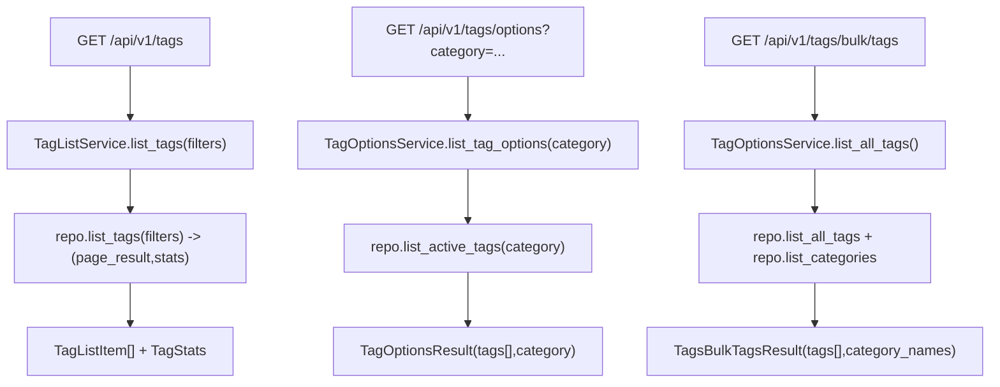

# Tags Read Services(列表/options/categories)

> [!note] 本文目标
> 说明 tags 的读接口如何输出稳定 DTO, 以及 bulk options endpoints 的 category_names 口径.

## 1. 概览(Overview)

覆盖文件:

- `app/services/tags/tag_list_service.py`
- `app/services/tags/tag_options_service.py`
- repositories:
  - `app/repositories/tags_repository.py`
  - `app/repositories/tags_options_repository.py`

核心入口:

- `TagListService.list_tags(filters) -> (PaginatedResult[TagListItem], TagStats)`
- `TagOptionsService.list_tag_options(category?) -> TagOptionsResult`
- `TagOptionsService.list_categories() -> list`
- `TagOptionsService.list_taggable_instances() -> TagsBulkInstancesResult`
- `TagOptionsService.list_all_tags() -> TagsBulkTagsResult`

## 2. 事务与失败语义(Transaction + Failure Semantics)

- 读服务, 不做 commit.
- service 不捕获异常; DB/not found 由 repo/route 层处理.

## 3. 主流程图(Flow)

## 4. 决策表/规则表(Decision Table)

### 4.1 category normalization

| 输入 category | 输出 category |
| --- | --- |
| None/""/空白 | None |
| 其他 | `category.strip()` |

实现位置: `app/services/tags/tag_options_service.py:44`.

## 5. 兼容/防御/回退/适配逻辑

| 位置(文件:行号) | 类型 | 描述 | 触发条件 | 清理条件/期限 |
| --- | --- | --- | --- | --- |
| `app/services/tags/tag_list_service.py:22` | 防御 | `repository or TagsRepository()` 兜底 | 调用方未注入 | 若统一 DI, 改为强制注入 |
| `app/services/tags/tag_options_service.py:23` | 防御 | `repository or TagsOptionsRepository()` 兜底 | 调用方未注入 | 同上 |
| `app/services/tags/tag_options_service.py:38` | 兼容 | category_names 转 dict 并 cast | repo 返回 list[tuple] | 若 repo 输出固定 dict, 可收敛 cast |

## 6. 测试与验证(Tests)

最小验证命令:

- `uv run pytest -m unit tests/unit/routes/test_api_v1_tags_contract.py`
- `uv run pytest -m unit tests/unit/routes/test_api_v1_tags_bulk_contract.py`
