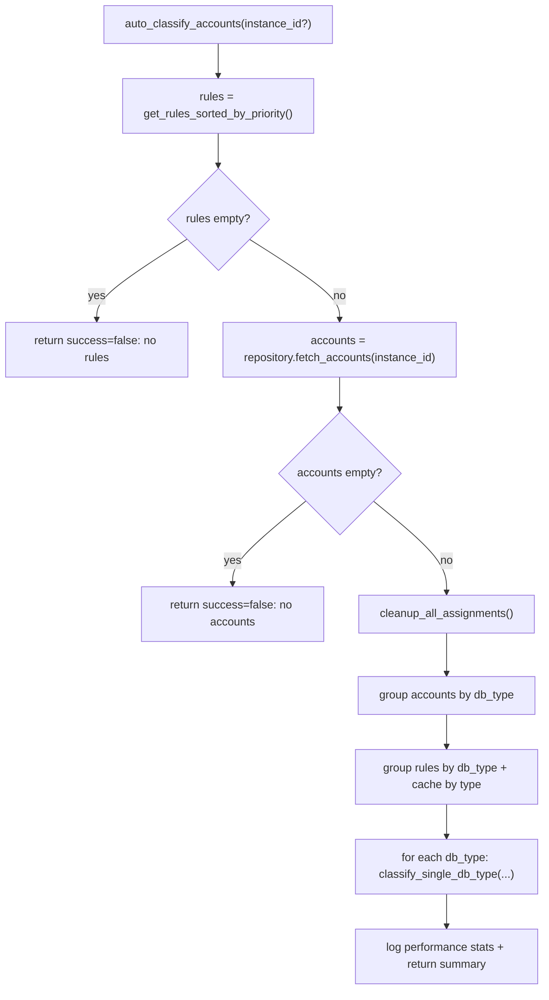
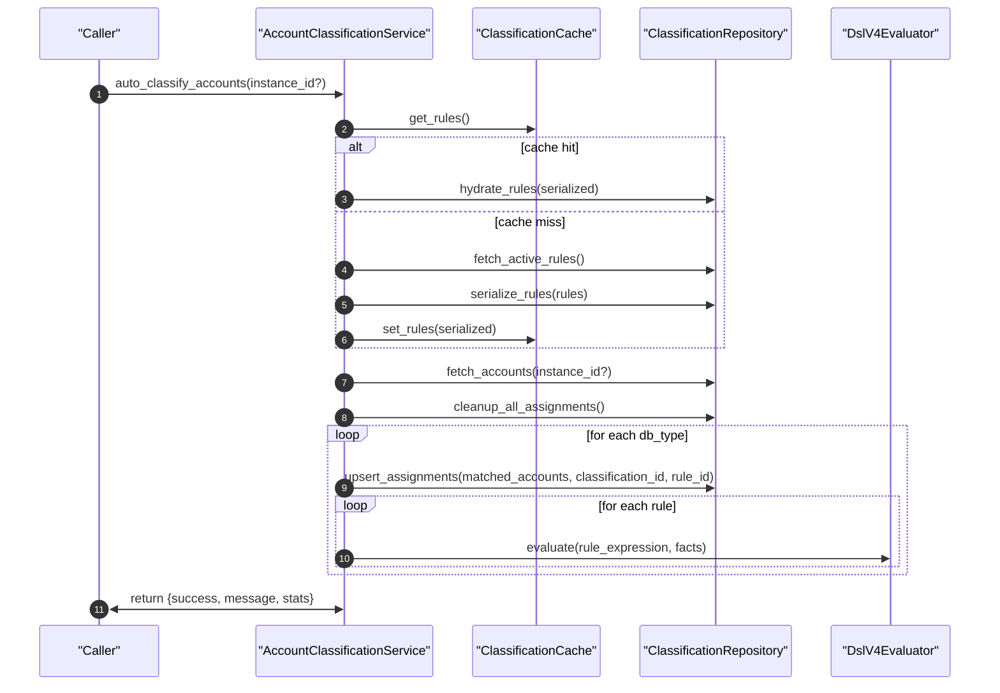

# Account Classification Orchestrator(规则加载 + 按 DB 类型编排)

> [!note] 本文目标
> 用“规则来源决策表 + 分组编排流程图 + 失败语义”描述 `AccountClassificationService` 的自动分类流程，避免把缓存/分组/DSL 守卫写散在各处。

## 1. 概览(Overview)

`AccountClassificationService` 是账户分类的编排服务，主要职责：
- 加载并缓存分类规则(全量 + 按 db_type 拆分缓存)
- 拉取待分类账户并清理旧分配
- 按 db_type 分组 -> 按规则优先级执行匹配 -> upsert assignments
- 对 rule_expression 强制 DSL v4 守卫(非法则抛 `ValidationError`)

入口方法：
- `auto_classify_accounts(instance_id=None, created_by=None) -> dict`
- `invalidate_cache() -> bool`
- `invalidate_db_type_cache(db_type) -> bool`

持久化影响(摘要)：
- 读取：分类规则、账户权限(用于 facts)与实例信息
- 写入：清理旧分配 + upsert 新分配(具体 SQL 在 `ClassificationRepository`)

## 2. 依赖与边界(Dependencies)

| 类型 | 组件 | 用途 | 失败语义(摘要) |
| --- | --- | --- | --- |
| Repo | `ClassificationRepository` | `fetch_active_rules/fetch_accounts/upsert_assignments/cleanup_all_assignments` | `SQLAlchemyError` 等可能传播 |
| Cache | `ClassificationCache` | 缓存全量规则/按 db_type 规则 | 失效失败返回 False(不抛) |
| DSL | `DslV4Evaluator` + 校验函数 | rule_expression 守卫与评估 | 非 DSL v4/非法 -> `ValidationError`(抛出) |
| Facts | `AccountPermission.permission_facts` | DSL 输入事实 | facts 缺失/非法 -> `raise AppError(CONFLICT)` |
| Logs | `log_info/log_error` | 结构化日志 | 不影响主逻辑 |

## 3. 事务与失败语义(Transaction + Failure Semantics)

- **入口返回结构**：`auto_classify_accounts()` 返回 `{"success": bool, "message": str, ...}`。
- **运行时异常兜底**：`auto_classify_accounts()` 捕获 `CLASSIFICATION_RUNTIME_EXCEPTIONS` 并返回 `success=false`(不抛异常)。`app/services/account_classification/orchestrator.py:84`
- **业务/守卫异常(不兜底)**：
  - rule_expression 非 DSL v4 或校验失败：抛 `ValidationError`(用于阻止“静默误分类”)。`app/services/account_classification/orchestrator.py:414`
  - permission_facts 缺失：抛 `AppError(CONFLICT, message_key=PERMISSION_FACTS_MISSING)`。`app/services/account_classification/orchestrator.py:430`

> [!warning] 口径提示
> `auto_classify_accounts()` 并不吞掉 `AppError/ValidationError`；它们应由上层(路由/任务)统一转换为对外错误。

## 4. 主流程图(Flow)

## 5. 时序图(Sequence)

## 6. 决策表/规则表(Decision Table)

### 6.1 规则来源选择(缓存优先)

| 步骤 | 条件 | 行为 |
| --- | --- | --- |
| 1 | `cache.get_rules()` 有值 | `repository.hydrate_rules()`，hydrated 非空则直接返回 |
| 2 | cache miss / hydrate 为空 | `repository.fetch_active_rules()` |
| 3 | DB 有规则 | `repository.serialize_rules()` + `cache.set_rules()` |

### 6.2 分类编排(按 db_type)

| 步骤 | 条件 | 行为 |
| --- | --- | --- |
| 分组 | `account.instance.db_type.lower()` | accounts 按 db_type 聚合并排序 |
| 规则分组 | `db_type = (rule.db_type or '').lower()` | rules 按 db_type 分组；同时写入 `cache.set_rules_by_db_type()` |
| 无规则 | `rules_by_db_type.get(db_type, [])` 为空 | 该 db_type 返回 0 rules，直接跳过 |
| 有规则 | 逐 rule 匹配 | 命中则 `upsert_assignments()` |

## 7. 兼容/防御/回退/适配逻辑

| 位置(文件:行号) | 类型 | 描述 | 触发条件 | 清理条件/期限 |
| --- | --- | --- | --- | --- |
| `app/services/account_classification/orchestrator.py:65` | 适配 | DI 兼容：`repository/cache_backend` 默认创建 | 未注入依赖 | 若统一 DI 后收敛 |
| `app/services/account_classification/orchestrator.py:84` | 防御/回退 | 捕获 `CLASSIFICATION_RUNTIME_EXCEPTIONS` 并返回 `success=false` | SQLAlchemy/连接/类型错误 | 明确哪些异常应上抛后收敛捕获列表 |
| `app/services/account_classification/orchestrator.py:101` | 防御 | rules 为空直接返回失败(不进入分类) | 没有启用规则 | UI 提示/引导后保留 |
| `app/services/account_classification/orchestrator.py:174` | 回退 | cache miss 时回源 DB；cache hit 但 hydrate 为空也回源 | cache 不可用/序列化变更 | 规则序列化版本化后可更严格处理 |
| `app/services/account_classification/orchestrator.py:229` | 防御 | `(rule.db_type or '').lower()` | rule.db_type 为空 | DB 约束后删除兜底 |
| `app/services/account_classification/orchestrator.py:279` | 防御 | `rules_by_db_type.get(db_type, [])` 缺失时回退空列表 | rules 未覆盖该 db_type | 预生成空桶后可删除 |
| `app/services/account_classification/orchestrator.py:393` | 防御 | 再次过滤 `acc.instance.db_type`(即使已分组) | 上游传入混合集合 | 上游保证分组输入正确后删除 |
| `app/services/account_classification/orchestrator.py:414` | 兼容/守卫 | 非 DSL v4 直接 `raise ValidationError`(防止静默误分类) | rule_expression 历史数据/脏数据 | 数据迁移到 DSL v4 后可改为强校验写入侧保证 |
| `app/services/account_classification/orchestrator.py:425` | 守卫 | facts 非 dict 直接 `raise AppError(CONFLICT)` | permission_facts 缺失/未生成 | 同步链路保证 facts 写入后可改为降级策略(需明确) |
| `app/services/account_classification/orchestrator.py:451` | 防御 | `duration>0` 才做除法，避免除 0 | duration==0 | 保留 |

## 8. 可观测性(Logs + Metrics)

- 主要事件：
  - `开始账户分类`(含 total_rules/total_accounts/instance_id/created_by)
  - `规则处理完成`(rule_id/db_type/matched_accounts)
  - `账户分类完成`(含 classification_details)
  - `账户分类性能统计`(duration/accounts_per_second/total_classifications_added/failed_count)
- 缓存操作失败：
  - `清除分类缓存失败`
  - `清除数据库类型缓存失败`

## 9. 测试与验证(Tests)

- `uv run pytest -m unit tests/unit/services/test_account_classification_orchestrator_dsl_guard.py`
- `uv run pytest -m unit tests/unit/services/test_account_classification_facts_and_cache_guards.py`
