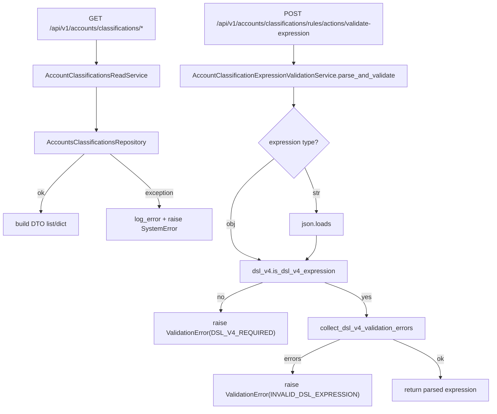

# Accounts Classifications Read Service(分类/规则/分配/权限选项)

> [!note] 本文目标
> 覆盖 AccountClassificationsReadService 读链路与 rule_expression 校验链路, 让调用方明确: 哪些失败会转为 SystemError, 哪些失败会返回 ValidationError.

## 1. 概览(Overview)

覆盖文件:

- `app/services/accounts/account_classifications_read_service.py`
- `app/services/accounts/account_classification_expression_validation_service.py`
- repository: `app/repositories/accounts_classifications_repository.py`

核心入口:

- `AccountClassificationsReadService`:
  - `list_classifications()`
  - `list_rules()`
  - `filter_rules(classification_id?, db_type?)`
  - `list_assignments()`
  - `get_rule_stats(rule_ids?)`
  - `get_permissions(db_type)`
- `AccountClassificationExpressionValidationService.parse_and_validate(expression)`
  - 强制 DSL v4, 支持对象或 JSON 字符串输入.

不在本服务组做的事:

- 不做分类写入/规则写入(见 `[[reference/service/accounts-classifications-write-service]]`).
- 不做分类引擎匹配与批量落库(见 `[[reference/service/account-classification-orchestrator]]`).

## 2. 依赖与边界(Dependencies)

| 类型 | 组件 | 用途 | 失败语义(摘要) |
| --- | --- | --- | --- |
| Repo | `AccountsClassificationsRepository` | Query/读取/统计 | 异常会被捕获并转为 SystemError |
| DSL | `app.services.account_classification.dsl_v4` | 校验 DSL v4 | 校验失败 -> ValidationError |
| Logs | `log_error` | 记录读链路失败 | 不影响异常抛出 |

## 3. 事务与失败语义(Transaction + Failure Semantics)

- AccountClassificationsReadService:
  - 读服务, 不 commit.
  - 所有方法对 repository 异常使用 `except Exception`:
    - 记录 error 日志.
    - 抛 `SystemError("<中文提示>")`.
- AccountClassificationExpressionValidationService:
  - `expression is None` -> ValidationError("缺少 rule_expression 字段").
  - string JSON 解析失败 -> ValidationError("规则表达式 JSON 解析失败: ...").
  - 非 DSL v4 -> ValidationError(message_key="DSL_V4_REQUIRED").
  - DSL 校验 errors 非空 -> ValidationError(message_key="INVALID_DSL_EXPRESSION", extra.errors=[]).

## 4. 主流程图(Flow)

## 5. 决策表/规则表(Decision Table)

### 5.1 rule_expression 输出形态(读 vs filter)

| API | service 方法 | rule_expression 字段 |
| --- | --- | --- |
| list_rules | `list_rules()` | `rule.get_rule_expression()` (解析后对象) |
| filter_rules | `filter_rules()` | `rule.rule_expression` (raw) |

实现位置:

- `app/services/accounts/account_classifications_read_service.py:75`
- `app/services/accounts/account_classifications_read_service.py:109`

## 6. 兼容/防御/回退/适配逻辑

| 位置(文件:行号) | 类型 | 描述 | 触发条件 | 清理条件/期限 |
| --- | --- | --- | --- | --- |
| `app/services/accounts/account_classifications_read_service.py:20` | 防御 | `repository or AccountsClassificationsRepository()` 兜底 | 调用方未注入 repository | 若统一 DI, 改为强制注入 |
| `app/services/accounts/account_classifications_read_service.py:31` | 防御 | `except Exception` 兜底并转 SystemError | DB/序列化/ORM 异常 | 若要细分错误, 收敛异常类型并补单测 |
| `app/services/accounts/account_classification_expression_validation_service.py:30` | 兼容 | expression 支持 object 或 JSON string | Web UI 可能传 string | 若统一只传 object, 可移除 string 分支 |

## 7. 可观测性(Logs + Metrics)

- read service 异常日志:
  - `log_error("获取账户分类失败", module="accounts_classifications_read_service", exception=exc)` 等.
- validate-expression 当前不打日志, 失败通过 error envelope 返回 extra.errors.

## 8. 测试与验证(Tests)

最小验证命令:

- `uv run pytest -m unit tests/unit/routes/test_api_v1_accounts_classifications_contract.py`
