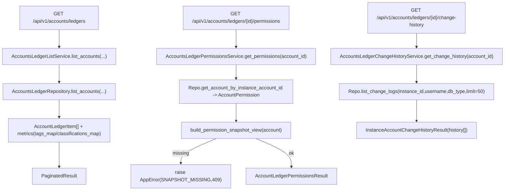
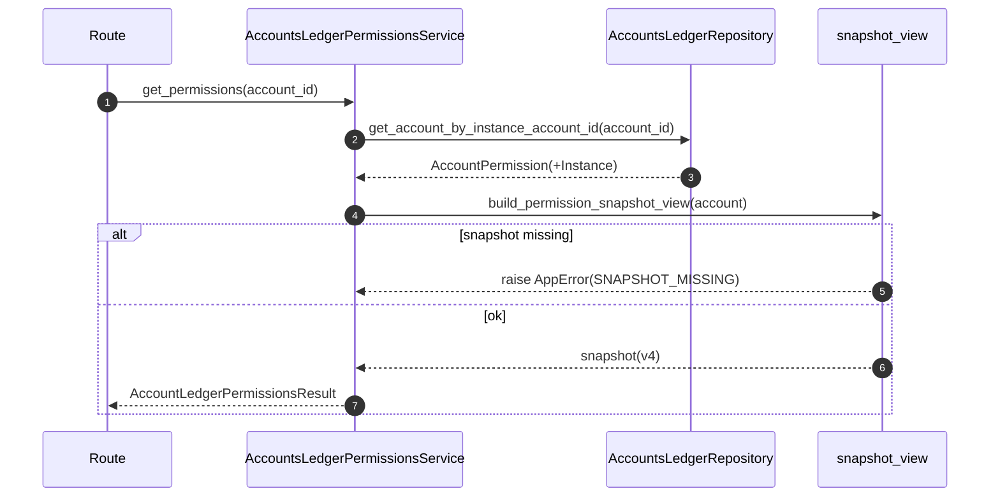

# Accounts Ledger Services(台账列表/权限详情/变更历史)

> [!note] 本文目标
> 说明 Accounts Ledgers 读链路的 3 个 service 如何把 repository 的 ORM 结果转换为稳定 DTO, 以及权限快照缺失时的失败语义.

## 1. 概览(Overview)

覆盖文件:

- `app/services/ledgers/accounts_ledger_list_service.py`
- `app/services/ledgers/accounts_ledger_permissions_service.py`
- `app/services/ledgers/accounts_ledger_change_history_service.py`
- repository: `app/repositories/ledgers/accounts_ledger_repository.py`

核心入口:

- `AccountsLedgerListService.list_accounts(filters, sort_field, sort_order) -> PaginatedResult[AccountLedgerItem]`
- `AccountsLedgerPermissionsService.get_permissions(account_id) -> AccountLedgerPermissionsResult`
- `AccountsLedgerChangeHistoryService.get_change_history(account_id) -> InstanceAccountChangeHistoryResult`

持久化影响:

- 只读: `account_permission` + `instance_accounts` + `instances` + `account_change_log` + tags/classification join (通过 repository 查询).

## 2. 依赖与边界(Dependencies)

| 类型 | 组件 | 用途 | 失败语义(摘要) |
| --- | --- | --- | --- |
| Repo | `AccountsLedgerRepository` | 组装 Query/分页/metrics | Query 失败可能抛异常; 过滤失败可能降级(见 7) |
| Snapshot | `build_permission_snapshot_view` | 构造权限快照 v4 view | snapshot 缺失 -> AppError(SNAPSHOT_MISSING, 409) |
| Time | `time_utils.format_china_time` | 格式化 last_sync_time/change_time | None -> "未知" |
| DTO | `AccountLedgerItem/...` | 对外稳定结构 | 不直接返回 ORM |

## 3. 事务与失败语义(Transaction + Failure Semantics)

- 全部为读服务, 不做 commit.
- `get_permissions`:
  - snapshot 不存在或不是 v4 -> `AppError(message_key="SNAPSHOT_MISSING", status_code=409)` (来自 `build_permission_snapshot_view`).
- repository 层的显式降级:
  - 标签过滤失败/分类过滤解析失败时会记录 warning 并返回未过滤的 query (见 7).

## 4. 主流程图(Flow)

## 5. 时序图(Sequence)

以 `get_permissions` 为例:

## 6. 决策表/规则表(Decision Table)

### 6.1 is_deleted 推断(列表 DTO)

| InstanceAccount.is_active | is_deleted | is_active(DTO) |
| --- | --- | --- |
| True | False | True |
| False | True | False |
| InstanceAccount 缺失 | False | True |

实现位置: `app/services/ledgers/accounts_ledger_list_service.py:40`.

### 6.2 permissions: db_type 展示

| instance.db_type | 展示 |
| --- | --- |
| None/空 | "" |
| 其他 | `.upper()` |

实现位置: `app/services/ledgers/accounts_ledger_permissions_service.py:33`.

## 7. 兼容/防御/回退/适配逻辑

| 位置(文件:行号) | 类型 | 描述 | 触发条件 | 清理条件/期限 |
| --- | --- | --- | --- | --- |
| `app/services/ledgers/accounts_ledger_list_service.py:20` | 防御 | `repository or AccountsLedgerRepository()` 兜底 | 调用方未注入 repository | 若统一 DI, 改为强制注入并补测试 |
| `app/repositories/ledgers/accounts_ledger_repository.py:175` | 回退 | 标签过滤失败后返回未过滤 query | SQLAlchemyError | 若需要强一致过滤, 改为硬失败并提示参数错误 |
| `app/repositories/ledgers/accounts_ledger_repository.py:205` | 兼容 | classification_id 解析失败 -> 不过滤 | query 参数非数字 | 若前端强约束为 int, 可改为 ValidationError |
| `app/services/ledgers/accounts_ledger_permissions_service.py:26` | 兼容 | last_sync_time None -> "未知" | 从未同步/数据缺失 | 若 UI 要区分, 改为返回 null |
| `app/services/ledgers/accounts_ledger_change_history_service.py:46` | 兼容 | change_time None -> "未知" | 历史数据缺字段 | 若修复存量数据, 可改为 null |

## 8. 可观测性(Logs + Metrics)

- 列表/详情 service 本身不写日志; 过滤降级与异常主要在 repository 与 route 层记录.
- snapshot 缺失为业务错误(AppError), 排障建议:
  - 先确认该账户是否已跑过 accounts sync
  - 再看 `account_permission.permission_snapshot` 是否为 v4 (见 `[[reference/service/accounts-sync-permission-manager]]`)

## 9. 测试与验证(Tests)

最小验证命令:

- `uv run pytest -m unit tests/unit/routes/test_api_v1_accounts_ledgers_contract.py`
- `uv run pytest -m unit tests/unit/routes/test_api_v1_accounts_statistics_contract.py`
