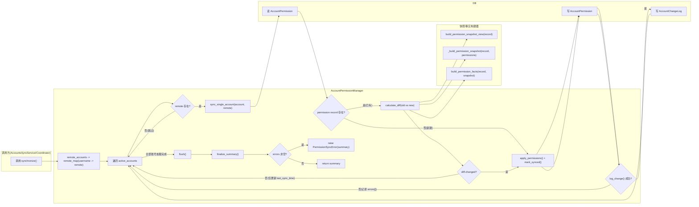
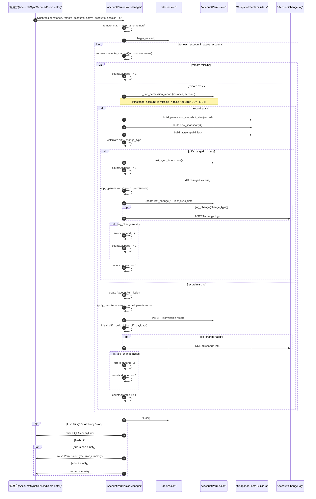

# AccountPermissionManager 权限同步(泳道图与决策表)

> [!note] 本文目标
> 用泳道流程图说明 `AccountPermissionManager.synchronize()` 的主链路, 并用决策表固化权限快照与差异生成规则. 便于后续重构与测试拆分.

## 1. 概览

`AccountPermissionManager` 负责把远端采集到的账户权限快照写入本地表 `AccountPermission`, 并将变化以结构化 diff 记录到 `AccountChangeLog`.

- 入口: `AccountPermissionManager.synchronize(instance, remote_accounts, active_accounts, session_id=None)`
- 持久化:
  - `AccountPermission.permission_snapshot` (v4)
  - `AccountPermission.permission_facts` (由 `build_permission_facts()` 生成, 细节见 [[reference/service/accounts-permissions-facts-builder|Facts Builder]])
  - `AccountChangeLog.privilege_diff` / `AccountChangeLog.other_diff`

> [!tip] 上下文入口
> - Accounts Sync 域整体链路: [[reference/service/accounts-sync-overview|Accounts Sync 总览]]
> - Adapter 差异与 SQL 分支: [[reference/service/accounts-sync-adapters|Accounts Sync Adapters]]

## 2. 流程图

### 2.1 泳道流程图

> [!warning] 失败语义
> 账户级别的日志写入失败会被收集进 `errors[]`, 循环会继续执行. 但 `finalize_summary()` 在 `errors[]` 非空时会抛出 `PermissionSyncError`, 代表本阶段整体失败.

### 2.2 时序图

> [!tip] 对比口径
> - 泳道图: 强调阶段与职责分区(谁负责什么).
> - 时序图: 强调对象/组件的调用顺序(谁先调用谁).

## 3. 决策表: 快照构建规则(v4)

### 3.1 快照结构

`_build_permission_snapshot()` 会把输入 `permissions` 归一化为 v4 snapshot 结构:

| 字段 | 说明 |
| --- | --- |
| `version` | 固定为 `4` |
| `categories` | 权限分类(见 3.2) |
| `type_specific` | 与 `db_type` 绑定的数据库特性(见 3.3) |
| `extra` | 未识别字段的透传容器 |
| `errors` | 归一化阶段发现的问题列表 |
| `meta` | 预留字段, 当前为空对象 |

### 3.2 categories 归类规则

| 输入 key | 条件 | 写入位置 | 备注 |
| --- | --- | --- | --- |
| `global_privileges` | key 命中映射表 | `categories.global_privileges` | `PRIVILEGE_FIELD_LABELS` 显示名: `全局权限` |
| `database_privileges` | key 命中映射表 | `categories.database_privileges` | 显示名: `数据库权限` |
| `database_privileges_pg` | key 命中映射表 | `categories.database_privileges` | PostgreSQL 兼容键, 会被归一到 `database_privileges` |
| `predefined_roles` | key 命中映射表 | `categories.predefined_roles` | 显示名: `预设角色` |
| `role_attributes` | key 命中映射表 | `categories.role_attributes` | 显示名: `角色属性` |
| `tablespace_privileges` | key 命中映射表 | `categories.tablespace_privileges` | 显示名: `表空间权限` |
| `server_roles` | key 命中映射表 | `categories.server_roles` | 显示名: `服务器角色` |
| `server_permissions` | key 命中映射表 | `categories.server_permissions` | 显示名: `服务器权限` |
| `database_roles` | key 命中映射表 | `categories.database_roles` | 显示名: `数据库角色` |
| `database_permissions` | key 命中映射表 | `categories.database_permissions` | 显示名: `数据库权限` |
| `oracle_roles` | key 命中映射表 | `categories.oracle_roles` | 显示名: `Oracle 角色` |
| `system_privileges` | key 命中映射表 | `categories.system_privileges` | 显示名: `系统权限` |
| 其他 key | 未命中映射表, 且不是 `type_specific` | `extra.<key>` | 用于保持向后兼容与调试 |

### 3.3 type_specific 归类与清洗规则

`type_specific` 用于存放数据库特性字段, 其 key 会按当前 `record.db_type.lower()` 写入 `type_specific.<db_type>`.

| 输入 key | 输入 value | 清洗规则 | 写入位置 | errors 记录 |
| --- | --- | --- | --- | --- |
| `type_specific` | dict | 删除禁用键集合 `_TYPE_SPECIFIC_FORBIDDEN_KEYS` | `type_specific.<db_type>` | 每个被删除键追加 `TYPE_SPECIFIC_FORBIDDEN_FIELD:<key>` |
| `type_specific` | 非 dict | 忽略 | 不写入 | 不追加 |

禁用键集合 `_TYPE_SPECIFIC_FORBIDDEN_KEYS` 固定为: `is_superuser`, `is_locked`, `roles`, `privileges`.

## 4. 决策表: 差异计算与变更类型(change_type)

### 4.1 diff 结构

`_calculate_diff()` 的返回结构:

| 字段 | 说明 |
| --- | --- |
| `changed` | `change_type != "none"` |
| `change_type` | 见 4.2 |
| `privilege_diff` | 权限差异条目列表(见 5) |
| `other_diff` | 非权限差异条目列表(见 6) |

### 4.2 change_type 判定规则(已有记录)

| privilege_diff | other_diff | change_type | changed | 是否写入 `AccountChangeLog` |
| --- | --- | --- | --- | --- |
| empty | empty | `none` | `False` | 否 |
| non-empty | any | `modify_privilege` | `True` | 是 |
| empty | non-empty | `modify_other` | `True` | 是 |

> [!info] 新建记录的 change_type
> 新建 `AccountPermission` 时不会走 `_determine_change_type()`, 而是固定使用 `change_type="add"` 写入 `AccountChangeLog`, 并把 `AccountPermission.last_change_type` 置为 `add`.

## 5. 决策表: privilege_diff 条目生成规则

`_build_privilege_diff_entries(field, old_value, new_value)` 会把单个 `categories.<field>` 的变化拆解为 `GRANT` / `REVOKE` / `ALTER` 动作.

### 5.1 dict 形态(对象粒度)

当 `old_value` 或 `new_value` 任意一方是 dict 时, 走 dict 分支:

| 条件 | 归一化 | 产出条目 |
| --- | --- | --- |
| `old_value` 或 `new_value` 是 dict | `old_map/new_map: dict[str, set[str]]` | 对每个 object key 计算 grants/revokes |
| `new_set - old_set` 非空 | 见上 | 追加 `action="GRANT"`, `permissions=sorted(grants)` |
| `old_set - new_set` 非空 | 见上 | 追加 `action="REVOKE"`, `permissions=sorted(revokes)` |
| grants/revokes 都为空, 但 `new_set != old_set` | 见上 | 追加 `action="ALTER"`, `permissions=sorted(new_set)` |

object 命名规则: `object = "<label>:<key>"`(key 非空) 否则 `object = "<label>"`.

### 5.2 序列/单值形态(字段粒度)

当 `old_value` 与 `new_value` 都不是 dict 时, 走序列分支:

| 条件 | 归一化 | 产出条目 |
| --- | --- | --- |
| 两侧都不是 dict | `old_set/new_set: set[str]` | 基于集合差异输出 grants/revokes |
| `old_set` 与 `new_set` 同时为空集合 | 见上 | 不产出条目 |
| `new_set - old_set` 非空 | 见上 | 追加 `action="GRANT"`, `permissions=sorted(grants)` |
| `old_set - new_set` 非空 | 见上 | 追加 `action="REVOKE"`, `permissions=sorted(revokes)` |
| grants/revokes 都为空, 但 `new_set != old_set` | 见上 | 追加 `action="ALTER"`, `permissions=sorted(new_set)` |

## 6. 决策表: other_diff 条目生成规则

### 6.1 other_diff 参与字段

`_collect_other_changes()` 只关心 3 个字段:

| 字段 | 来源 | 说明 |
| --- | --- | --- |
| `is_superuser` | `build_permission_facts(...).capabilities` 包含 `SUPERUSER` | 对应 `OTHER_FIELD_LABELS` 的 `超级用户` |
| `is_locked` | `build_permission_facts(...).capabilities` 包含 `LOCKED` | 对应 `OTHER_FIELD_LABELS` 的 `锁定状态` |
| `type_specific` | v4 snapshot 的 `type_specific.<db_type>` | 对应 `OTHER_FIELD_LABELS` 的 `数据库特性` |

### 6.2 条目生成与描述规则

`_build_other_diff_entry(field, old_value, new_value)` 的规则:

| 条件 | 是否产出条目 | description 规则 |
| --- | --- | --- |
| `old_value == new_value` | 否 | - |
| `old_value != new_value` 且 before/after 都非空字符串 | 是 | `"<label> 从 <before> 调整为 <after>"` |
| `old_value != new_value` 且 after 非空, before 为空 | 是 | `"<label> 设置为 <after>"` |
| `old_value != new_value` 且 before 非空, after 为空 | 是 | `"<label> 已清空"` |
| 其他 | 是 | `"<label> 已更新"` |

> [!note] "空" 的定义
> `before/after` 来自 `_repr_value()`, 其中 `None` 会被转成空字符串. 因此这里的 "空" 指的是 `_repr_value()` 结果为空字符串.

## 7. 可观测性与异常路径要点

- Prometheus:
  - `account_permission_snapshot_write_success_total{db_type}`
  - `account_permission_snapshot_write_failed_total{db_type,error_type}`
  - `account_permission_snapshot_build_duration_seconds{db_type}`
- SQLAlchemyError:
  - `synchronize()` 在 `flush()` 失败时记录 `account_permission_sync_flush_failed` 并向上抛出.
- 变更日志异常:
  - `_log_change()` 失败会被捕获并写入 `errors[]`, 最终由 `finalize_summary()` 抛出 `PermissionSyncError(summary)`.

## 8. 兼容/防御/回退/适配逻辑

| 位置(文件:行号) | 类型 | 描述 | 触发条件 | 清理条件/期限 |
| --- | --- | --- | --- | --- |
| `app/services/accounts_sync/permission_manager.py:95` | 兼容/防御 | Prometheus client 缺失时用 `_NoopMetric` 降级(避免 import 失败) | `prometheus_client` 未安装或不可用 | 若线上强依赖指标: 固化依赖并移除 no-op 分支；否则保留 |
| `app/services/accounts_sync/permission_manager.py:122` | 兼容 | `database_privileges_pg -> database_privileges` 字段别名归一化 | PostgreSQL 侧上报历史 key | 采集/adapter 全量改为 canonical key 后删除别名并加单测 |
| `app/services/accounts_sync/permission_manager.py:137` | 防御/清洗 | `type_specific` 禁用键清洗(移除 `is_superuser/is_locked/roles/privileges`) | 上游把敏感/重复字段塞进 `type_specific` | 上游不再产出禁用键后删除清洗与对应错误码 |
| `app/services/accounts_sync/permission_manager.py:187` | 防御 | `message or summary.get("message") or ...` 补齐异常 message | 调用方未传 message/summary 缺字段 | summary schema 稳定后删除兜底 |
| `app/services/accounts_sync/permission_manager.py:477` | 防御 | `(permissions or {})` 避免 `permissions=None` 触发崩溃 | 上游传入 None(违反约定) | 上游强约束 + 单测覆盖后删除 |
| `app/services/accounts_sync/permission_manager.py:512` | 回退/防御 | Facts 构建异常时回退为最小 facts(v2) 并写 `errors=["FACTS_BUILD_FAILED"]` | `build_permission_facts()` 抛异常 | 修复根因并补测试后, 改为硬失败或移除兜底 |
| `app/services/accounts_sync/permission_manager.py:572` | 兼容(前向) | 未识别字段写入 `snapshot.extra` 以保留信息 | 采集侧新增字段/未知字段 | schema 稳定后: 要么落入 categories/type_specific, 要么明确丢弃策略 |
| `app/services/accounts_sync/permission_manager.py:837` | 适配 | diff 计算支持 dict 与 list/单值两种形态(`old`/`new` 任意一侧为 dict 即走 dict 分支) | 历史数据/不同 adapter 导致形态不一致 | 权限快照统一为一种形态后删掉分支 |

## 9. 测试与验证(Tests)

- `uv run pytest -m unit tests/unit/services/test_account_permission_manager.py`
