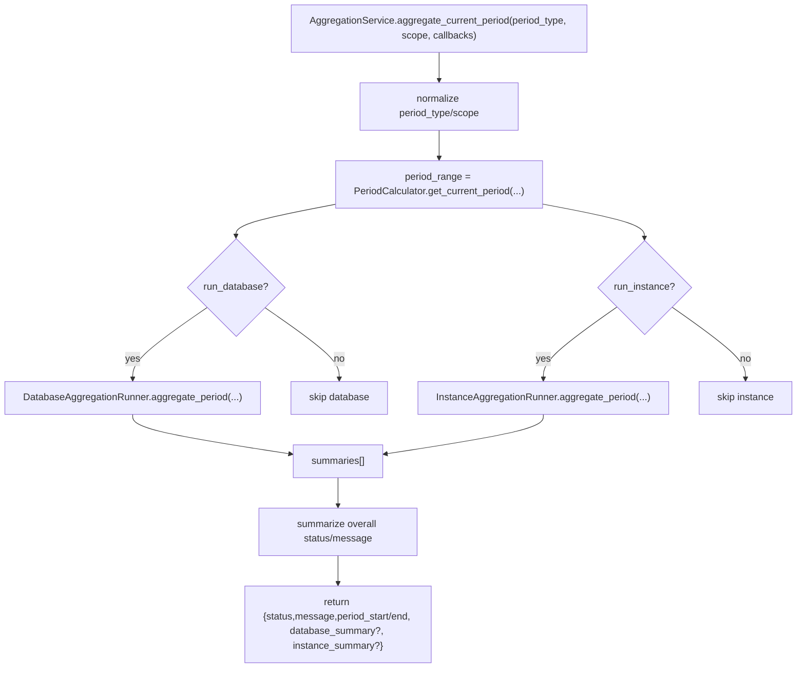
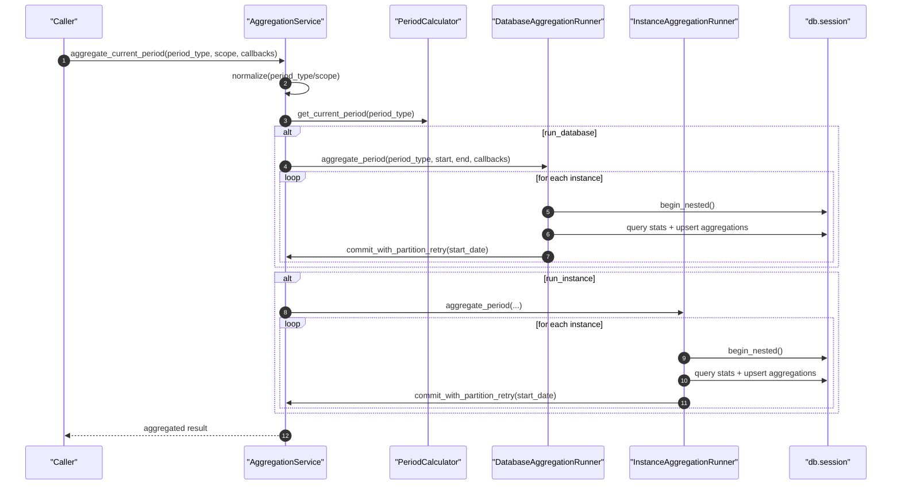

# Aggregation Pipeline(数据库/实例聚合流水线)

> [!note] 本文目标
> 把 `AggregationService + Database/Instance AggregationRunner` 视为同一条“容量统计聚合流水线”(SSOT)：明确入口、范围(scope)/周期(period)的决策、失败语义与兜底逻辑，并给出可观察的结果结构。

## 1. 概览(Overview)

聚合模块用于把“采集到的容量统计明细”汇总成按周期的聚合指标，支持：
- 周期：`daily/weekly/monthly/quarterly`
- 维度：
  - 数据库级(Database)：每个实例的每个数据库的聚合指标
  - 实例级(Instance)：每个实例整体的聚合指标

核心入口：
- `AggregationService.aggregate_current_period(period_type="daily", scope="all", progress_callbacks=None)`
- `AggregationService.calculate_*_aggregations(use_current_period=None)`：数据库级聚合
- `AggregationService.calculate_*_instance_aggregations(use_current_period=None)`：实例级聚合
- `DatabaseAggregationRunner.aggregate_period(...)` / `InstanceAggregationRunner.aggregate_period(...)`

结果结构：
- runner 结果以 `AggregationStatus`(`completed/skipped/failed`) + `processed_instances/processed_records/errors` 表达(见 `PeriodSummary/InstanceSummary`)。

## 2. 依赖与边界(Dependencies)

| 类型 | 组件 | 用途 | 失败语义(摘要) |
| --- | --- | --- | --- |
| Service | `AggregationService` | 入口编排/参数归一化/结果汇总 | period/scope 非法 -> `ValidationError` |
| Calculator | `PeriodCalculator` | 计算 current/last period 的日期窗口 | 输入非法 -> 传播异常 |
| Runner | `DatabaseAggregationRunner` | 数据库级聚合执行 | “无数据” -> SKIPPED；部分异常 -> 记录 summary.errors |
| Runner | `InstanceAggregationRunner` | 实例级聚合执行 | 同上 |
| Callback | `RunnerCallbacks` | per-instance 进度通知 | callback 失败被吞并记录 warning |
| DB | `db.session.begin_nested()` + `flush()` | 每实例事务包裹 + 落库 | `flush` 失败 -> `DatabaseError`(硬失败) |

## 3. 事务与失败语义(Transaction + Failure Semantics)

- **事务边界**：两个 runner 都以“每实例一个 `db.session.begin_nested()`”包裹持久化写入。`DatabaseAggregationRunner.aggregate_period`：`app/services/aggregation/database_aggregation_runner.py:147`；`InstanceAggregationRunner.aggregate_period`：`app/services/aggregation/instance_aggregation_runner.py:148`。
- **硬失败(抛出)**：`AggregationService._commit_with_partition_retry()` 在 `flush()` 失败时抛 `DatabaseError`(并记录 error)，可能中断当前执行链路。`app/services/aggregation/aggregation_service.py:142`。
- **软失败(汇总返回)**：runner 的 `aggregate_period()` 对“无数据”返回 SKIPPED，对部分运行时异常记录 `summary.errors` 并继续处理其他实例。
- **状态口径**：
  - `PeriodSummary.status`: `failed_instances>0 => failed`；`processed_instances==0 => skipped`；否则 `completed`。`app/services/aggregation/results.py:49`

## 4. 主流程图(Flow)

## 5. 时序图(Sequence)

## 6. 决策表/规则表(Decision Table)

### 6.1 当前周期 vs 上一周期(use_current_period)

| period_type | 默认 use_current_period | 说明 |
| --- | --- | --- |
| `daily` | True | 默认聚合“今日” |
| 其他(`weekly/monthly/quarterly`) | False | 默认聚合“上一周期” |

覆盖规则：
- 显式传 `override` 优先，否则走默认。`app/services/aggregation/aggregation_service.py:172`
- `use_current_periods` 映射可逐周期覆盖。`app/services/aggregation/aggregation_service.py:178`

### 6.2 scope 解析

| scope | run_database | run_instance |
| --- | --- | --- |
| `all` | True | True |
| `database` | True | False |
| `instance` | False | True |

### 6.3 periods 列表标准化(去重 + 过滤未知)

| 输入 periods | 行为 |
| --- | --- |
| None/空 | 返回全部 `period_types` |
| 含未知项 | 忽略未知项 |
| 含重复项 | 去重并保持出现顺序 |

## 7. 兼容/防御/回退/适配逻辑

| 位置(文件:行号) | 类型 | 描述 | 触发条件 | 清理条件/期限 |
| --- | --- | --- | --- | --- |
| `app/services/aggregation/aggregation_service.py:75` | 适配 | `period_calculator or PeriodCalculator()` 允许注入测试替身 | 未注入 calculator | 若统一 DI 后收敛 |
| `app/services/aggregation/aggregation_service.py:145` | 防御 | `hasattr(exc,"orig") ? exc.orig : exc` 兼容不同 SQLAlchemy 异常结构 | IntegrityError 无 orig | 若统一异常包装后删 |
| `app/services/aggregation/aggregation_service.py:170` | 防御 | `(period_type or '').lower()` 默认策略：仅 daily 默认 current | period_type 为空 | 入参强校验后删 |
| `app/services/aggregation/aggregation_service.py:305` | 防御 | `(period_type or 'daily').lower()` | period_type 为空/None | route 层强约束后删 |
| `app/services/aggregation/aggregation_service.py:315` | 防御 | `(scope or 'all').lower()` | scope 为空/None | route 层强约束后删 |
| `app/services/aggregation/aggregation_service.py:397` | 防御 | `summary.get('status') or FAILED` 兜底子任务缺 status | summary 结构不完整 | summary schema 固化后删 |
| `app/services/aggregation/aggregation_service.py:450` | 防御 | `(item or '').strip().lower()` 兜底 periods 列表元素为空 | periods 含 None/空串 | 入参强约束后删 |
| `app/services/aggregation/aggregation_service.py:472` | 防御 | `use_current_periods or {}` 兜底覆盖映射缺失 | use_current_periods=None | 保留 |
| `app/services/aggregation/instance_aggregation_runner.py:88` | 防御 | callback 执行失败被吞并记录 warning(防止回调影响主流程) | callback 抛异常 | 若回调必须可靠则改为硬失败 |
| `app/services/aggregation/instance_aggregation_runner.py:143` | 防御 | `callbacks or RunnerCallbacks()` | callbacks 为 None | 保留 |
| `app/services/aggregation/database_aggregation_runner.py:142` | 防御 | `callbacks or RunnerCallbacks()` | callbacks 为 None | 保留 |
| `app/services/aggregation/database_aggregation_runner.py:379` | 防御 | `int(row.data_count or 0)` 兜底聚合字段为空 | DB 返回 NULL | DB 层约束后删 |

## 8. 可观测性(Logs + Metrics)

- Service 侧：
  - `开始计算当前周期统计聚合`(period_type/start_date/end_date/scope)
  - `数据库级聚合执行失败`(period_type/exception)
- Runner 侧：
  - `实例...跳过聚合`(无数据)
  - `实例...聚合完成`
  - `实例...聚合失败`(summary.errors 追加)
- callback 失败：
  - `聚合回调执行失败`(callback name + error)

## 9. 测试与验证(Tests)

- `uv run pytest -m unit tests/unit/services/test_aggregation_service_periods.py`
