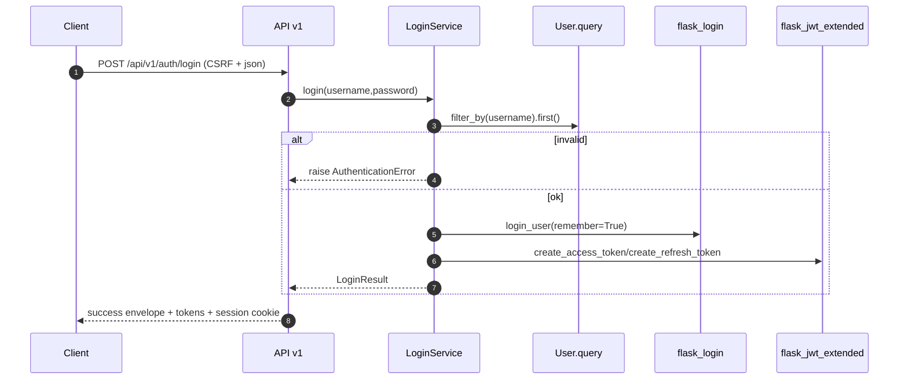

# Auth Services(Login/Change Password/Auth Me)

> [!note] 本文目标
> 把 Auth 域的 3 个高频 service 写清: 登录(LoginService), 改密(ChangePasswordService), JWT me(AuthMeReadService).

## 1. 概览(Overview)

覆盖文件:

- `app/services/auth/login_service.py`
- `app/services/auth/change_password_service.py`
- `app/services/auth/auth_me_read_service.py`

核心入口:

- `LoginService.login(username, password) -> LoginResult`
  - 写入 session cookie: `login_user(user, remember=True)`
  - 生成 JWT: `create_access_token` + `create_refresh_token`
- `ChangePasswordService.change_password(payload, user=current_user) -> User` (flush only)
- `AuthMeReadService.get_me(identity=jwt_identity) -> dict`

不在这些 service 内做的事:

- 不返回 Response, 不封套, 不做 commit (由 route 层 `safe_route_call` 统一处理).

## 2. 依赖与边界(Dependencies)

| 类型 | 组件 | 用途 | 失败语义(摘要) |
| --- | --- | --- | --- |
| DB | `User.query` | 登录/读取用户 | 用户不存在或密码不匹配 -> INVALID_CREDENTIALS |
| Session | `flask_login.login_user` | 写 session cookie + remember cookie | 依赖 Flask-Login 配置 |
| JWT | `flask_jwt_extended.create_access_token/create_refresh_token` | 生成 access/refresh token | 依赖 JWT 配置 |
| Payload | `parse_payload` + `validate_or_raise(ChangePasswordPayload)` | 改密入参校验 | ValidationError |
| Errors | `AuthenticationError/AuthorizationError/NotFoundError` | 对外失败口径 | 由 route 层封套 |

## 3. 事务与失败语义(Transaction + Failure Semantics)

- LoginService:
  - 用户名/密码错误 -> `AuthenticationError(message_key="INVALID_CREDENTIALS")`.
  - 用户被禁用 -> `AuthorizationError(message_key="ACCOUNT_DISABLED")`.
  - 不做 DB 写事务, 仅写 session + 生成 JWT.
- ChangePasswordService:
  - `user is None` -> ValidationError("用户未登录").
  - old_password 不匹配 -> `AuthenticationError(message_key="INVALID_OLD_PASSWORD")`.
  - `user.set_password` 失败 -> ValidationError(message_key="PASSWORD_INVALID").
  - `db.session.begin_nested() + flush()` 失败 -> ValidationError("密码修改失败,请稍后再试").
- AuthMeReadService:
  - identity 无法转为 int -> `AuthenticationError(message_key="INVALID_CREDENTIALS")`.
  - user 不存在 -> NotFoundError("用户不存在").

## 4. 主流程图(Flow)

```mermaid
flowchart TD
    Login["LoginService.login(username,password)"] --> Auth["authenticate -> User?"]
    Auth -->|None| BadCreds["raise AuthenticationError(INVALID_CREDENTIALS)"]
    Auth -->|User| Active{user.is_active?}
    Active -->|no| Disabled["raise AuthorizationError(ACCOUNT_DISABLED)"]
    Active -->|yes| Session["login_user(remember=True)"]
    Session --> JWT["create_access_token + create_refresh_token"]
    JWT --> Payload["return LoginResult(access,refresh,user)"]

    CP["ChangePasswordService.change_password(payload,user)"] --> Validate["parse_payload + validate_or_raise"]
    Validate --> CheckOld{check_password(old)?}
    CheckOld -->|no| OldBad["raise AuthenticationError(INVALID_OLD_PASSWORD)"]
    CheckOld -->|yes| SetPw["user.set_password(new)"]
    SetPw --> DB["begin_nested + add + flush"]
    DB --> Done["return user"]

    Me["AuthMeReadService.get_me(identity)"] --> Parse["int(identity)"]
    Parse -->|fail| MeBad["raise AuthenticationError(INVALID_CREDENTIALS)"]
    Parse -->|ok| Get["User.query.get(user_id)"]
    Get -->|missing| Missing["raise NotFoundError"]
    Get -->|ok| MeOK["return user payload"]
```

## 5. 时序图(Sequence)

以 `/api/v1/auth/login` 为例:



## 6. 决策表/规则表(Decision Table)

### 6.1 Login: INVALID_CREDENTIALS vs ACCOUNT_DISABLED

| 条件 | 行为 | message_key |
| --- | --- | --- |
| user 不存在或密码不匹配 | AuthenticationError | INVALID_CREDENTIALS |
| user 存在但 `is_active=false` | AuthorizationError | ACCOUNT_DISABLED |
| 其他 | 返回 tokens + user payload | - |

### 6.2 AuthMe: identity 解析

| identity | 行为 |
| --- | --- |
| None/不可转 int | AuthenticationError(INVALID_CREDENTIALS) |
| 可转 int 但 user 不存在 | NotFoundError |
| ok | 返回 `{id,username,role,...}` |

## 7. 兼容/防御/回退/适配逻辑

| 位置(文件:行号) | 类型 | 描述 | 触发条件 | 清理条件/期限 |
| --- | --- | --- | --- | --- |
| `app/services/auth/change_password_service.py:36` | 防御 | `parse_payload(payload or {}, ...)` 允许 payload 为 None | route 层未强约束 payload | route 层强约束后可移除 `or {}` |
| `app/services/auth/auth_me_read_service.py:28` | 兼容 | `int(identity)` 允许 identity 为 str | JWT identity 存储为 str | 若统一 identity 类型, 可收敛 |
| `app/services/auth/login_service.py:61` | 业务 | `login_user(..., remember=True)` 固定开启 remember | 产品希望跨会话登录 | 若要可配置, 引入 settings 开关并补测试 |

## 8. 可观测性(Logs + Metrics)

- 改密成功日志: `log_info("用户修改密码成功", module="auth", operator_id=...)` `app/services/auth/change_password_service.py:56`.
- 登录与 me 当前无结构化日志, 排障优先看 route 层 envelope 与 auth 中间件日志.

## 9. 测试与验证(Tests)

最小验证命令:

- `uv run pytest -m unit tests/unit/routes/test_api_v1_auth_contract.py`

关键用例:

- 登录成功返回 cookie + access/refresh token
- 错密码返回 401 且 message_code=INVALID_CREDENTIALS
- change-password 错旧密码返回 401 且 message_code=INVALID_OLD_PASSWORD
- /auth/me identity 非法返回 INVALID_CREDENTIALS
