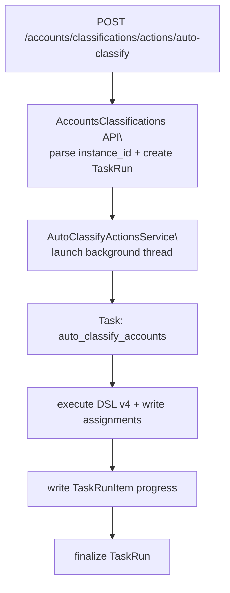

# Auto Classify（手动触发：TaskRun + 后台线程）

> [!note] 本文目标
> 说明“账户分类管理 - 自动分类”按钮对应的后端链路：instance_id 解析、TaskRun/TaskRunItem 写入口径、后台线程执行入口，以及失败/取消语义。

## 1. 概览(Overview)

当前实现不再使用 `AutoClassifyService`（已删除）；自动分类动作采用“API 创建 TaskRun + 后台线程执行任务”的模式：

- API action：`POST /api/v1/accounts/classifications/actions/auto-classify`（`update` + CSRF），返回 `run_id`。
- 编排：`AutoClassifyActionsService` 创建 `TaskRun` 并启动后台线程。
- 后台任务：`app/tasks/account_classification_auto_tasks.py:auto_classify_accounts`
  - 按规则维度写入 `TaskRunItem` 进度
  - 执行 DSL v4 校验与匹配
  - 写入分类分配并清理缓存/旧分配（以任务实现为准）

## 2. 依赖与边界(Dependencies)

| 类型 | 组件 | 用途 | 失败语义(摘要) |
| --- | --- | --- | --- |
| Caller | `POST /api/v1/accounts/classifications/actions/auto-classify` | 触发自动分类 | 返回 `run_id`；任务在后台执行 |
| Orchestrator | `AutoClassifyActionsService` | 创建 `TaskRun` + 启动后台线程 | DB/参数异常 -> `ValidationError/SystemError` |
| Task | `auto_classify_accounts` | 真正执行分类与写入进度 | 异常 -> 标记 TaskRun/Items failed + finalize |
| Storage | `TaskRunsWriteService` | init/complete/fail/finalize run & items | DB 异常传播 |

## 3. 事务与失败语义(Transaction + Failure Semantics)

- **请求侧**：API 仅创建 `TaskRun` 并返回 `run_id`（不在请求内执行分类）。
- **后台执行侧**：任务在 Flask `app_context()` 内运行：
  - 启动前会检查 `TaskRun.status == cancelled`，取消则提前 `finalize_run` 并返回。
  - 异常路径会把 `TaskRun` 标记为 `failed`，并把仍处于 `pending/running` 的 `TaskRunItem` 统一标记为 `failed`，随后 `finalize_run`。

## 4. 主流程图(Flow)

## 5. 决策表/规则表(Decision Table)

### 5.1 instance_id 归一化

| 输入 | 输出 | 失败 |
| --- | --- | --- |
| None/"" | None(全量) | - |
| bool | - | `ValidationError("instance_id 参数无效")` |
| int/str 可转 int | int | - |
| 其他 | - | `ValidationError("instance_id 必须为整数")` |

## 6. 兼容/防御/回退/适配逻辑

（以任务实现为准）：

- `instance_id` 为空：执行全量自动分类
- `rule_expression`：强制为 DSL v4；非法表达式会导致任务失败
- 取消语义：通过 `TaskRun.status == cancelled` 在 task 侧实现“尽快退出”

## 7. 可观测性(Logs + Metrics)

- 后台线程异常：`AutoClassifyActionsService` 会记录 `后台自动分类失败`（包含 `run_id/instance_id`）。
- 运行进度：主要通过 `TaskRun/TaskRunItem` 展示（运行中心）。

## 8. 测试与验证(Tests)

最小验证命令:

- `uv run pytest -m unit tests/unit/routes/test_api_v1_accounts_classifications_contract.py`
