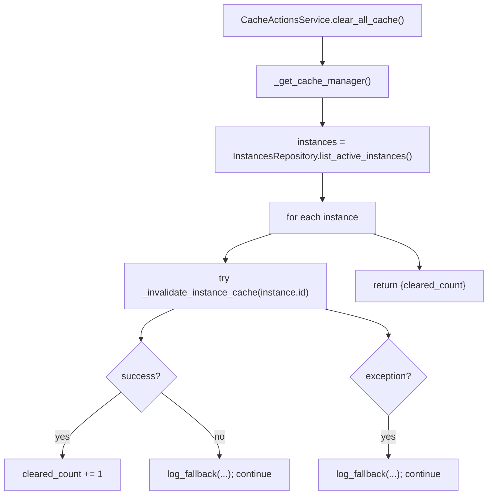
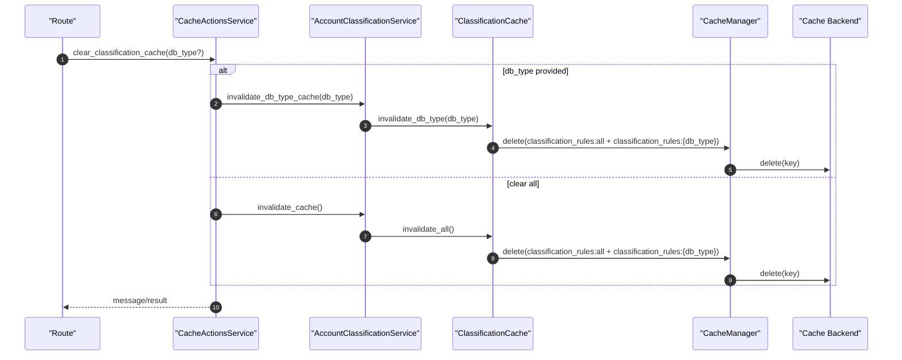

# Cache Services(缓存服务/清理动作)

> [!note] 本文目标
> 覆盖缓存域的“基础设施抽象 + 动作编排 + 业务缓存访问器”三层实现：
> - `CacheManager`/`CacheManagerRegistry`：对 Flask-Caching 的薄封装（get/set/delete/stats + 容错 + 日志）
> - `CacheActionsService`：面向 route 的动作编排（stats/clear-* / 分类缓存统计）
> - 业务缓存访问器：
>   - `ClassificationCache`：分类规则缓存（固定 key + TTL + 显式失效）
>   - `OptionsCache`：下拉/筛选项缓存（固定 key + 短 TTL，最终一致）
>
> 重点：当前“按用户/按实例清理”不做模式匹配删除（不引入 Redis scan/keys），因此属于 no-op（返回 True）。必须显式文档化，避免调用方误以为一定被清理。

## 1. 概览(Overview)

覆盖文件：

- `app/utils/cache_utils.py`
- `app/services/cache/cache_actions_service.py`
- `app/services/account_classification/cache.py`
- `app/services/common/options_cache.py`
- `app/services/health/health_checks_service.py`（缓存探活）

典型入口：

- `init_cache_manager(cache, default_timeout=...)`（初始化 `CacheManagerRegistry`）`app/__init__.py`
- `CacheActionsService.get_cache_stats()/clear_*`（缓存管理动作）
- `ClassificationCache.get_rules()/set_rules()/invalidate_*`（分类规则缓存）
- `FilterOptionsService` → `OptionsCache`（下拉/筛选项短 TTL 缓存）

## 2. 依赖与边界(Dependencies)

| 类型 | 组件 | 用途 | 失败语义(摘要) |
| --- | --- | --- | --- |
| Cache | `flask_caching.Cache` | 实际缓存后端（Redis/Memory 等） | backend 波动时由 `CacheManager` 记录 warning 并降级返回 |
| Registry | `CacheManagerRegistry` | 全局缓存入口（避免散落全局变量） | 未初始化 -> `CacheActionsService` 抛 `SystemError`；业务访问器视为“未启用缓存” |
| Service | `AccountClassificationService` | 分类缓存失效入口 | 失效失败 -> 记录日志并返回 False（不抛） |

边界约束（简版）：

- routes/api 层 MUST NOT：直接 get/set cache；只调用 service。
- service 层 SHOULD：只调用“业务缓存访问器”，不拼 key。
- cache 访问器 MUST：通过 `CacheManagerRegistry.get()` 获取能力；MUST NOT：直接操作 redis client / scan keys。

## 3. 事务与失败语义(Transaction + Failure Semantics)

- 缓存链路不涉及 DB 事务（除 `CacheActionsService` 查询活跃实例列表）。
- **显式降级**：
  - `CacheManager.get/set/delete/get_stats`：捕获缓存后端异常，记录 `fallback=True/fallback_reason`，并返回 `None/False`（保证业务链路不因缓存波动而中断）。
  - `CacheActionsService.clear_all_cache`：逐实例清理，单实例失败吞并并继续（记录 fallback），返回 `cleared_count`。
  - `CacheActionsService.clear_user_cache/clear_instance_cache`：不引入 scan/keys，目前不做精确删除（返回 True）。

## 4. 主流程图(Flow)

## 5. 时序图(Sequence)

## 6. key/TTL 约定(Key + TTL)

### 6.1 ClassificationCache（分类规则缓存）

- keys：
  - 全量：`classification_rules:all`
  - 兼容/清理用：`classification_rules:{db_type}`（不再作为核心读路径依赖）
- TTL：`CACHE_RULE_TTL`（默认 2h）
- 失效：
  - clear-all：删除 all + 逐 db_type key
  - clear-db_type：删除 `{db_type}`，并同步删除 all key（保证对外语义有效）

### 6.2 OptionsCache（下拉/筛选项短 TTL 缓存）

- key 命名：`whalefall:v1:options:*`
- TTL：`CACHE_OPTIONS_TTL`（默认 60s）
- 失效：优先短 TTL 最终一致；不引入 scan/keys。

## 7. 决策表/规则表(Decision Table)

### 7.1 ClassificationCache.get_rules 缓存格式

| cached_data | 判定 | 返回 |
| --- | --- | --- |
| `dict` 且包含 `rules: list` | wrapped schema | `rules` |
| `list` | legacy schema | `None`（视为 miss） |
| 其他 | 格式错误 | `None` |

## 8. 测试与验证(Tests)

最小验证命令：

- `uv run pytest -m unit tests/unit/routes/test_api_v1_cache_contract.py`
- `uv run pytest -m unit tests/unit/routes/test_api_v1_health_extended_contract.py`
- `uv run pytest -m unit tests/unit/routes/test_api_v1_common_options_contract.py`
- `uv run pytest -m unit tests/unit/services/test_cache_fallback_observability.py`

关键用例：

- 未初始化 `CacheManagerRegistry`：路由返回 `SystemError`
- 分类规则缓存：仅接受 wrapped schema（legacy list 视为 miss）
- clear_all_cache：单实例异常不会阻断整体返回（记录 fallback）
- OptionsCache：短 TTL 缓存 options 读路径（空列表也缓存）

