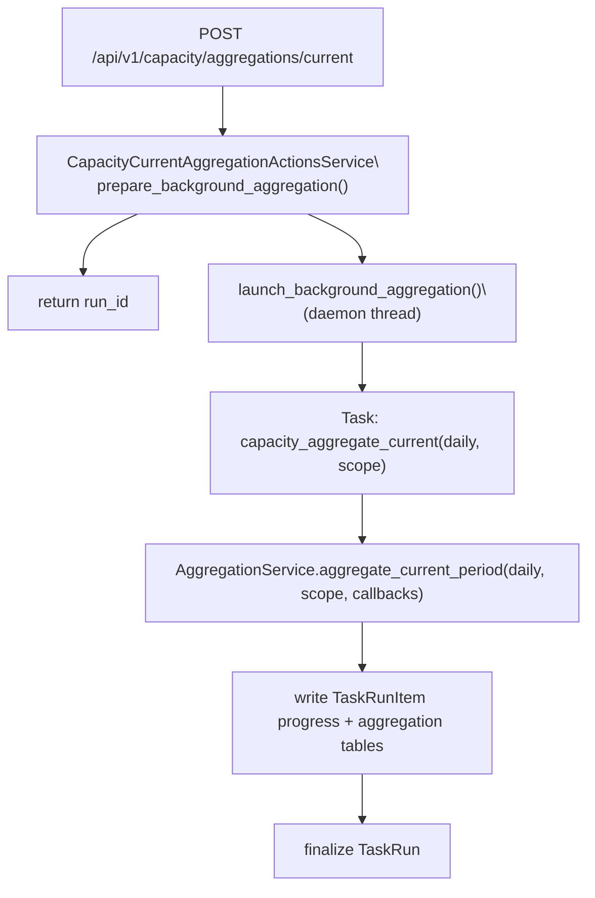
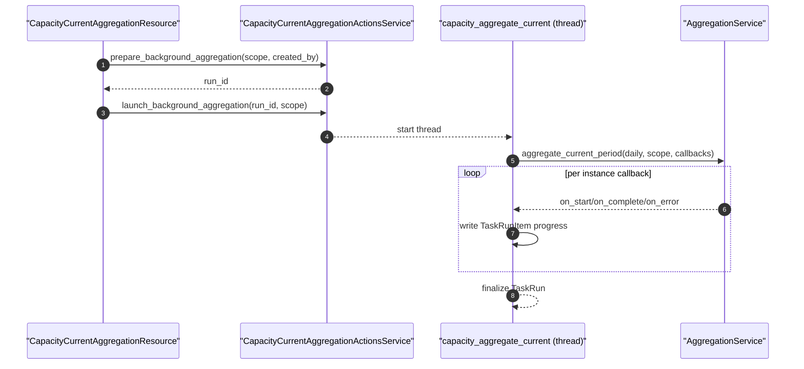

# Capacity Current Aggregation（手动触发：TaskRun + 后台线程）

> [!note] 本文目标
> 说明“容量统计 - 统计当前周期”按钮对应的后端链路：scope 校验、TaskRun/TaskRunItem 写入口径、后台线程执行入口，以及失败/取消语义。

## 1. 概览(Overview)

当前实现不再使用 `SyncSession/SyncInstanceRecord` 写入进度；手动触发的进度统一写入 `TaskRun/TaskRunItem`，并在“运行中心”展示。

- 入口：`POST /api/v1/capacity/aggregations/current`（`admin` + CSRF），返回 `run_id`。
- scope：`instance/database/all` 三选一（由前端页面决定：实例页传 `instance`，数据库页传 `database`）。
- 周期：当前固定 `daily`（前端固定传 `period_type=daily`；后端执行也强制按 daily）。
- 执行器：复用 [[reference/service/aggregation-pipeline|Aggregation Pipeline]] 的 `AggregationService.aggregate_current_period(...)`。

持久化影响(摘要)：
- 写表：`task_runs`、`task_run_items`（状态/错误/metrics/details/summary）
- 写表：`*_size_aggregations`（聚合结果表）
- 读取：`instances(is_active=True)`

## 2. 依赖与边界(Dependencies)

| 类型 | 组件 | 用途 | 失败语义(摘要) |
| --- | --- | --- | --- |
| Caller | `POST /api/v1/capacity/aggregations/current` | 触发手动聚合 | 返回 `run_id`；任务在后台执行 |
| Orchestrator | `CapacityCurrentAggregationActionsService` | 创建 `TaskRun` + 启动后台线程 | 校验失败抛 `ValidationError` |
| Task | `capacity_aggregate_current` | 真正执行聚合 + 写入 `TaskRunItem` 进度 | 异常 -> 标记 TaskRun/Items failed + finalize |
| Aggregator | `AggregationService.aggregate_current_period` | 执行 database/instance runner | 异常传播到 task 边界处理 |
| Storage | `TaskRunsWriteService` | init/complete/fail/finalize run & items | DB 异常传播 |

## 3. 事务与失败语义(Transaction + Failure Semantics)

- **请求侧**：`CapacityCurrentAggregationActionsService.prepare_background_aggregation(...)` 只负责创建 `TaskRun` 并返回 `run_id`。
- **后台执行侧**：`capacity_aggregate_current(...)` 在 Flask `app_context()` 内运行：
  - 启动前会检查 `TaskRun.status == cancelled`，取消则提前 `finalize_run` 并返回。
  - 异常路径会把 `TaskRun` 标记为 `failed`，并把仍处于 `pending/running` 的 `TaskRunItem` 统一标记为 `failed`，随后 `finalize_run`。

## 4. 主流程图(Flow)

## 5. 时序图(Sequence)

## 6. 决策表/规则表(Decision Table)

### 6.1 scope 校验

| scope | 允许 | 说明 |
| --- | --- | --- |
| `instance`/`database`/`all` | ✅ | 合法 |
| 其他 | ❌ | `ValidationError("scope 参数仅支持 ...")` |

### 6.2 period_type 处理

| period_type | effective_period_type | 行为 |
| --- | --- | --- |
| 任意/缺失 | `daily` | 当前固定为 `daily`（接口模型保留该字段，但后端执行暂不读取） |

## 7. 兼容/防御/回退/适配逻辑

- `scope` 为空/缺失：默认 `all`（由 API 层做归一化）。
- `period_type` 字段：接口模型保留，但当前执行固定 `daily`（后续支持多周期手动触发时再启用）。
- 取消语义：通过 `TaskRun.status == cancelled` 在 task 侧实现“尽快退出”。

## 8. 可观测性(Logs + Metrics)

- 后台线程异常：`CapacityCurrentAggregationActionsService` 会记录 `后台统计当前周期失败`（包含 `run_id/scope`）。
- 运行进度：主要通过 `TaskRun/TaskRunItem` 展示（运行中心）。

## 9. 测试与验证(Tests)

- (接口契约) `uv run pytest -m unit tests/unit/routes/test_api_v1_capacity_aggregations_contract.py`
