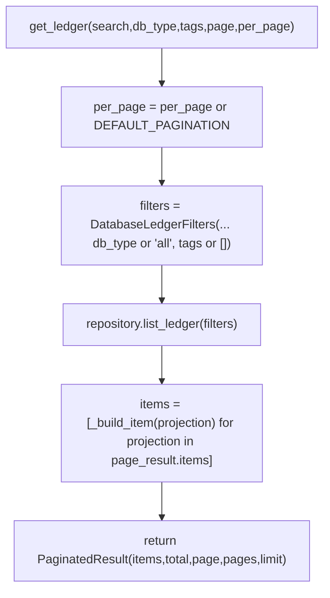
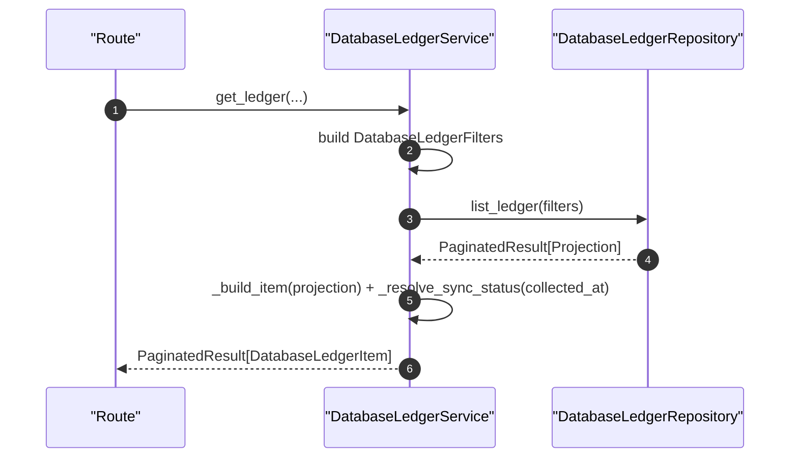

# Database Ledger Service(数据库台账查询/同步状态推断)

> [!note] 本文目标
> 说明台账查询服务如何构建 filters、分页结果与展示层需要的衍生字段（容量 label、size_bytes、sync_status），并显式列出默认值与 `or` 兜底分支。

## 1. 概览(Overview)

入口：

- `DatabaseLedgerService.get_ledger(...) -> PaginatedResult[DatabaseLedgerItem]` `app/services/ledgers/database_ledger_service.py:54`
- `DatabaseLedgerService.iterate_all(...) -> Iterable[DatabaseLedgerItem]`（导出用）`app/services/ledgers/database_ledger_service.py:105`

核心职责：

- 将查询参数归一化为 `DatabaseLedgerFilters`
- 调用 `DatabaseLedgerRepository` 获取投影数据
- 将投影转换为 `DatabaseLedgerItem`，并推断 `sync_status`（已更新/待刷新/超时/待采集）

## 2. 依赖与边界(Dependencies)

| 类型 | 组件 | 用途 | 失败语义(摘要) |
| --- | --- | --- | --- |
| Repo | `DatabaseLedgerRepository` | 查询投影/分页 | 异常 -> `SystemError` |
| Types | `DatabaseLedger*` | 输出结构 | 无 |
| Time | `time_utils.now()` | 推断同步状态 | 无 |

## 3. 事务与失败语义(Transaction + Failure Semantics)

- 只读服务，不写 DB。
- get_ledger/iterate_all：异常会记录 log_error 并抛 `SystemError`（硬失败）。`app/services/ledgers/database_ledger_service.py:88`

## 4. 主流程图(Flow)

## 5. 时序图(Sequence)

## 6. 决策表/规则表(Decision Table)

### 6.1 sync_status 推断（基于 collected_at 与当前时间差）

| collected_at | delay_hours | value/label/variant |
| --- | --- | --- |
| None | N/A | `pending` / `待采集` / `secondary` |
| not None | `<= 6` | `completed` / `已更新` / `success` |
| not None | `<= 48` | `running` / `待刷新` / `warning` |
| not None | `> 48` | `failed` / `超时` / `danger` |

实现位置：`app/services/ledgers/database_ledger_service.py:181`。

## 7. 兼容/防御/回退/适配逻辑

| 位置(文件:行号) | 类型 | 描述 | 触发条件 | 清理条件/期限 |
| --- | --- | --- | --- | --- |
| `app/services/ledgers/database_ledger_service.py:52` | 防御 | `session or db.session` 注入兜底 | 单测/调用方未传 session | 若统一 session 管理，可收敛 |
| `app/services/ledgers/database_ledger_service.py:76` | 防御 | `per_page = per_page or DEFAULT_PAGINATION` 默认分页 | 未传 per_page | 若前端必传可移除默认 |
| `app/services/ledgers/database_ledger_service.py:79` | 防御 | `db_type or 'all'`：空表示不过滤 | db_type 为空 | 若前端必传枚举可收敛 |
| `app/services/ledgers/database_ledger_service.py:129` | 防御 | `tags or []` + strip 过滤空白 | tags 为空/含空字符串 | 若前端严格传参可收敛 |
| `app/services/ledgers/database_ledger_service.py:150` | 防御 | projection 字段缺失用 `getattr(..., default)` 兜底 | repository 投影字段变化 | 规范投影 schema 后可转为强约束 |
| `app/services/ledgers/database_ledger_service.py:193` | 防御 | collected_at 缺失 -> sync_status=pending | 无采集记录 | 若 UI 改为显式区分“从未采集”，保留该分支 |
| `app/services/ledgers/database_ledger_service.py:217` | 防御 | size_mb None -> label=`未采集` | 无容量数据 | 同上 |

## 8. 可观测性(Logs + Metrics)

- 失败：`log_error("获取数据库台账失败")` `app/services/ledgers/database_ledger_service.py:89`
- 导出失败：`log_error("遍历数据库台账失败")` `app/services/ledgers/database_ledger_service.py:139`

## 9. 测试与验证(Tests)

最小验证命令：

- `uv run pytest -m unit tests/unit/services/test_database_ledger_service.py`
- `uv run pytest -m unit tests/unit/routes/test_api_v1_databases_ledgers_contract.py`

关键用例：

- collected_at None -> sync_status pending
- delay 边界（6h/48h）映射正确
