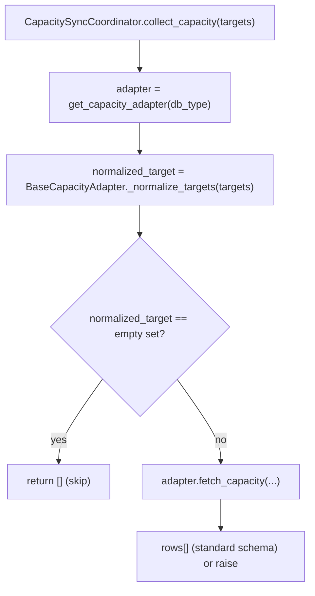
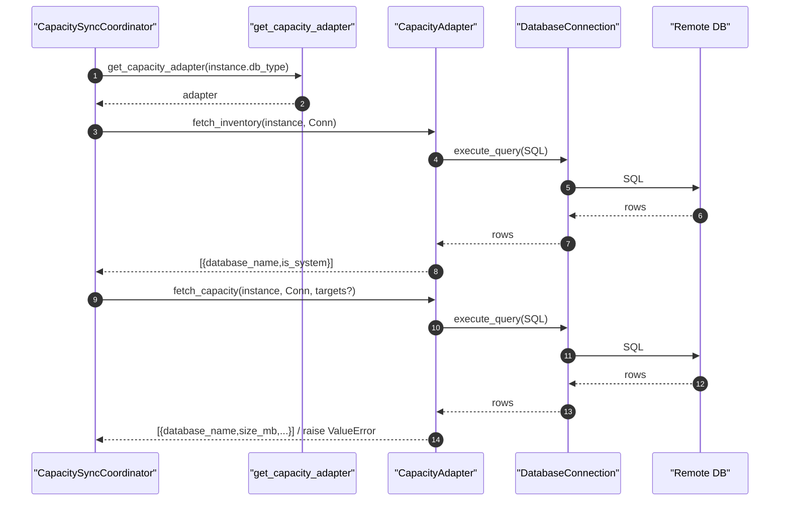

# Database Sync Adapters(容量采集适配器差异表)

> [!note] 本文目标
> 把 `app/services/database_sync/adapters/*` 视为同一套“容量采集适配器”实现：集中列出 MySQL/PG/SQLServer/Oracle 的差异、异常口径与兜底逻辑，避免在 overview/route 中重复解释。

## 1. 概览(Overview)

适配器统一接口：`BaseCapacityAdapter`

- `fetch_inventory(instance, connection) -> [{database_name,is_system}]`
- `fetch_capacity(instance, connection, target_databases=None) -> [{database_name,size_mb,...}]`

入口(由 orchestrator 调用)：

- `get_capacity_adapter(db_type)`：`app/services/database_sync/adapters/factory.py:27`

## 2. 依赖与边界(Dependencies)

| 类型 | 组件 | 用途 | 失败语义(摘要) |
| --- | --- | --- | --- |
| Factory | `get_capacity_adapter` | 选择适配器 | 不支持类型 -> `ValueError` |
| Base | `_normalize_targets/_safe_to_float` | targets 归一化 + 数值安全转换 | 非数值 -> 0.0；空列表 -> 空集合 |
| Remote | `DatabaseConnection.execute_query` | 执行远端 SQL | 连接/查询失败 -> adapter 抛异常 |
| Time | `time_utils` | 生成 collected_date/collected_at | 无 |

## 3. 事务与失败语义(Transaction + Failure Semantics)

- 适配器只负责**读取远端**并返回结构化数据，不直接写本地 DB。
- 适配器的异常策略存在差异（见 6.2、7）：
  - MySQL：部分查询失败会降级尝试其他视图；最终可能返回空聚合或抛 last_error。`app/services/database_sync/adapters/mysql_adapter.py:206`。
  - PostgreSQL / SQLServer / Oracle：容量查询 result 为空会直接 `raise ValueError(...)`。`app/services/database_sync/adapters/postgresql_adapter.py:151`、`app/services/database_sync/adapters/sqlserver_adapter.py:142`、`app/services/database_sync/adapters/oracle_adapter.py:145`。

## 4. 主流程图(Flow)

## 5. 时序图(Sequence)

## 6. 决策表/规则表(Decision Table)

### 6.1 target_databases 输入语义（统一）

| target_databases | `_normalize_targets` 返回 | 语义 |
| --- | --- | --- |
| `None` | `None` | 不做 target 过滤（采集所有可采集对象） |
| `[]` / `["", "  "]` | `set()` | 明确“无目标”，适配器直接跳过采集返回空 |
| `["db1","db2"]` | `{"db1","db2"}` | 仅采集目标集合（缺失目标会记录 warning） |

实现位置：`app/services/database_sync/adapters/base_adapter.py:92`。

### 6.2 Adapter 差异表（Inventory + Capacity）

| db_type | inventory 来源 | system 判定 | capacity 来源 | empty result 行为 | 额外约束/说明 |
| --- | --- | --- | --- | --- | --- |
| MySQL | `SHOW DATABASES` | 固定集合 `information_schema/...` | `information_schema.INNODB_TABLESPACES` / `INNODB_SYS_TABLESPACES` | **不一定抛**：尝试多个视图；最终可能返回空 dict 或抛 last_error | 需要能访问 `information_schema.SCHEMATA`（权限校验） |
| PostgreSQL | `pg_database` | `datistemplate` 或 `postgres` | `pg_database_size(datname)` | **抛 `ValueError`** | 仅采集 `datistemplate=false` |
| SQL Server | `sys.databases` | `database_id<=4` | `sys.master_files` 聚合 ROWS 文件 | **抛 `ValueError`** | capacity 中 `is_system` 固定 False（依赖库存侧剔除系统库） |
| Oracle | `dba_data_files` tablespace | 固定 False | `dba_data_files` 聚合 bytes | **抛 `ValueError`** | 以 tablespace 作为 database_name；数值字段 `_to_int(...) or 0` |

## 7. 兼容/防御/回退/适配逻辑

| 位置(文件:行号) | 类型 | 描述 | 触发条件 | 清理条件/期限 |
| --- | --- | --- | --- | --- |
| `app/services/database_sync/adapters/factory.py:45` | 兼容 | `DatabaseType.normalize(db_type or '')` 兜底 | Instance.db_type 为空/大小写不一致 | 数据层强约束 db_type 非空且规范化后可收敛 |
| `app/services/database_sync/adapters/base_adapter.py:106` | 防御 | `_normalize_targets` 用 `normalized or set()` 把空输入统一成空集合 | targets 为空/全空白 | 若上游总传 `None/非空列表`，可移除空集合语义 |
| `app/services/database_sync/adapters/base_adapter.py:121` | 防御 | `_safe_to_float` 对 None/非数值返回 0.0 | DB 返回非数值/空值 | 若需要强校验，改为抛错并补用例 |
| `app/services/database_sync/adapters/mysql_adapter.py:407` | 兼容 | `(instance.main_version or '').strip().lower()` 按版本选择视图顺序 | main_version 为空/格式不一 | 规范 main_version 或在连接层探测后可收敛 |
| `app/services/database_sync/adapters/mysql_adapter.py:206` | 回退 | MySQL 依次尝试多个视图；失败继续下一个 | 视图不存在/权限不足/查询异常 | 若明确版本与权限，移除多视图 fallback |
| `app/services/database_sync/adapters/mysql_adapter.py:279` | 防御 | `_ensure_databases_presence` 失败则只记录 warning 并返回 | `SHOW DATABASES` 失败 | 若必须保证全量库名占位，改为硬失败 |
| `app/services/database_sync/adapters/mysql_adapter.py:365` | 兼容 | `@XXXX` 十六进制转义解码回原字符 | tablespace 名包含编码片段 | 若确认不再需要兼容编码格式可移除 |
| `app/services/database_sync/adapters/postgresql_adapter.py:151` | 防御 | 空 result 直接抛 `ValueError`，避免“成功但无数据” | 权限不足/查询返回空 | 若要支持空库实例，改为返回空列表并在上层标记 skipped |
| `app/services/database_sync/adapters/sqlserver_adapter.py:142` | 防御 | 空 result 直接抛 `ValueError` | 同上 | 同上 |
| `app/services/database_sync/adapters/oracle_adapter.py:163` | 防御 | `_to_int(...) or 0` 保证 size 字段可计算 | bytes 字段为空/非数值 | 若要区分“未知/0”，改为 None 并完善 schema |

## 8. 可观测性(Logs + Metrics)

- MySQL：`mysql_tablespace_query_failed/empty/success` + `mysql_permission_check_failed`（权限问题）`app/services/database_sync/adapters/mysql_adapter.py:211`、`app/services/database_sync/adapters/mysql_adapter.py:169`
- PostgreSQL：`postgresql_capacity_empty`（空结果抛错前记录）`app/services/database_sync/adapters/postgresql_adapter.py:154`
- SQL Server：`sqlserver_capacity_empty` `app/services/database_sync/adapters/sqlserver_adapter.py:145`
- Oracle：`oracle_capacity_empty` `app/services/database_sync/adapters/oracle_adapter.py:148`

## 9. 测试与验证(Tests)

最小验证命令：

- `uv run pytest -m unit tests/unit/routes/test_api_v1_instances_sync_capacity_contract.py`

关键用例：

- targets 为空列表 -> 直接 skip 返回空（各 adapter `*_skip_capacity_no_targets`）
- MySQL：INNODB_* 视图切换、权限校验失败抛 `ValueError`
- PG/SQLServer/Oracle：空结果抛 `ValueError`（上层应捕获并标记实例失败）
