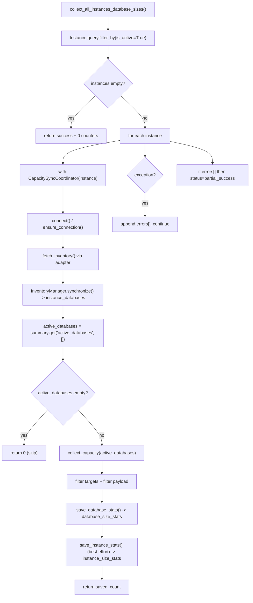
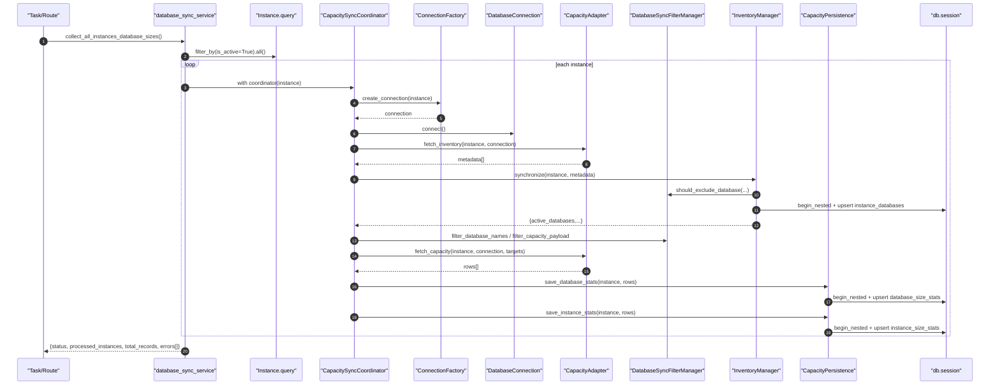

# Database Sync(容量同步/数据库容量采集)概览

> [!note] 本文目标
> 把 “容量同步(Database Sync)” 链路作为一个完整的服务域：说明入口、编排、过滤、库存同步(instance_databases)、落库(database_size_stats/instance_size_stats)、以及明确的失败语义与兜底逻辑。

## 1. 概览(Overview)

容量同步用于**从远端数据库实例采集“数据库容量统计”**并落到本地，主要产出：

- 库存同步：`instance_databases`（激活/停用 + last_seen）
- 数据库容量明细：`database_size_stats`（按日）
- 实例容量汇总：`instance_size_stats`（按日，基于当次 payload 汇总）

核心入口(Top38/常用)：

- 批量入口：`collect_all_instances_database_sizes()`（`app/services/database_sync/database_sync_service.py:34`）
- 单实例编排：`CapacitySyncCoordinator.collect_and_save()`（`app/services/database_sync/coordinator.py:296`）

不在本服务域做的事：

- 不负责 schedule/cron（由任务层/路由层触发）
- 不负责聚合(aggregation)（见 `[[reference/service/aggregation-pipeline|Aggregation Pipeline]]`）
- 不负责对外 Response 封套（由 route 层 `safe_route_call` 统一处理）

## 2. 依赖与边界(Dependencies)

| 类型 | 组件 | 用途 | 失败语义(摘要) |
| --- | --- | --- | --- |
| Entry | `collect_all_instances_database_sizes` | 遍历活跃实例并汇总结果 | 单实例失败不阻断批次，最终 `partial_success` |
| Orchestrator | `CapacitySyncCoordinator` | 连接、库存同步、容量采集、持久化编排 | 连接失败 -> 抛 `RuntimeError`（由外层捕获） |
| Adapter | `get_capacity_adapter` | db_type -> 适配器 | 不支持类型 -> `ValueError` |
| Filter | `DatabaseSyncFilterManager` | 按 db_type 过滤数据库名/结果行 | 规则缺失 -> 不过滤；配置文件缺失 -> `FileNotFoundError` |
| DB(本地) | `db.session.begin_nested()` + `flush()` | 库存/容量 upsert | upsert 失败：database stats 硬失败；instance stats 软失败 |
| Remote DB | `ConnectionFactory` + connection adapters | 执行 inventory/capacity SQL | 连接/查询失败 -> 适配器抛异常，外层捕获 |

## 3. 事务与失败语义(Transaction + Failure Semantics)

- **批次级失败语义**：按实例 try/except，失败追加到 `errors[]`，最终 `status` 可能为 `partial_success`。`app/services/database_sync/database_sync_service.py:72`、`app/services/database_sync/database_sync_service.py:88`。
- **连接失败**：
  - `connect()` 失败返回 `False`，`_ensure_connection()` 会抛 `RuntimeError("数据库连接未建立")`。`app/services/database_sync/coordinator.py:98`、`app/services/database_sync/coordinator.py:334`。
- **库存同步(instance_databases)**：
  - 以 `db.session.begin_nested()` 包裹并 `flush()`，`SQLAlchemyError` 会被记录并抛出（硬失败）。`app/services/database_sync/inventory_manager.py:90`。
- **容量明细(database_size_stats)**：
  - upsert 以 `begin_nested()` 包裹，异常会被记录并抛出（硬失败）。`app/services/database_sync/persistence.py:98`。
  - payload 缺字段时单行跳过（不抛）。`app/services/database_sync/persistence.py:49`。
- **实例汇总(instance_size_stats)**：
  - upsert 失败时返回 `False`（软失败），上层不阻断流程。`app/services/database_sync/persistence.py:173`、`app/services/database_sync/coordinator.py:324`。
- **空数据语义**：
  - 无活跃实例：直接返回 success + 0 计数。`app/services/database_sync/database_sync_service.py:54`。
  - 无活跃库：`collect_and_save()` 直接返回 `0`。`app/services/database_sync/coordinator.py:315`。

## 4. 主流程图(Flow)

## 5. 时序图(Sequence)

## 6. 决策表/规则表(Decision Table)

### 6.1 system DB 是否进入“库存同步”

| 输入 | 规则 | 结果 |
| --- | --- | --- |
| `item.is_system == False` | 永不跳过 | 进入库存 |
| `item.is_system == True` 且 `instance.db_type != mysql` | 非 MySQL 保持跳过系统库 | 跳过 |
| `item.is_system == True` 且 `instance.db_type == mysql` | MySQL 按需求纳入系统库同步 | 进入库存 |

实现位置：`app/services/database_sync/inventory_manager.py:140`。

### 6.2 filters：过滤规则加载与匹配

| 场景 | 规则 | 影响范围 |
| --- | --- | --- |
| 配置文件不存在 | `reload()` 抛 `FileNotFoundError` | 整个同步硬失败（应由上层捕获） |
| YAML 解析失败 | `yaml.YAMLError` -> `ValueError` | 同上 |
| db_type 为空/未知 | `should_exclude_database` 返回 `(False, None)` | 不过滤（全放行） |
| rule 格式异常（非 Mapping） | warning + continue | 忽略该 db_type 的规则 |
| `exclude_databases` 命中 | 返回 `exclude_database` | 过滤该库 |
| `exclude_patterns` 命中 | LIKE-style `%/_` -> regex 匹配 | 过滤该库 |

实现位置：`app/services/database_sync/database_filters.py:55`、`app/services/database_sync/database_filters.py:122`。

## 7. 兼容/防御/回退/适配逻辑

| 位置(文件:行号) | 类型 | 描述 | 触发条件 | 清理条件/期限 |
| --- | --- | --- | --- | --- |
| `app/services/database_sync/database_sync_service.py:54` | 防御 | 无活跃实例直接返回 0 计数 success | `instances == []` | 若产品要求“无活跃实例也算异常”，则调整为显式错误并补测试 |
| `app/services/database_sync/database_sync_service.py:88` | 防御/回退 | 单实例失败不阻断批次；最终 `status=partial_success` | 任一实例抛出 `DATABASE_SYNC_EXCEPTIONS` | 若需要“全失败回滚/中断”，引入 strict 模式并补用例 |
| `app/services/database_sync/coordinator.py:107` | 防御 | 连接对象存在且 `is_connected` 时复用 | coordinator 重入/重复调用 | 若 connection 生命周期策略改变，收敛到显式 connect/disconnect |
| `app/services/database_sync/coordinator.py:312` | 防御 | `inventory_summary.get("active_databases", [])` 兜底 | summary 缺 key | 若 InventoryManager 总能返回 key，可改为强约束并加断言 |
| `app/services/database_sync/coordinator.py:240` | 防御 | 过滤后 targets 为空直接返回空列表 | 传入 targets 全被 filters 排除 | 若调用方必须知道“被全部过滤”，可返回结构化原因 |
| `app/services/database_sync/inventory_manager.py:76` | 防御 | `metadata or []` 把 None 视为空输入 | adapter 返回 None | 适配器接口强约束为 list 后移除兜底 |
| `app/services/database_sync/inventory_manager.py:145` | 兼容 | `instance.db_type or ""` 兜底并按 mysql 特例处理系统库 | db_type 为空/大小写不一致 | 数据层保证 db_type 非空且规范化后可收敛 |
| `app/services/database_sync/database_filters.py:68` | 防御 | `yaml.safe_load(...) or {}` 避免 None | YAML 内容为空 | 配置 schema 校验齐全后可改为显式空结构 |
| `app/services/database_sync/database_filters.py:136` | 防御 | `getattr(instance,'db_type',None) or ''` 为空时不启用过滤 | Instance 未设置 db_type | 统一 instance schema 后移除兜底分支 |
| `app/services/database_sync/persistence.py:62` | 防御 | payload 缺关键字段 `KeyError` 时单行跳过 | 适配器返回缺字段行 | 统一适配器 schema + 单测覆盖后可改为硬失败 |
| `app/services/database_sync/persistence.py:177` | 回退 | 保存 instance 汇总失败返回 `False`（不抛） | DB 写入失败/约束冲突 | 若业务要求强一致，改为抛错并让上层标记实例失败 |
| `app/services/database_sync/persistence.py:213` | 兼容 | outer join 后 `InstanceDatabase.is_active IS NULL` 视为 active | instance_databases 缺行/历史数据 | 清理历史数据并强制外键/补齐行后移除 `IS NULL` 分支 |

## 8. 可观测性(Logs + Metrics)

关键日志事件(按链路阶段)：

- 批次：`capacity_collection_failed`（单实例失败）`app/services/database_sync/database_sync_service.py:90`
- 连接：`capacity_sync_connection_success/failed`（connect 生命周期）`app/services/database_sync/coordinator.py:126`
- filters：`database_filter_config_loaded`（配置加载）`app/services/database_sync/database_filters.py:101`
- 库存：`inventory_database_filtered` / `inventory_sync_completed` `app/services/database_sync/inventory_manager.py:152`、`app/services/database_sync/inventory_manager.py:212`
- 持久化：`save_database_stats_success` / `save_database_stat_invalid_payload` `app/services/database_sync/persistence.py:63`、`app/services/database_sync/persistence.py:110`

## 9. 测试与验证(Tests)

最小验证命令：

- `uv run pytest -m unit tests/unit/routes/test_api_v1_instances_sync_capacity_contract.py`
- `uv run pytest -m unit tests/unit/routes/test_api_v1_instances_contract.py`

关键用例：

- happy path：有活跃实例 + 有活跃库 -> `total_records > 0`
- filters：目标库全被排除 -> 返回空列表且不中断（`coordinator.collect_capacity`）
- payload 兼容：缺字段行被跳过仍可 upsert（`save_database_stats`）
- 失败语义：某个实例连接失败 -> 批次 `partial_success`
