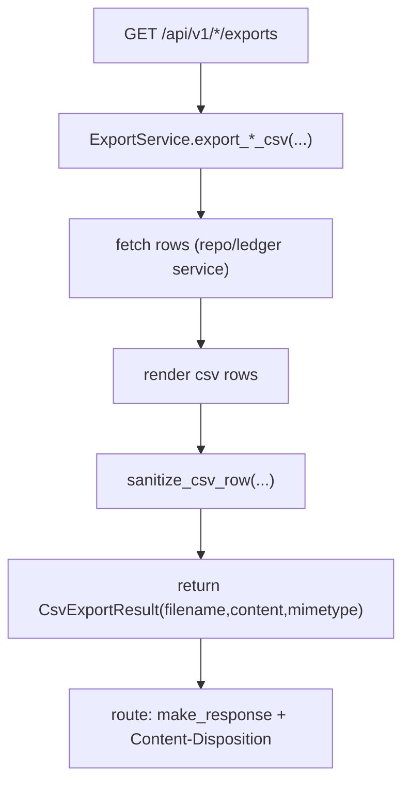

# Files Export Services(CSV 导出与模板)

> [!note] 本文目标
> 把 CSV 导出与导入模板服务的边界写清: 这些 service 只负责"拿数据 + 渲染 CSV + 返回 filename/content", Response 由 route 层负责.

## 1. 概览(Overview)

覆盖文件:

- `app/services/files/account_export_service.py` (accounts ledger exports)
- `app/services/files/database_ledger_export_service.py`
- `app/services/files/instances_export_service.py`
- `app/services/files/instances_import_template_service.py`

核心入口:

- `AccountExportService.export_accounts_csv(filters) -> CsvExportResult`
- `DatabaseLedgerExportService.export_database_ledger_csv(search, db_type, instance_id?, tags) -> CsvExportResult`
- `InstancesExportService.export_instances_csv(search, db_type) -> CsvExportResult`
- `InstancesImportTemplateService.build_template_csv() -> CsvExportResult`

安全点:

- CSV 行写入前统一使用 `sanitize_csv_row` 防止公式注入.

## 2. 依赖与边界(Dependencies)

| 类型 | 组件 | 用途 | 失败语义(摘要) |
| --- | --- | --- | --- |
| Repo | `AccountsLedgerRepository` / `InstancesRepository` | 导出用全量查询/标签 map | DB 异常由 repository 抛出 |
| Ledger | `DatabaseLedgerService.iterate_all` | 数据库台账导出迭代器 | ledger service 内部异常会抛出 |
| CSV | `csv.writer` + `io.StringIO` | 渲染 CSV 内容 | - |
| Security | `sanitize_csv_row` | 公式注入防护 | - |
| Time | `time_utils.format_china_time` | 文件名时间戳 | - |

## 3. 事务与失败语义(Transaction + Failure Semantics)

- 均为读服务, 不做 commit.
- `DatabaseLedgerExportService` 会依赖 `DatabaseLedgerService.iterate_all` 的 query 构造与容错逻辑(见 `[[reference/service/database-ledger-service]]`).

## 4. 主流程图(Flow)

## 5. 决策表/规则表(Decision Table)

### 5.1 AccountExportService: username 展示规则

| db_type | username_display |
| --- | --- |
| sqlserver/oracle/postgresql | `username` |
| 其他 | `f\"{username}@{instance_host}\"` |

实现位置: `app/services/files/account_export_service.py:62`.

## 6. 兼容/防御/回退/适配逻辑

| 位置(文件:行号) | 类型 | 描述 | 触发条件 | 清理条件/期限 |
| --- | --- | --- | --- | --- |
| `app/services/files/account_export_service.py:28` | 防御 | `repository or AccountsLedgerRepository()` 兜底 | 调用方未注入 | 若统一 DI, 改为强制注入 |
| `app/services/files/database_ledger_export_service.py:31` | 防御 | `ledger_service or DatabaseLedgerService()` 兜底 | 调用方未注入 | 同上 |
| `app/services/files/instances_export_service.py:28` | 防御 | `repository or InstancesRepository()` 兜底 | 调用方未注入 | 同上 |
| `app/services/files/account_export_service.py:59` | 兼容 | instance/host 缺失时使用 "%" 占位 | 不完整 instance 数据 | 若数据完整性可保证, 改为强约束 |

## 7. 可观测性(Logs + Metrics)

- 导出 service 本身无结构化日志; 失败通常在 repository/ledger service 或 route 层记录.

## 8. 测试与验证(Tests)

最小验证命令:

- `uv run pytest -m unit tests/unit/routes/test_api_v1_files_contract.py`
